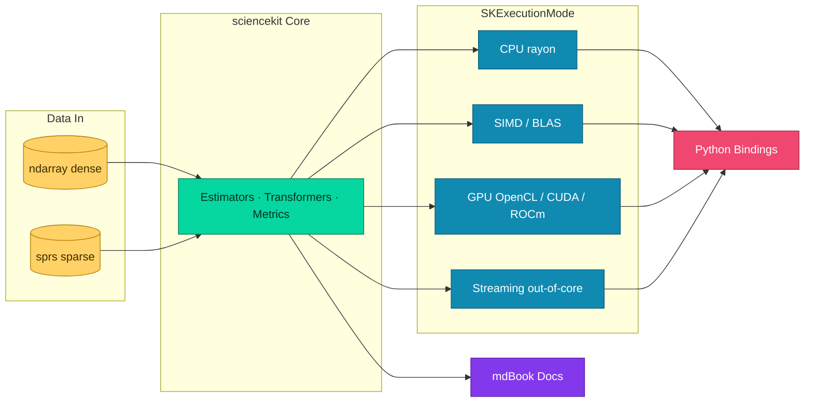

# sciencekit

A machine learning library in Rust reimplementing all of scikit-learn — extreme performance, zero-copy APIs and native out-of-core processing.

## Highlights

- Full scikit-learn surface with idiomatic Rust builder-pattern APIs
- Zero-copy public APIs built on `ndarray` views and sparse `sprs` views
- Pluggable execution via `SKExecutionMode`: CPU (rayon), SIMD/BLAS, GPU (OpenCL/CUDA/ROCm), streaming/out-of-core

## Architecture

## Documentation

The full documentation — API reference, usage examples and a description of every function — lives in the mdBook on the [`docs/documentations`](https://github.com/neurono-ml/sciencekit/tree/docs/documentations) branch, published via GitHub Pages at <https://neurono-ml.github.io/sciencekit/>.

Release notes: [CHANGELOG.md](CHANGELOG.md). Contribution workflow for agents and humans: [AGENTS.md](AGENTS.md).

## Status

Early development — the Cargo workspace lands with Phase 0 of the roadmap ([docs/PRD.md](docs/PRD.md)).
