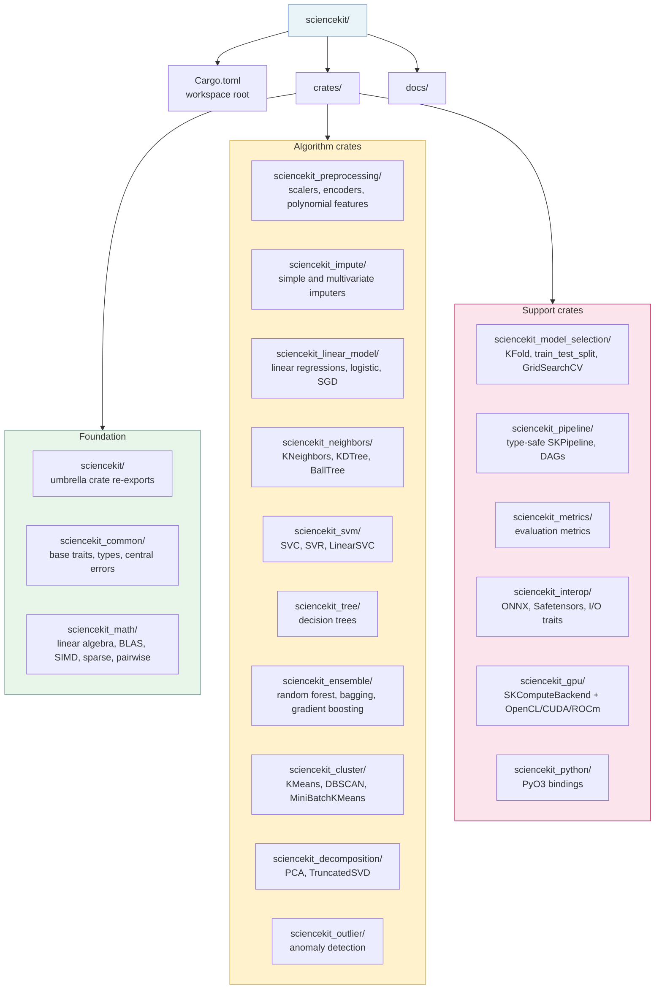
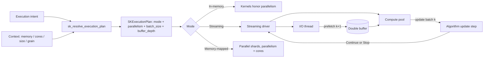

# Architecture

The project is a Cargo workspace split into cohesive sub-crates, optimizing build times and isolating dependencies. Every structural rule below comes from the PRD (§3–§9).

## Workspace layout



### Structural rules

| Rule | Detail |
|---|---|
| **One responsibility per module** | Modules stay small enough to have exactly one responsibility. |
| **200-line limit** | A `.rs` file exceeding 200 lines becomes a **folder module** (`mod.rs`, `builder.rs`, `core_implementation.rs`, `fitting_logic.rs`, `*_tests.rs`). |
| **Single responsibility per item** | Functions, structs and traits do one thing. Prefer **trait composition** over responsibility inheritance. |
| **Small PRs** | Each change alters the minimum necessary. |

### Naming convention

No abbreviations anywhere — single exception: the project prefix `sk`/`SK`.

| Item kind | Convention | Example |
|---|---|---|
| Structs and traits | `SK` + PascalCase | `SKEstimator`, `SKStandardScaler` |
| Free public functions, variables, modules | `sk_` + snake_case | `sk_train_test_split` |
| Methods (inside `impl`) | complete name only | `fit`, `predict`, `execution_mode` |
| Crates | full name | `sciencekit_linear_model` |

```rust,ignore
// Illustrative — naming convention in action.
let model = SKKMeansClassifierBuilder::new()
    .maximum_iterations(300)      // not max_iter
    .nearest_neighbors_count(5)   // not k
    .build()?;
```

## Core traits (`sciencekit_common`)

Trait composition is the foundation of everything:

```rust,ignore
// Core trait vocabulary — implemented by the sciencekit crates.
pub trait SKEstimator { /* hyperparameters and fit */ }
pub trait SKPredictor: SKEstimator { /* predict */ }
pub trait SKTransformer: SKEstimator { /* transform / fit_transform */ }

pub trait SKDataSource { /* eager: full in-memory access */ }
pub trait SKLazySource { /* streaming: Iterator<Item = Batch> */ }
pub trait SKMappableSource { /* memmap: O(1) random access */ }
pub trait SKToOnnx { /* ONNX export */ }
pub trait SKComputeBackend { /* compute device abstraction */ }
```

Algorithms compose exactly the traits they support: an `SKSGDClassifier` implements `SKPredictor` + `SKLazySource`; an `SKStandardScaler` implements only `SKTransformer`.

## Memory management

<div class="sk-box sk-box--warning">
<strong>Zero-copy is non-negotiable:</strong> public APIs receive <code>ArrayView</code>, <code>CowArray</code>
or sparse views (<code>sprs</code>) — never copies of giant matrices. Memory layout (row-major/column-major,
contiguity) is always considered in binary operations.
</div>

Higher-order iteration is mandatory: `.map()`, `.map_inplace()`, `.zip_mut_with()`, plus `azip!()` /
`par_azip!()` and `rayon` for data parallelism — never manual index loops.

### Custom allocators

| Allocator | Feature flag | Characteristics |
|---|---|---|
| glibc malloc | (none — fallback) | System default, zero dependencies |
| jemalloc | `allocator-jemalloc` | Per-thread arenas; shines with many same-size allocations |
| mimalloc | `allocator-mimalloc` | Very low p99 latency; variable sizes |

Expected gains vs glibc on ML workloads: **15–30% allocation throughput**. The automatic decision mechanism picks the default per platform and workload.

### Out-of-core strategies

Every algorithm declares its access pattern and implements what works:

| Trait | Strategy | Typical algorithms |
|---|---|---|
| `SKLazySource` | Sequential streaming in batches | SKSGD*, SKMiniBatchKMeans, incremental SKPCA |
| `SKMappableSource` | Memory-mapped files, O(1) random access | SKKMeans, SKKNN, SKDBSCAN, SKDecisionTree |

Sparse arrays are first-class from day one via `sprs` + `ndarray` (CSR/CSC/COO) — essential for Lasso, linear SVMs and text classification.

## Threads and concurrency

<div class="sk-box sk-box--danger">
<strong>Non-negotiable rule:</strong> CPU-intensive work never blocks async threads.
Math runs on rayon's pool; Tokio handles I/O and delegates computation blocks to the CPU pool.
</div>

### Automatic execution decision

Every builder exposes `execution_mode(SKExecutionMode::...)`. Default: `Automatic`.

| Mode | When |
|---|---|
| `InProcessSynchronous` | Dataset fits in RAM; eager algorithm; rayon only |
| `InProcessAsynchronous` | Async I/O source; Tokio orchestrates, rayon computes |
| `OutOfCoreStreaming` | Dataset > RAM; sequential batches (`SKLazySource`) |
| `OutOfCoreMemoryMapped` | Dataset > RAM; random access required (`SKMappableSource`) |

The decision weighs: available memory (`sysinfo`), dataset size, declared access pattern, CPU cores (`available_parallelism`) and an optional batch hint. Users can override any parameter in the builder.

### Size-aware parallelism

Resolution derives `parallelism = min(cores, ceil(unit / grain))`, where the
work unit is the whole dataset (in-memory), one batch (streaming), or an
arbitrary shard (memory-mapped → always the core count). A single-core machine
or a sub-grain unit resolves to exactly `1` (sequential, no dispatch overhead).
The per-kernel `grain` (minimum elements per thread to amortize dispatch) is
measured by the `kernel_calibration` criterion bench and recorded beside each
kernel with machine + date provenance (see [math-kernel](math-kernel.md)).



For streaming, the driver owns the I/O ∥ CPU overlap: a dedicated I/O thread
prefetches the next batch into a bounded double buffer while the compute pool
processes the current batch via an algorithm-supplied `update(batch, parallelism, state)`
step. Resolution guards the double-buffer footprint — $2 \times \text{batch} \le \text{available
memory}$ — and refuses oversized batch hints before any data is processed.

## Optimization layers

1. **Algorithmic** — correct complexity before micro-optimization.
2. **Memory layout** — contiguity, cache-friendliness, SoA vs AoS where relevant.
3. **Higher-order functions** — `azip!`/`par_azip!`/`zip_mut_with` (mandatory).
4. **SIMD** — LLVM autovectorization → explicit `wide` on profiled hot paths → `std::simd` when stable.
5. **BLAS** — opt-in flag (`blas-backend`: OpenBLAS default, BLIS alternative, MKL never a direct dependency).
6. **GPU** — additional backend per separate change via `SKComputeBackend` (OpenCL → CUDA → ROCm).
7. **Allocators** — automatic choice, user-configurable.

Feature flags have dual granularity: per capability (`parallel`, `allocator-*`, `blas-*`, `gpu-*`, `telemetry-opentelemetry`) and per algorithm group (`classification`, `regression`, `clustering`, ...).

## Model export and import

- **Single internal format:** extended Safetensors — JSON header with `"sciencekit_format_version"`, hyperparameters, training state and recoverability metadata (checkpointing).
- **Partial writes:** in-place tensor updates at known offsets; sharding for large models; header padding for small ones.
- **Compression:** `.safetensors.gz`, `.safetensors.brotli`, `.snappy.safetensors`.
- **ONNX:** every estimator implements `SKToOnnx`; external models load as a generic `SKPredictor`.
- **JSON debug:** human-readable serialization through the same central export trait.

Errors use `thiserror` enums per algorithm with uniform propagation of common errors; observability uses `tracing` oriented to OpenTelemetry, disableable at near-zero cost.

<div class="sk-btn-row">
  <a class="sk-btn sk-btn--primary" href="./roadmap.html">Next: plan &amp; roadmap →</a>
  <a class="sk-btn sk-btn--secondary" href="https://github.com/neurono-ml/sciencekit/blob/main/docs/PRD.md">Read the full PRD ↗</a>
</div>
