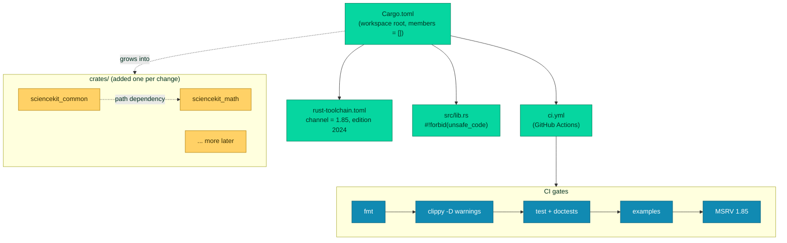

# Bootstrap: the Cargo workspace & CI

Every machine-learning library is, underneath, a collection of *many* small pieces that must agree on shared rules: how numbers are typed, how errors are reported, how code is formatted, and how it is proven to work. When `sciencekit` started, it was an empty repository — no code at all. The very first engineering decision was therefore not *which algorithm to write*, but **how to lay the ground** so that every later chapter has a stable place to stand. This chapter is about that foundation: a **Cargo workspace** that splits the library into sub-crates, a **pinned Rust toolchain**, and an automated **CI pipeline** that guards the whole thing.

## 1. The problem we were solving

Imagine you are going to build a house. You do not start by picking paint colors. You start with the foundation, the plumbing, the frame — the parts that are invisible once the house is finished but that *everything else* depends on.

A Rust library has the same hidden first step. Before you can write a single estimator, you need to answer boring-but-critical questions:

- **Where does the code live?** One giant folder, or several small, related folders?
- **Which version of the Rust language are we writing for?** Rust evolves every six weeks; we must say *exactly* which one we target.
- **How do we prove the code works?** Running the tests by hand on your laptop is not enough. A machine must re-run them automatically on every change, forever, so a mistake is caught the moment it is made.

If you skip these questions, you get a pile of code that:

- compiles on the author's machine but not anyone else's;
- mixes unrelated concerns in one huge, slow-to-compile crate;
- silently breaks because nobody re-ran the tests.

In `sciencekit`'s case the very first commit had **no code at all** — the repository was freshly initialized under the name `neurono-ml`. So the first task, called **Phase 0.1 "bootstrap"**, was to create the skeleton: a workspace, a pinned toolchain, and a CI pipeline. Nothing else. Two pull requests did this:

- **PR 96b77ab — "bootstrap sciencekit workspace"**: added `Cargo.toml` (the workspace root), `rust-toolchain.toml` (the pinned toolchain), a `LICENSE`, and a nearly-empty `src/lib.rs`.
- **PR dd3b524 — "add CI workflow"**: added `.github/workflows/ci.yml` with five automated *gates*.

Everything you will read in later chapters — `sciencekit_common`, `sciencekit_math`, every algorithm — sits on top of this skeleton. That is why the chapter is called "bootstrap": a library cannot build itself up until this scaffolding exists.

## 2. The decisions — and the roads not taken

A bootstrap is almost entirely *decisions about structure*. Here are the four big ones, and the alternatives we consciously rejected.

| Decision | Why we chose it | Alternatives we discarded |
|---|---|---|
| **Split into a Cargo workspace of `sciencekit_*` sub-crates** (PRD §3.1) | Compile times stay small (each sub-crate rebuilds independently), dependencies are isolated per area, and PRs stay small because each new area lands as its own crate. | **One giant crate.** Everything in a single crate forces a full recompile on every change and mixes concerns. Rejected at the architecture level (PRD §3.1). |
| **Empty `members = []` at bootstrap, sub-crates added one per change** | At bootstrap there is nothing to add yet. PRD §3.1 mandates sub-crates arrive *one per change* to keep PRs small; the workspace starts empty and grows deliberately. | **Create all sub-crates immediately.** Would have created a dozen empty crates with no content — noise and guessing about future boundaries. |
| **Pin the toolchain to exactly Rust 1.85, edition 2024** (PRD §3.6) | A clean clone compiles with *exactly* 1.85 regardless of the contributor's installed Rust. Upgrading becomes an explicit, reviewable change (the comment in `rust-toolchain.toml` says exactly this). | **No pin / "use whatever is installed".** Builds become non-reproducible — the same code behaves differently on different machines. Rejected because reproducibility is a core requirement. |
| **CI gates: fmt + strict clippy + test + examples + MSRV** | Each gate catches a different failure class early and automatically: formatting (consistency), clippy (likely bugs and code smells), tests (behavior), examples (documented usage compiles), and a dedicated MSRV job (guarantees 1.85 still builds). | **Only run `cargo test`.** Would pass even if formatting is chaotic or the code is full of warnings-as-errors; the stricter gates exist precisely to prevent those. |

Two smaller but telling decisions in the same spirit:

- **License: Apache-2.0** — chosen for the project (visible in `Cargo.toml`), standard for an international open-source library.
- **`src/lib.rs` declares `#![forbid(unsafe_code)]`** — a library this concerned with correctness opts *out* of `unsafe` Rust by default, so no unsound code can sneak in silently. (A later phase reintroduces a controlled, reviewable amount of `unsafe` for SIMD — but only behind explicit, approved features.)

## 3. The concepts, taught from zero

Before we read the files, we need three ideas from scratch. If you already know them, skim; if not, this is the whole foundation.

### 3.1 What is a "crate"? What is a "workspace"?

A **crate** is Rust's unit of compilation and distribution. Think of it as a *package*: it has a name, a version, a set of dependencies, and a set of source files. When you build, Rust compiles each crate as a unit.

A **workspace** is a collection of crates that are developed *together* in one repository. They share a single `Cargo.toml` at the root that lists them. You can build, test, and release them all with one command (`cargo build --workspace`).

Why does this matter for a library? Three reasons:

1. **Isolation.** If `sciencekit_math` (linear algebra) pulls in a heavy dependency, that dependency only affects `sciencekit_math`. The other crates do not see it, do not recompile because of it, and are not slowed down by it.
2. **Small PRs.** Each algorithm area becomes its own crate, added in its own change. Reviewers read one focused change instead of a megamorphic one.
3. **Reuse.** Sub-crates can depend on each other cleanly — `sciencekit_math` depends on `sciencekit_common`, for instance — using *path* dependencies (relative paths inside the workspace) rather than downloading from the internet.

Think of a workspace like a *monorepo*: one repository holding several related projects that know about each other.

### 3.2 Edition 2024 and MSRV

Rust has two "versions" knobs that beginners often confuse:

- **The edition** is a *language compatibility mode*. Every few years the Rust team makes a release that may change how some syntax behaves. To avoid breaking all existing code, they ship these as "editions" (`2015`, `2018`, `2021`, and now `2024`). Picking `edition = "2024"` just says "write this crate using the 2024 rules of the language." It is set once, in `Cargo.toml`.

- **MSRV** stands for **Minimum Supported Rust Version**. It is the *oldest* Rust compiler that this project promises to work with. Our MSRV is **Rust 1.85** (set via `rust-version = "1.85"` in `Cargo.toml`). This is a compatibility promise to users: they can build with 1.85 or anything newer.

There is also the subtle difference between the *two* places we record the toolchain:

- `rust-version = "1.85"` in `Cargo.toml` is a **promise to the world** — it says "1.85 is the minimum you need." It is metadata.
- `rust-toolchain.toml` is a **declaration for our own machines** — it says "use exactly 1.85, no matter what is installed." It *enforces* reproducibility for contributors and CI.

The difference matters: one is a guarantee, the other is a lock.

### 3.3 What is a CI pipeline? What are "gates"?

**CI** stands for **Continuous Integration**. The idea: instead of hoping everyone runs the tests locally, a *remote server* automatically runs a checklist of checks on every code change. If any check fails, the change is blocked — it cannot be merged.

Each check is a **gate**: a rule the code must pass to be accepted. Think of it like airport security — you do not board until every checkpoint clears. The `sciencekit` CI has five gates, and each guards a different failure:

| Gate | What it checks | What it catches |
|---|---|---|
| `fmt` | Does the code match `rustfmt`'s canonical formatting? | Chaotic, inconsistent whitespace/style that makes diffs unreadable. |
| `clippy` | Does the code pass linting with `-D warnings` (warnings *become errors*)? | Likely bugs, unnecessary clones, dead code, common mistakes. |
| `test` | Do all unit tests and doctests pass? | Broken behavior. |
| `examples` | Do the example programs compile and run? | Documentation/examples that have drifted from the real API. |
| `msrv` | Does everything still build and pass on *exactly* Rust 1.85? | Accidental use of features newer than the promised MSRV. |

The `msrv` gate is the subtle one: our own machines might run Rust 1.90, but if someone on 1.85 is promised support, the code must actually build there. A dedicated job running *exactly* 1.85 proves it. That is the "reproducibility promise" made real.

### 3.4 The naming convention: `SK` / `sk_`

One more foundation stone, defined in PRD §3.4, will be visible in *every* later chapter, so it is worth learning now:

- **No abbreviations**, except a single project prefix. Names must be complete and self-explanatory: `maximum_number_of_iterations`, not `max_iter`; `nearest_neighbors_count`, not `k`.
- The project prefix **`sk`** / **`SK`** is the *only* allowed abbreviation.
- **Structs and traits** get `SK` + PascalCase: `SKEstimator`, `SKStandardScaler`, `SKExecutionMode`.
- **Free functions, variables, and modules** get `sk_` + snake_case: `sk_train_test_split`, `sk_resolve_execution_plan`.
- **Methods** (functions inside an `impl` block) get **no** prefix: `fit`, `predict`, `execution_mode`.
- **Crates** always keep the full name `sciencekit_*` — never abbreviated.

Why? Machine-learning code is full of cryptic one-letter names (`k`, `c`, `X`, `y`). The project deliberately bans them for readability and self-documentation. The `sk` prefix is a *namespace marker*: it tells readers "this object belongs to sciencekit" the way a brand marks its products.

## 4. Each object, explained

For the bootstrap, the "objects" are configuration files and the workflow, not Rust structs. Each one is explained below in the same mini-structure.

### 4.1 `Cargo.toml` (workspace root)

*What it is.* The workspace's identity card and command center. It declares the crate `sciencekit` and the workspace that will hold the sub-crates.

*Why it exists.* It is where the workspace is born. It records the name, version, edition, license, MSRV, and — crucially — the empty list of workspace members. Here is the real content (from PR 96b77ab):

```rust
[package]
name = "sciencekit"
version = "0.1.0"
edition = "2024"
license = "Apache-2.0"
rust-version = "1.85"
description = "Machine Learning library in Rust reimplementing all of scikit-learn — extreme performance, zero-copy and native out-of-core."
repository = "https://github.com/neurono-ml/sciencekit"

[workspace]
resolver = "3"
members = []
```

*What we rejected.* Filling `members` with a dozen not-yet-written sub-crates. The decision (PRD §3.1) is to add sub-crates **one per change**, so `members` starts empty and grows deliberately. The `resolver = "3"` line picks the modern dependency-resolution strategy (required for edition 2024 workspaces).

### 4.2 `rust-toolchain.toml`

*What it is.* The reproducibility lock. It tells any machine that opens this repository, "install and use *exactly* this Rust toolchain."

*Why it exists.* To guarantee that a clean clone compiles identically for every contributor and for CI. The real content:

```toml
# Pin the exact Rust toolchain for reproducible builds (PRD §3.6).
# A clean clone compiles with exactly 1.85, edition 2024, regardless of the
# contributor's installed Rust. Upgrading the channel is an explicit, reviewable change.

[toolchain]
channel = "1.85"
components = ["rustfmt", "clippy"]
profile = "minimal"
```

Note the `components` line: it asks for `rustfmt` (the formatter) and `clippy` (the linter) to be installed alongside the compiler — the two tools our CI gates depend on. `profile = "minimal"` avoids installing extra docs/components we do not need, keeping clones fast.

*What we rejected.* Not pinning, or pinning to a moving "stable" channel. Both would break reproducibility.

### 4.3 `src/lib.rs` (the umbrella crate)

*What it is.* The root source file of the `sciencekit` crate — currently nearly empty.

*Why it exists.* It is the future *umbrella*: PRD §3.1 and §3.3 describe `sciencekit` as the crate that **re-exports** the public surface of all the `sciencekit_*` sub-crates, so users can write `use sciencekit::prelude::*` and get everything. At bootstrap there is nothing to re-export yet, so it carries only the two attribute declarations:

```rust
//! `sciencekit` — Machine Learning library in Rust reimplementing all of
//! scikit-learn, with extreme performance, zero-copy and native out-of-core.
//!
//! This crate is the umbrella re-export of the `sciencekit_*` sub-crates.

#![forbid(unsafe_code)]
#![warn(missing_docs)]
```

`#![forbid(unsafe_code)]` refuses any `unsafe` block (a correctness stance). `#![warn(missing_docs)]` warns when public items lack documentation (a quality gate — the whole library is to be documented).

*What we rejected.* Putting the umbrella crate logic inside the workspace root crate from day one. It will be a *separate* crate under `crates/` once there is something to re-export.

### 4.4 `.github/workflows/ci.yml` (the CI pipeline)

*What it is.* The automation recipe. It is a GitHub Actions workflow: a YAML file that tells GitHub's servers what to run on every push and every pull request.

*Why it exists.* To make the five gates (Section 3.3) run automatically and block bad changes. It triggers on `push` to `main` and on every `pull_request`. Let us look at the shape of two jobs, then the test job, then the MSRV job.

The **fmt** job checks formatting:

```yaml
  fmt:
    name: Formatting (cargo fmt)
    runs-on: ubuntu-latest
    steps:
      - name: Install Rust 1.85 toolchain (rustfmt)
        uses: dtolnay/rust-toolchain@1.85
        with:
          components: rustfmt
      - name: cargo fmt --all -- --check
        run: cargo fmt --all -- --check
```

Note the trick in the last step: `cargo fmt --check` does **not** reformat the code; it only *reports* whether the code already matches the canonical format. If a contributor forgot to format, this job fails.

The **clippy** job runs the linter with warnings promoted to hard errors:

```yaml
      - name: cargo clippy --workspace --all-targets -- -D warnings
        run: cargo clippy --workspace --all-targets -- -D warnings
```

The `-D warnings` flag is the teeth: a mere *warning* (e.g. an unnecessary `.clone()`) becomes a build **error**. This is deliberate strictness — the project would rather block a merge than ship a smell.

The **test** job runs everything:

```yaml
      - name: cargo test --workspace --all-targets
        run: cargo test --workspace --all-targets
```

`--workspace` builds and tests every sub-crate; `--all-targets` also builds test code, examples, and benchmarks so that *their* compilation is checked too.

And the **msrv** job re-runs build + test on the exact promised minimum, closing the reproducibility loop:

```yaml
  msrv:
    name: MSRV gate (exact 1.85)
    runs-on: ubuntu-latest
    steps:
      - name: Install exact Rust 1.85 toolchain (rustfmt + clippy)
        uses: dtolnay/rust-toolchain@1.85
        with:
          components: rustfmt, clippy
      - name: cargo build + test on exact 1.85
        run: |
          cargo build --workspace --all-targets
          cargo test --workspace --all-targets
```

*What we rejected.* A single catch-all `cargo test` job. Splitting fmt / clippy / test / examples / msrv into separate jobs means each failure is reported *independently and clearly*, and the CI can tell you exactly which guarantee was broken.

### 4.5 A peek at the future: the sub-crate layout

The workspace's *members* list is empty today, but the plan (PRD §3.1) is a folder tree like this:

```
sciencekit/
├── Cargo.toml              # workspace root (what we just made)
├── crates/
│   ├── sciencekit/                  # umbrella crate (re-exports)
│   ├── sciencekit_common/           # base traits, types, central errors
│   ├── sciencekit_math/             # linear algebra, BLAS, SIMD, sparse
│   ├── sciencekit_preprocessing/    # scalers, encoders, polynomial features
│   ├── sciencekit_linear_model/     # linear regressions, logistic, SGD
│   └── ...                          # one crate per algorithm area
└── docs/
```

To see how a sub-crate actually registers into the workspace, here is the real `sciencekit_math/Cargo.toml` (from a later phase). Notice it is a *member* only once its own change adds it to the root's `members` list, and it depends on `sciencekit_common` by **path**:

```rust
[package]
name = "sciencekit_math"
version = "0.1.0"
edition = "2024"
license = "Apache-2.0"
rust-version = "1.85"
description = "Computational kernels and the BLAS/LAPACK interface for sciencekit: pairwise distances, dense/sparse products, higher-order operations and memory-layout helpers."

[dependencies]
sciencekit_common = { path = "../sciencekit_common" }
faer = "0.24"
ndarray = { version = "0.17", features = ["rayon"] }
rayon = "1"
```

The `path = "../sciencekit_common"` is the workspace in action: an internal dependency resolved from a sibling folder, not from the internet.

## 5. A real walk-through, using the tests

Bootstrap (Phase 0.1) adds **no algorithm code and therefore no `*_tests.rs` files** — there is nothing to test yet. So the honest "executable example" here is the CI itself: what the pipeline actually runs on every change. Let us walk through the **test** job's command as if we were the machine.

### Step 1 — what `cargo test --workspace --all-targets` does

```bash
cargo test --workspace --all-targets
```

Run this in the terminal (it is what CI runs). Cargo:

1. Reads the root `Cargo.toml` and discovers the workspace and its `members`.
2. Compiles every crate in the workspace and their dependencies (the *build*).
3. Finds every `#[test]` function in every crate, builds them, and runs them.
4. Also builds and runs **doctests** — code examples written inside `///` documentation comments. These are real, executable tests that prove the documented examples still work.
5. With `--all-targets`, it additionally compiles examples and benchmarks, catching compilation errors in *those* too, even though it only runs the tests.

At bootstrap the output is essentially "0 tests" — but the *build* succeeds, which proves the workspace itself is sound. That is the whole point of this phase: a green build with nothing inside is the green light to start adding crates.

### Step 2 — how a gate *blocks* a change

Suppose a contributor (or an agent) pushes a change with a single formatting slip — say, an extra space. The `fmt` job runs:

```bash
cargo fmt --all -- --check
```

Because `--check` only verifies, it exits with a *non-zero status code* (a failure). GitHub Actions marks the job red. The pull request shows ❌ **Formatting (cargo fmt)**. The change is blocked until the contributor runs `cargo fmt --all` (without `--check`) to actually fix the formatting, then pushes again.

This is the loop that keeps the codebase healthy forever: *write → push → machine verifies every guarantee → fixes if any gate fails.*

### Step 3 — why the MSRV gate exists

Here is a scenario the `msrv` job is designed to catch. A developer's local Rust is version 1.90. They use a brand-new API that only exists in 1.90. It compiles fine locally, and `cargo test` passes. But the project *promises* support for 1.85. If nothing checks, this promise silently breaks.

The `msrv` job installs **exactly** 1.85 and builds + tests again:

```bash
cargo build --workspace --all-targets
cargo test --workspace --all-targets
```

If that 1.90-only API was used, the build fails *here* — even though it passed on the developer's machine. The promise is enforced, not assumed.

## 6. Look inside

<div class="sk-box sk-box--info">
<strong>The key insight of this chapter:</strong> a workspace and a CI pipeline are <em>the same idea at different scales</em>. The workspace splits a big thing (the library) into small, isolated, verified pieces. The CI gates split "does it work?" into small, isolated, verified checks. Both are about making correctness *provable and incremental* rather than trusting a single big "it probably works."
</div>

The relationship between all the pieces we built:



The workspace root points at the toolchain (what version to use), the umbrella `lib.rs` (the crate that will one day re-export everything), and the CI workflow. The CI runs the five gates in order. The `crates/` folder starts empty and is filled one sub-crate per change, wired together by path dependencies.

## 7. Recap

- **A Cargo workspace** splits the library into small, isolated `sciencekit_*` sub-crates so each area compiles independently, keeps PRs small, and shares dependencies by *path*.
- **Edition 2024** is a language compatibility mode; **MSRV 1.85** is a compatibility promise. `rust-toolchain.toml` *enforces* 1.85 on our machines, while `rust-version` in `Cargo.toml` *announces* it to the world.
- **CI is automated enforcement**: the five gates (`fmt`, `clippy -D warnings`, `test`, `examples`, `msrv`) each catch a different failure class, and a red gate blocks the change until it is fixed.
- **The naming convention** (`SK` / `sk_`, no other abbreviations) is decided now and applied to every object in every later chapter.
- **Bootstrap is the skeleton**: it contains no algorithms, but every algorithm that follows stands on it.

**Next chapter:** with the workspace and CI in place, the first real *content* arrives — the shared contract vocabulary in `sciencekit_common`, where `SKFloat`, `SKError`, and the fundamental traits like `SKEstimator` begin.