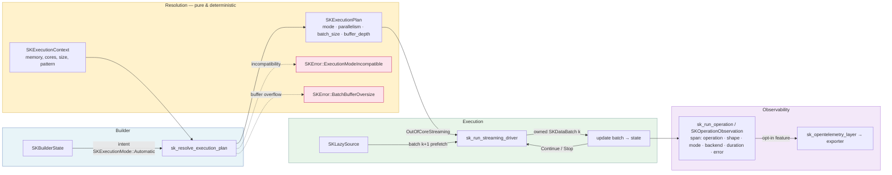

# Execution modes, resolution and observability

A machine-learning library cannot assume one-size-fits-all execution: the same algorithm
must run instantly on a small in-memory dataset, stream through one too large to fit in
RAM, or shuffle bytes off a memory-mapped file. And when it does run, an engineer needs to
*see* what happened — which mode was chosen, how long it took, whether it failed. This
chapter explains how `sciencekit` turns a loose *intent* ("just run it the best way") into a
concrete *plan* (a specific mode, thread count, and batch size), how that plan drives a
double-buffered streaming pipeline, and how every operation emits a trace span you can
export to OpenTelemetry.

---

## 1. The problem we were solving

Imagine you build a library that does math on datasets. Some datasets are tiny — a few
hundred rows, the kind you could hold in a spreadsheet. Others are enormous — a terabyte of
sensor readings that will never, ever fit in your computer's memory at once.

If you write your algorithm assuming one of these, you break the other. Assume "everything
fits in memory" and the big dataset crashes or swaps painfully. Assume "always stream" and
the tiny dataset pays an absurd overhead of threading and batching for no reason.

The naive solution is to make the *caller* decide: pass a flag that says "in-memory" or
"streaming". That works, but it is a burden on the user — and, worse, a source of bugs. The
user might pick "in-memory" for data that is actually too large, or pick "streaming" for an
algorithm that fundamentally needs random access (jumping to arbitrary positions), which
streaming cannot provide.

The library should be *smarter than that*. It should let the user say "just pick the right
one" (an **automatic** intent), and then decide for itself, based on how much memory is
available, how big the dataset is, and what kind of access the algorithm needs. That is the
first half of this chapter: **execution mode resolution**.

The second half is **observability**. When something runs — especially something slow or
concurrent — you want to know *what happened*. Did `fit` choose in-memory or streaming? How
many milliseconds did it take? Did it fail? Answering these questions requires wrapping every
operation in a "span" — a named, timed box of structured metadata — that a tracing system can
collect and export. This must be cheap by default and **opt-in** for export, so the default
library never sends telemetry traffic over the network.

Both halves share one philosophy, which the previous chapter called the library's core
strength: *push mistakes out of the running program and into the compiler and the types*.
We will see that philosophy again and again — in enums that make invalid states
unrepresentable, in a deterministic resolver that cannot depend on hidden global state, and
in a builder pattern that makes an unconfigured model impossible to construct.

---

## 2. The decisions — and the roads not taken

| Decision | Why we chose it | Alternatives we discarded |
|---|---|---|
| **Intent and plan are separate types** | The user declares a loose *intent* (`Automatic`, `InProcessSynchronous`, `OutOfCoreStreaming`…), stored in the builder. Only at operation time — when the dataset size is finally known — is that intent resolved into a concrete *plan* carrying mode, parallelism, and batch size. This lets fit and predict resolve differently, because their data sizes differ (spec `execution-decision`: "each heavy operation SHALL resolve its own plan"). | Resolving once at build time — but data size is unknown until the operation's input arrives, so a fixed plan would be wrong. |
| **Resolution is a pure, deterministic function with an injectable context** | `sk_resolve_execution_plan(intent, context)` reads *nothing* global: memory, cores, and dataset size are passed in an `SKExecutionContext`. Same inputs → same plan, guaranteed, and tests can inject a fake machine instead of reading the real one (spec `execution-planning`: "the context SHALL be providable by the caller, enabling deterministic tests independent of the machine"). | Reading `sysinfo` directly inside the resolver — makes every test depend on the physical machine and makes behavior non-reproducible. |
| **Automatic never fails; explicit incompatible modes fail loudly** | If the user says `Automatic`, the resolver always finds a compatible mode. If they insist on `OutOfCoreStreaming` for a random-access algorithm, it returns `SKError::ExecutionModeIncompatible` *before processing any data*, naming both sides of the conflict (spec: "automatic mode SHALL NEVER produce such an error"). | Silently downgrading an explicit choice — hides a likely programmer error behind surprising behavior. |
| **`SKExecutionMode` and `SKAccessPattern` are enums, `#[non_exhaustive]`** | A mode/pattern is one of a closed set; an enum makes "invalid mode" a compile-time error. `non_exhaustive` lets us add modes later without breaking consumers who `match` on them. | Free-form strings (`"streaming"`) — a typo would fail at runtime, and there'd be no central list of valid values. |
| **Observability is `tracing` spans, exported opt-in behind a feature flag** | Every operation opens a `tracing` span with structured fields (operation, shape, mode, backend, duration, error). Export to OpenTelemetry is gated behind the `observability-export` feature, so the default build compiles the export path out and emits no OTLP traffic (spec `observability`: "the default build emits no OTLP traffic"). | Instrumenting with a heavyweight SDK unconditionally — would force every consumer to configure an exporter they may not want. |

---

## 3. The concepts, taught from zero

### Rust concept 1: enums with data-carrying variants

An **enum** is a type whose value is exactly *one* of a fixed set of possibilities. In Rust
each possibility (a **variant**) can carry its own data. We met this in chapter 2 with
`SKDataView`. Here it powers the execution intent:

```rust
pub enum SKExecutionMode {
    Automatic,
    InProcessSynchronous,
    InProcessAsynchronous,
    OutOfCoreStreaming,
    OutOfCoreMemoryMapped,
}
```

A value of this type is one of those five — never two, never none. The compiler knows the
full list, so when we `match` on it we must handle every variant, and the compiler refuses
to let us forget one. `#[non_exhaustive]` above the enum tells the compiler: "outsiders
should still add a wildcard arm, because we may add variants in the future." Inside our own
crate we are exhaustive; outside, consumers write a `_ =>` catch-all to stay future-proof.

### Rust concept 2: the builder pattern — mandatory here

Rust structs often hold many optional settings. The **builder pattern** solves "too many
optional parameters" by giving you a chainable object that you configure step by step, then
finally ask to produce the real value.

In `sciencekit` this is *mandatory*: you cannot call a constructor directly. Every public
estimator exposes a builder, and construction goes through `build()` (spec `base-builders`).
Two shared pieces make this uniform across every algorithm:

- `SKBuilderState` — the reusable "storage drawer" that remembers the execution intent and
  knows how to resolve it into a plan.
- `SKBuilder` — the trait (an interface) every builder implements, guaranteeing the same two
  methods: `execution_mode(...)` and `build()`.

The reason this is mandatory is safety-by-construction: a model only ever exists after
`build()` has validated its configuration and returned `Result`. You cannot accidentally use
an unbuilt, half-configured model.

### Rust concept 3: fluent setters and the `Automatic` default

A builder method that returns `&mut Self` lets you chain calls. The key default is that the
execution intent starts as `Automatic`:

```rust
pub fn execution_mode<E>(&mut self, mode: E) -> &mut Self
where
    E: TryInto<SKExecutionMode>,
```

Notice the argument is generic over `E: TryInto<SKExecutionMode>`. We learned `TryInto` in
chapter 2. The point here: you can pass an `SKExecutionMode` directly (it converts
infallibly), and a mis-typed string *cannot compile*, because a string cannot `TryInto`
an `SKExecutionMode`. The `&mut self` return means you can chain: `.execution_mode(...)`
then `.build()`.

Because `SKBuilderState::new()` starts at `Automatic`, a consumer who never calls
`execution_mode` still gets automatic behavior — the requirement "a consumer who does not set
it still gets automatic execution."

### Rust concept 4: `Result` and error propagation

Functions that can fail return `Result<T, E>` — either `Ok(value)` or `Err(error)`. The
resolver returns `Result<SKExecutionPlan, SKError>`, and the builder's `build()` returns
`Result<Model, SKError>`. `SKError` is the central taxonomy we met in chapter 2; two variants
matter here:

```rust
#[error("execution mode `{mode}` is incompatible with the declared access pattern `{pattern}`")]
ExecutionModeIncompatible { mode: &'static str, pattern: &'static str },

#[error("streaming batch buffer overflow: {required_bytes} bytes needed (2 × {batch_bytes} per batch) exceeds {available_bytes} bytes available")]
BatchBufferOversize { batch_bytes: u64, required_bytes: u64, available_bytes: u64 },
```

The `#[error("...")]` comes from `thiserror`, which generates the human-readable message.
The fields give the caller *structured* information — not just "it failed", but exactly
which mode, which pattern, how many bytes were needed. The `?` operator propagates a
`Result` up the call stack automatically, but here the resolver builds its errors by hand
with `Err(...)` when it detects an incompatibility or an oversized buffer.

### Rust concept 5: threads, `Arc`, `Mutex`, and `Condvar` (the streaming driver)

The streaming driver runs two threads that share a buffer. Rust's answer to shared mutable
state is precise:

- **`Arc<T>`** (atomic reference count) is a smart pointer that many threads can hold a clone
  of; when the last clone drops, the value is freed. It lets the producer thread and the
  consumer thread both "hold onto" the same shared state.
- **`Mutex<T>`** wraps a value so only one thread can read/write it at a time (mutual
  exclusion). You lock it to get a guard, work, then drop the guard to release it.
- **`Condvar`** (condition variable) is a way for a thread to *wait* until a condition
  becomes true and be *notified* when it changes. The producer waits when the buffer is full;
  the consumer waits when the buffer is empty.

You will see these three working together in the walk-through: the buffer is `Mutex`-protected
state plus a `Condvar` for signaling, all shared through an `Arc`.

### Numerical concept 1: what "in-memory vs out-of-core" means

- **In-memory** execution: the whole dataset sits in RAM, so the algorithm can touch any
  element at any time (random access) and pass over it repeatedly. Fast, but bounded by memory.
- **Out-of-core** execution: the dataset is bigger than memory, so it lives on disk and is
  processed in pieces. Two flavors: **streaming** (read a sequential batch, compute, move on)
  and **memory-mapped** (the OS lazily pages parts of the file into memory as you access them,
  giving random access to a file larger than RAM).

### Numerical concept 2: what an access pattern is

An algorithm declares how it wants to touch data:

- **Sequential**: read a batch, move to the next, never look back — perfect for streaming.
- **RandomAccess**: jump to element *i* in O(1) — only possible in-memory or memory-mapped.
- **Iterative**: pass over the whole dataset repeatedly (e.g. gradient descent epochs) —
  fits in-memory or streaming, but not a single forward scan.

This is the crux of the incompatibility rule: you cannot stream an algorithm that needs
random access, because a streaming pipeline only hands you batches in order.

### Numerical concept 3: double buffering

In streaming, the reader (I/O) and the compute (math) are two different speeds. If the
reader waits for compute to finish before reading the next batch, the I/O sits idle. If
compute waits for the reader, the CPU sits idle.

**Double buffering** keeps both busy: while compute works on batch *k*, the reader fetches
batch *k+1* into a second buffer. When compute finishes batch *k*, the already-fetched
*k+1* is ready — no waiting. The `buffer_depth` in the plan (double buffering = `1`) is the
number of prefetched batches ahead. The guard in the resolver ensures two resident batches
fit in memory: if one batch is `B` bytes, double buffering needs `2 × B`, and if that exceeds
available memory the plan is rejected *before any data is processed*.

### Numerical concept 4: the "grain" — how many elements per thread

Parallelizing has a fixed overhead: spawning a thread and coordinating it costs time. If a
dataset is tiny, splitting it across threads costs *more* than it saves. So the resolver
needs a **grain**: the minimum number of elements per thread that justifies a thread. The
number of threads is `ceil(elements / grain)`, clamped to the core count. A 100-element
dataset below one grain (e.g. 1,024 elements) resolves to **one** thread; a 10-million-element
dataset resolves to `ceil(10,000,000 / 1,024) = 9,766`, clamped to, say, 8 cores. This is
why `parallelism` is part of the plan.

### Observability concept: `tracing` spans

`tracing` is a Rust library for structured, hierarchical logging. A **span** is a named
region of execution with a start, an end, and structured fields (key–value pairs). Spans can
nest (a `fit` span containing a `predict` span). A span is created, its fields are filled in
over time (some like `duration_ms` and `error` start *empty* and are filled at the end), and
it is finalized when the operation completes. An **OpenTelemetry layer** is a piece that plugs
a subscriber (the thing collecting spans) together with an exporter that sends them to a
collector (like Jaeger). Making that layer opt-in behind a feature flag keeps the default
build free of any network exporter.

---

## 4. Each object, explained

### `SKExecutionMode`

*What it is:* A `#[non_exhaustive]` enum with five variants — `Automatic`,
`InProcessSynchronous`, `InProcessAsynchronous`, `OutOfCoreStreaming`,
`OutOfCoreMemoryMapped`. It is the *intent* the consumer declares; it is stored in the
builder and can be `Copy` + `Clone` + `PartialEq` (cheap to duplicate and compare).

*Why it exists:* It separates "what the user wants" from "what will actually happen". The
user picks one value (or leaves it `Automatic`); the resolver later turns that into a plan.
The `Automatic` variant is the key: it is the default that lets the library decide.

*What we rejected:* Free-form strings and allowing arbitrary extra modes without a fixed
list. The enum makes invalid modes a compile-time error, and `non_exhaustive` still lets us
grow the set later.

### `SKAccessPattern`

*What it is:* A `#[non_exhaustive]` enum with three variants — `Sequential`, `RandomAccess`,
`Iterative`. It is *not* a user choice; it is a property the *algorithm* declares about how
it must touch its data.

*Why it exists:* It is the half of the compatibility check the user never controls. The
resolver consults it to decide *whether* a requested mode is even possible: random access
can never stream.

*What we rejected:* Letting the user set the access pattern (they would not know the
algorithm's internals) and deriving it heuristically at runtime (unsafe, opaque). The
algorithm author declares it once, honestly, and the type keeps it honest.

### `SKExecutionContext`

*What it is:* A plain struct holding the *inputs to resolution*: `available_memory_bytes`,
`cpu_cores`, `dataset_size_bytes`, `dataset_elements`, `scalar_size_bytes`, `grain`,
`access_pattern`, and `batch_size_hint`. It has two constructors: `real()` reads the physical
machine (memory via `sysinfo`, cores via `thread::available_parallelism`), and tests build
their own by hand with simulated values.

*Why it exists:* It makes resolution *pure* — all the environment enters through one explicit
argument rather than hidden global state. That is what lets tests inject a fake 1-byte machine
and get deterministic answers, and it is what makes "same inputs, same plan" a guarantee.

*What we rejected:* Reading the machine inside the resolver. That couples every resolution to
the physical environment, breaks reproducibility, and makes the resolver impossible to unit
test.

### `SKExecutionPlan`

*What it is:* A struct with four fields — `mode`, `parallelism`, `batch_size: Option<usize>`,
and `buffer_depth`. It is the *output* of resolution, `PartialEq + Eq` so two plans can be
compared for equality.

*Why it exists:* It is the concrete, executable decision: "run in this mode, on this many
threads, in batches of this size (if streaming), prefetching this many batches ahead." It is
what an algorithm actually consumes to run an operation.

*What we rejected:* Confusing the plan with the intent (they are deliberately different
types), and leaving `parallelism`/`batch_size` out — an executable plan needs all of them.

### `sk_resolve_execution_plan`

*What it is:* The free-scope public function `sk_resolve_execution_plan(intent, context) ->
Result<SKExecutionPlan, SKError>`. It `match`es the intent; for `Automatic` it compares
`dataset_size_bytes` to `available_memory_bytes`. If it fits, the mode is
`InProcessSynchronous`; if not, the mode follows the access pattern (`RandomAccess` →
`OutOfCoreMemoryMapped`; `Sequential`/`Iterative` → `OutOfCoreStreaming`). Explicit modes are
kept unless a streaming intent meets a random-access pattern, which returns
`ExecutionModeIncompatible`. Parallelism comes from `parallelism_for(mode, context)`, and the
buffer guard `check_buffer_guard(context)` rejects an oversized double-buffer footprint.

*Why it exists:* It is the pure, deterministic heart of the whole design (spec
`execution-decision`). "Intent + context → plan" with no hidden state, so it is safe to call
from any number of threads concurrently.

*What we rejected:* Resolving against the physical machine directly, and allowing automatic
to ever produce an incompatibility error (it never does — automatic always picks a compatible
mode).

### `sk_run_streaming_driver`

*What it is:* The free-scope function that actually runs a streaming operation:
`sk_run_streaming_driver(source, state, update, plan) -> Result<(), SKError>`. It spawns a
dedicated producer thread that pulls batches from an `SKLazySource` into a bounded
double buffer, while the caller's thread consumes each owned `SKDataBatch` and applies the
algorithm-supplied `update(batch, parallelism, state)` closure. `update` returns an
`SKStreamDecision` (`Continue` or `Stop`) to steer the pipeline.

*Why it exists:* It implements the prefetch contract — input and computation overlap, batches
arrive in order and fully owned, and a mid-stream read error surfaces as a central `SKError`
with the effects of earlier batches preserved. This is the executor the plan's streaming modes
drive.

*What we rejected:* Reading and computing on the same thread (no overlap), and letting the
algorithm push unboundedly ahead (hence the bounded buffer of `buffer_depth`).

### `SKBuilderState`

*What it is:* A struct holding one field, `execution_intent: SKExecutionMode`, defaulting to
`Automatic`. It offers `execution_mode(...)` (the chainable setter), `execution_intent()`
(the getter), and `resolve_plan(context)` which delegates to `sk_resolve_execution_plan`.

*Why it exists:* It is the reusable "storage drawer" every algorithm builder embeds, so the
execution-intent plumbing is written *once* instead of per algorithm (spec `base-builders`).
It carries the `Automatic` default and knows how to turn stored intent into a concrete plan.

*What we rejected:* Each algorithm re-implementing intent storage and resolution — duplicated
logic and drifting defaults. A single shared state type keeps the default uniform everywhere.

### `SKBuilder`

*What it is:* A trait with two methods: `execution_mode<E>(&mut self, mode: E) -> &mut Self
where E: TryInto<SKExecutionMode>` and `build(self) -> Result<Model, SKError>`.

*Why it exists:* It is the mandatory contract every estimator builder implements, so all
builders *look* the same: configure execution, call `build()`, get a `Result`. It encodes
"construction always goes through `build()`" at the type level (spec `base-builders`).

*What we rejected:* Letting algorithms skip the builder (they can't — the trait and shared
state are the foundation every one compiles against) and `build()` returning a bare model
instead of a `Result` (loses the guarantee that invalid config surfaces as an error, not a
panic).

### `SKOperationKind` and `SKBackendKind`

*What it is:* Two enums of bounded strings. `SKOperationKind` is the closed set of library
operations that emit spans (`Fit`, `PartialFit`, `FitTransform`, `Transform`, `Predict`,
`FitPredict`, `Score`). `SKBackendKind` is the closed set of math backends (`Faer`,
`MatrixMultiply`, `NdArrayLinalg`). Both implement `Display` so they render as clean strings
like `"fit"` and `"faer"`.

*Why it exists:* Structured observability needs bounded, compiler-checked values. Modelling
these as enums means a misspelled operation or backend is a compile-time error, not a runtime
surprise (spec `observability`: "the compiler rejects invalid values ... instead of letting
them surface at runtime").

*What we rejected:* Free-form `String` attributes in the span — a typo would silently produce
a mislabeled trace.

### `SKOperationAttributes`

*What it is:* A struct bundling the structured fields of an operation span: `operation`
(`SKOperationKind`), `rows`, `columns`, `execution_mode` (`SKExecutionMode`), and `backend`
(`SKBackendKind`).

*Why it exists:* It is the single, type-safe bundle handed to the observability system when a
span opens — one argument instead of five, all compiler-checked. Note it carries the resolved
`execution_mode`, so a trace tells you *which* mode an operation actually ran in.

*What we rejected:* Passing each field separately to the span opener, and letting the span
record raw, untyped values.

### `SKOperationObservation`

*What it is:* A live span wrapper. It is created with `begin(attributes)`, runs work via
`in_scope(...)` (or `enter()`), records a failure with `record_error(&error)`, and closes with
`finish()`, which stamps the elapsed `duration_ms` onto the span.

*Why it exists:* It encapsulates the `tracing::Span` lifecycle so callers never touch `tracing`
directly and never forget to fill `duration_ms` or record an error.

*What we rejected:* Exposing the raw `tracing::Span` and making callers manage its lifecycle —
error-prone, and easy to leak a span.

### `sk_run_operation`

*What it is:* A convenience function: `sk_run_operation(attributes, operation) -> Result<T, E>`.
It opens an observation, runs the closure `operation`, records any error on the span, finishes
the span, and returns the result unchanged.

*Why it exists:* It is the one-liner algorithm crates wrap each public operation in, so every
`fit`/`predict`/`transform` is automatically traceable with failure visible in the trace
(spec `observability`: "each public operation ... so failures stay visible in the trace").

*What we rejected:* Requiring each algorithm to hand-roll span open/error/close — duplication
and easy to get wrong.

### `sk_opentelemetry_layer`

*What it is:* A free-scope function that builds a `Box<dyn tracing_subscriber::Layer<...>>`
wiring `tracing` to an OpenTelemetry tracer, given a `tracer_name`. It is only compiled when
the `observability-export` feature is on.

*Why it exists:* It is the opt-in export path. The consumer configures the OpenTelemetry
tracer provider and combines the returned layer with their subscriber; the default build
compiles this out entirely and never initializes an exporter (spec `observability`: "the
default build emits no OTLP traffic").

*What we rejected:* Initializing an exporter by default, or coupling the library to a specific
tracing subscriber — both would force telemetry behavior on consumers who don't want it.

---

## 5. A real walk-through, using the tests

The most convincing way to learn is to read actual passing tests. Here are three — one from
`execution_tests.rs` and two from `streaming_driver_tests.rs`.

### Test 1: `automatic_oversized_sequential_streams`

This test proves that when an automatic intent meets a dataset larger than memory with a
sequential access pattern, resolution picks streaming with the declared batch size.

```rust
#[test]
fn automatic_oversized_sequential_streams() {
    let ctx = simulated(
        1 << 30,          // available memory = 1 GiB
        4,                // CPU cores
        1 << 40,          // dataset size = 1 TiB  → larger than memory!
        None,             // dataset_elements unknown
        8,                // scalar size = 8 bytes (f64)
        SKAccessPattern::Sequential,
        Some(1024),       // batch size hint = 1024 elements
    );
    let plan = sk_resolve_execution_plan(SKExecutionMode::Automatic, &ctx).unwrap();
    assert_eq!(plan.mode, SKExecutionMode::OutOfCoreStreaming);
    assert_eq!(plan.batch_size, Some(1024));
}
```

Line by line:

1. `let ctx = simulated(...)` — we call the test helper `simulated`, which builds an
   `SKExecutionContext` *by hand*, never touching the physical machine. The `1 << 30` is
   bit-shift notation for `2^30` = 1 GiB of available memory; `1 << 40` is `2^40` = 1 TiB of
   dataset. The dataset is a thousand times bigger than memory.
2. `SKAccessPattern::Sequential` tells the resolver the algorithm reads in order, so streaming
   is a legal option. `Some(1024)` is the caller's batch-size hint.
3. `sk_resolve_execution_plan(SKExecutionMode::Automatic, &ctx)` — automatic intent. Inside,
   the resolver sees `dataset_size_bytes (1 TiB) <= available_memory_bytes (1 GiB)` is false,
   so the dataset does *not* fit in memory. It then matches the access pattern `Sequential`
   and picks `OutOfCoreStreaming`. `.unwrap()` asserts the `Result` is `Ok`.
4. `assert_eq!(plan.mode, SKExecutionMode::OutOfCoreStreaming)` — confirms the mode.
5. `assert_eq!(plan.batch_size, Some(1024))` — confirms the batch hint flowed into the plan,
   because in streaming mode `batch_size` is the hint (in other modes it is `None`).

The lesson: a single automatic intent produced a *streaming* plan purely from context — no
user flag, no hidden machine reads.

### Test 2: `ordered_delivery_of_owned_batches`

This test proves the streaming driver hands batches to the compute step in source order, and
that each batch's data survives even after the source has moved past it (i.e. the batch is
*owned*, a copy, not a borrow).

```rust
#[test]
fn ordered_delivery_of_owned_batches() {
    let (mut source, _read_log, _outstanding, _max) = RecordingSource::new(5, None);
    let update =
        |batch: SKDataBatch<f64>, _parallelism: usize, state: &mut Vec<(usize, Vec<f64>)>| {
            let data = batch.data().as_slice_memory_order().unwrap().to_vec();
            state.push((batch.position(), data));
            SKStreamDecision::Continue
        };
    let mut state = Vec::new();
    sk_run_streaming_driver(&mut source, &mut state, update, &streaming_plan()).unwrap();

    assert_eq!(state.len(), 5);
    for (index, (position, data)) in state.iter().enumerate() {
        assert_eq!(*position, index);
        assert_eq!(data, &[index as f64]);
    }
}
```

Line by line:

1. `RecordingSource::new(5, None)` — the test's instrumented source, `total = 5` batches,
   `fail_at = None` (never fails). It also returns three shared log handles
   (`read_log`, `outstanding`, `max`) we ignore here.
2. The `update` closure is the algorithm's per-batch step. Its signature is
   `(batch, parallelism, state)`. Here `state` is a `Vec<(position, data)>` we accumulate.
   Inside, `batch.data()` returns a view of the batch's matrix; `.as_slice_memory_order()
   .unwrap().to_vec()` copies it into an owned `Vec<f64>`, and we push `(position, data)`.
   We return `SKStreamDecision::Continue` to keep going.
3. `let mut state = Vec::new()` — the algorithm's mutable accumulator.
4. `sk_run_streaming_driver(&mut source, &mut state, update, &streaming_plan()).unwrap()` —
   run the pipeline. The driver's producer thread pulls batches from `source` into the
   double buffer; the caller's thread calls `update` for each in order. `.unwrap()` asserts
   success.
5. The assertions: `state.len() == 5` (all five batches delivered), and for each index, the
   `position` equals the index and the `data` equals `[index as f64]` — i.e. batch *k*
   arrived at step *k*, holding the value *k*. Because we copied into an owned `Vec`, the
   assertion works even though the source has already produced the next batch — proving
   ownership.

The lesson: ordering is exact, and each batch is a fully owned `SKDataBatch`, safe to use
after the source advances — exactly what the double-buffer prefetch promises.

### Test 3: `early_stop_halts_the_pipeline`

This test proves an `update` returning `Stop` halts the pipeline, keeps the current batch's
effect, reads no batch beyond the one prefetched, and returns without error.

```rust
#[test]
fn early_stop_halts_the_pipeline() {
    let (mut source, read_log, _outstanding, _max) = RecordingSource::new(8, None);
    let update = |batch: SKDataBatch<f64>, _parallelism: usize, state: &mut Vec<usize>| {
        state.push(batch.position());
        if batch.position() == 2 {
            SKStreamDecision::Stop
        } else {
            SKStreamDecision::Continue
        }
    };
    let mut state = Vec::new();
    let result = sk_run_streaming_driver(&mut source, &mut state, update, &streaming_plan());

    assert!(result.is_ok(), "early stop should return without error");
    assert_eq!(state, vec![0, 1, 2]);
    let max_read = read_log
        .lock()
        .unwrap()
        .iter()
        .map(|(index, _)| *index)
        .max()
        .unwrap();
    assert!(
        max_read <= 3,
        "read beyond the prefetched batch: up to index {max_read}"
    );
}
```

Line by line:

1. `RecordingSource::new(8, None)` — a source of 8 batches, never failing. We keep
   `read_log` this time.
2. `update` pushes each batch's position, then returns `Stop` exactly when `position == 2`,
   otherwise `Continue`.
3. `sk_run_streaming_driver(...)` — note we do **not** `.unwrap()`; we capture `result`.
4. `assert!(result.is_ok())` — stopping early is a normal, successful end; no error.
5. `assert_eq!(state, vec![0, 1, 2])` — the effect of batches 0, 1, 2 is kept; batch 2 was
   the last processed.
6. We inspect `read_log` (the recorded read timestamps). Since `buffer_depth = 1` (double
   buffering), when compute stopped at batch 2 the producer had already prefetched batch 3 —
   so `max_read <= 3` proves we read *at most* one batch ahead and then halted. No batch 4+.

The lesson: the driver hands control flow back to the algorithm through the return value of
`update` — stopping is cooperative, keeps work already done, and bounds how far ahead the
reader can go by the buffer depth.

---

## 6. Look inside

<div class="sk-box sk-box--tip">
  <p><strong>One strong insight:</strong> the whole design is about separating <em>what the
  user wants</em> (a loose intent), <em>what the machine allows</em> (a context), and
  <em>what will actually run</em> (a concrete plan). The resolver is the pure bridge between
  them — deterministic, injectable, and incapable of silently ignoring a mistake the user
  made explicit.</p>
</div>

Here is the end-to-end flow from intent to streaming execution:



Reading the diagram: the builder holds the intent; resolution combines it with an injected
context to produce a concrete plan (or a precise error); a streaming plan drives the
double-buffered driver, which feeds owned batches to the algorithm's `update`; and every
operation runs inside an observability span, exported only if the feature is on.

---

## 7. Recap

- **Intent and plan are different.** The user stores a loose `SKExecutionMode` (defaulting to
  `Automatic`); the operation resolves it against a context into a concrete `SKExecutionPlan`
  with mode, parallelism, batch size, and buffer depth.
- **Resolution is pure and deterministic.** `sk_resolve_execution_plan(intent, context)` reads
  nothing global, so the same inputs always yield the same plan and tests can inject a fake
  machine.
- **Automatic never fails; explicit errors are loud.** Automatic always finds a compatible
  mode; an explicit streaming intent on a random-access algorithm fails before processing any
  data with `ExecutionModeIncompatible`, and an oversized double-buffer footprint fails with
  `BatchBufferOversize`.
- **The builder pattern is mandatory.** Every estimator goes through a typed builder embedding
  `SKBuilderState` and implementing `SKBuilder`, so construction always passes through
  `build()` → `Result` and the execution intent always defaults to `Automatic`.
- **Streaming double-buffers.** `sk_run_streaming_driver` overlaps input and compute through a
  bounded buffer, delivers ordered owned batches, and lets `update` stop the pipeline early.
- **Observability is opt-in.** Every operation runs under a `tracing` span with structured
  fields; exporting to OpenTelemetry is gated behind the `observability-export` feature so the
  default build emits no telemetry traffic.

*Next chapter:* now that an operation can resolve how it runs and be traced while it runs, we
turn to the computational core — how the heavy math kernels are selected and parallelized
under the hood.