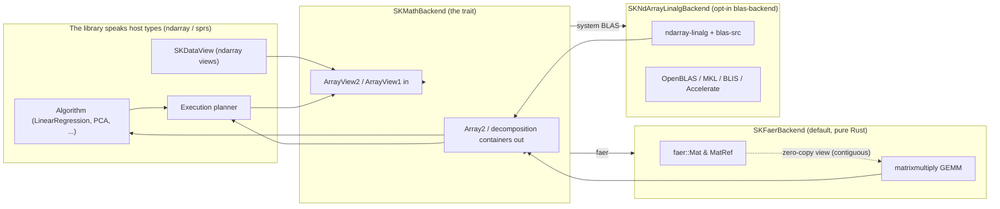

# Ch. 5 — The host-centric backend

The backend that does the heavy math started out married to one linear-algebra library
(`faer`) and one numeric type (`f64`), so every algorithm that wanted a matrix product or
a decomposition was stuck with that library's data types. This chapter is the story of
how we broke that marriage: we made the backend *host-centric* — it speaks only in the
library's own vocabulary (`ndarray` views in, `ndarray` results out) — and made the
*choice* of who actually computes replaceable, without touching a single caller.

---

## 1. The problem we were solving

Imagine you run a restaurant. The kitchen uses one specific brand of stove, and every
menu item is written as "cook it on *that exact stove*." Now you want to add a faster
stove, or a cheaper one, and offer both. You would have to rewrite every recipe. Worse,
the waiters (your algorithms) would have to learn how each stove works just to write down
an order.

That was our situation. The math backend — the code that multiplies matrices and factorizes
them — used `faer`, a pure-Rust linear-algebra library, and hard-coded the floating-point
type `f64`. Its public methods took `faer::Mat` and returned `faer::Mat`. So every
algorithm that wanted a matrix operation had to think in `faer`'s types. There was no way
to swap in a system-optimized BLAS library (OpenBLAS, MKL, Accelerate) without rewriting
the algorithms. And there was only one numeric type, `f64` — no room for the lighter, 
faster `f32` that many models use to save memory.

What goes wrong without a fix? Every new algorithm (Linear Regression, PCA, Ridge, GMM —
the roadmap was filling up) would be welded to `faer`, and adding a second backend would
mean touching everything. The library could not grow. So we asked a simple question:
*what is the smallest, cleanest promise a math backend can make to the rest of the library?*

The answer became the guiding idea of this whole chapter: **the backend adapts to the
library, not the other way around.** The library already has its own container type,
`ndarray`, for dense numbers. So the backend's public surface is written in `ndarray`
terms — you hand it a *view* of your numbers, it hands back an *owned* result. Whether
`faer`, a system BLAS, or (much later) a GPU sits behind the curtain is the backend's
private business.

---

## 2. The decisions — and the roads not taken

| Decision | Why we chose it | Alternatives we discarded |
|---|---|---|
| **Host-centric, concrete surface** — the trait takes `ArrayView2<F>` and returns `Array2<F>` | The rest of the crate already treats `ndarray` as its canonical host container. A GPU backend is explicitly deferred, so we don't need device types yet. Simplest thing that works for zero-copy, lazy, and out-of-core. (design Decision 1) | Backend-native associated types (`MatOwned`/`MatRef<'a>`) — device-ready but drags in generics/GATs for a GPU we aren't building yet; a generic matrix trait `M` — pushes the faer×ndarray×GPU unification problem onto *every* call site. |
| **Generic over `SKFloat`, not hard-coded `f64`** | Algorithms want both `f32` and `f64`; `SKFloat` is the sealed bound that already exists and admits exactly those two (proposal "What Changes"). | Keeping `f64` only — blocks half the users and the memory savings of `f32`. |
| **LU pivot is a host `Vec<usize>`** | LAPACK `ipiv` and faer's pivot are exactly this; every result is host-resident, so there is no backend-specific pivot representation to abstract over. (design Decision 2) | A `PivotInfo` associated type — extra machinery with nothing to abstract. |
| **Default = pure-Rust `faer`; system BLAS is opt-in** | `faer` compiles on Rust 1.85 with no C toolchain, so a default build "just works" everywhere. `ndarray-linalg`+`blas-src` (OpenBLAS/MKL/Accelerate) is gated behind the `blas-backend` feature, off by default. (spec `blas-interface`) | Making BLAS the default — would force every user to install a C/Fortran BLAS even to try the library. |
| **`lstsq` is a first-class backend op** | scikit-learn calls LAPACK `gelsd` for Linear Regression; centralizing rank-deficiency and `rcond` truncation in one place beats re-implementing tolerance logic per algorithm. (design Decision 7) | Composing `lstsq` from `svd`/`pinv` in every algorithm — slow (full vs truncated SVD) and duplicated. |

---

## 3. The concepts, taught from zero

Before we read any code, let's build the two ideas you need: what a *trait* is, and what
"host-centric" really means. We'll also touch on the small vocabulary the code uses.

### A trait is a contract

A **trait** in Rust is a set of promises a type makes. Think of an electrical outlet: the
outlet promises *"any device with the right plug can draw power here."* The device doesn't
care where the electricity comes from, and the outlet doesn't care what the device is. A
trait works the same way.

```rust
pub trait SKMathBackend<F: SKFloat>: Send + Sync {
    fn kind(&self) -> SKBackendKind;
    fn gemm(&self, a: ArrayView2<F>, b: ArrayView2<F>, alpha: F, parallelism: usize) -> Array2<F>;
    // ... and many more
}
```

This says: *"any type that wants to be a math backend must provide a `kind`, a `gemm`, a
`svd`, and so on."* The outlet (the trait) doesn't say *how* to compute — it just says the
plug fits. A backend like `SKFaerBackend` then declares "I am a math backend" and fills in
each method using its own library.

### Generic over `<F: SKFloat>`

The `<F: SKFloat>` is a **generic parameter** — a placeholder for a type, the way a
recipe's "add flour" leaves *how much flour* open. The little `: SKFloat` is a **bound**:
it means `F` is not *any* type, only types that implement `SKFloat`. And `SKFloat` is
**sealed**: only `f32` and `f64` can ever be `SKFloat`, because only those two are
declared to implement it. So `<F: SKFloat>` is a polite way of saying "this works for
`f32` and `f64`, and nothing else."

The whole trait is written once, generically over `F`. Then for each concrete float we
plug in the real types — `ArrayView2<f64>`, `ArrayView2<f32>`, and so on — automatically.

### `dyn` vs generics: why a box, not a concrete type

Rust has two ways to use a trait. **Generics** bake the concrete type in at compile time:
`SKFaerBackend::new().gemm(...)` knows exactly which type it is, so the compiler can make
everything fast and type-safe. But generics make the *caller* name the type.

Sometimes the caller doesn't know — or doesn't care — which backend it has. It just wants
"a math backend." That's where `dyn` comes in. `Box<dyn SKMathBackend<F>>` is a
**trait object**: a pointer to *some* value that happens to implement `SKMathBackend<F>`.
The caller holds the box and calls the trait's methods; the actual type is decided at
runtime (the dispatch function decides, below).

Why not always use `dyn`? Because a trait object adds a small runtime indirection and the
compiler can't inline it. Why not always use generics? Because the *default backend is
chosen by build configuration*, not by the caller — we literally do not know which type
will be there. So we use generics for the concrete backends (fast, in algorithms that name
them) and `dyn` at the boundary where configuration picks the type (`Box<dyn
SKMathBackend<F>>`). Each tool for its job.

### What "host-centric" means

The word **host** means "the machine the program runs on" — your CPU and RAM, as opposed to
a separate device like a GPU. **Host-centric** is a design rule: the library's public
vocabulary is the host's vocabulary (`ndarray` for dense data, `sprs` for sparse data),
and the backend must translate to and from it at the door.

Concretely: the trait's inputs are `ArrayView2<F>` — **views**, which are a *borrowed*
window over data that already exists (zero copies). Its outputs are `Array2<F>` — **owned**
containers, fresh memory the caller takes possession of. No `faer` type appears anywhere
in the public surface. If we swap the backend from `faer` to `ndarray-linalg`, every
algorithm keeps talking to `ndarray` exactly as before; only the door changes.

```rust
fn assert_host_centric_surface<F: SKFloat, B: SKMathBackend<F> + ?Sized>(
    backend: &B,
    a: Array2<F>,
) {
    let _ = backend.gemm(a.view(), a.view(), F::one(), 1);
    let _: Result<SKSingularValueDecomposition<F>, _> = backend.svd(a.view());
    let _: SKQRDecomposition<F> = backend.qr(a.view());
    // ...
}
```

This test compiles *if and only if* the trait's public surface is free of `faer` types.
It's the compiler enforcing "host-centric" for us — a theme we'll revisit in the walk-through.

### A small vocabulary of the code

- **`ndarray`** — the library's dense-array container. `Array2<F>` is a 2-D grid of `F`
  (a matrix); `ArrayView2<F>` is a read-only *view* over one (borrowed, no copy).
- **`SKFloat`** — the sealed scalar bound; only `f32` and `f64`.
- **`SKBackendKind`** — a small enum naming which backend produced a result (`Faer`,
  `MatrixMultiply`, `NdArrayLinalg`), recorded in observability spans.
- **`SKError`** — the crate's central error type; backends map their library's errors into
  it so callers never see a `faer` or LAPACK error.
- **Decompositions** — ways to rewrite a matrix into simpler pieces: SVD, QR, LU,
  Cholesky. They're the building blocks of many ML algorithms.

---

## 4. Each object, explained

### `SKMathBackend<F>` (trait)

*What it is* — The single contract for "a thing that can do heavy dense algebra." It
declares the operations the library needs: `gemm` (matrix multiply), `svd`, `qr`,
`cholesky`, `solve_triangular`, `solve`, `eigh`, `lu`, `slogdet`, `pinv`, `inv`, `lstsq`,
`norm`, and `vector_norm`. It is generic over `F: SKFloat`, so the same contract serves
both `f32` and `f64`. It is `Send + Sync`, so a math operation can be shared across
threads (an execution plan can fan the work out).

*Why it exists* — It is the **abstraction boundary**. Everything above it (the algorithms,
the execution planner) talks only to this trait, in `ndarray` terms. Everything below it
(the concrete backends) does the actual number crunching. The library is written once,
against the trait, and any backend that honors the trait plugs in.

*What we rejected* — We rejected leaking concrete types into the trait (the old `f64` +
`faer::Mat` surface), associated matrix types that would make the surface device-ready
now, and making the trait async (the backend stays eager and pure; concurrency is the
execution planner's job). Also rejected: hard-coding a sequential GEMM — the trait takes a
`parallelism` argument so large products scale with the plan.

### `SKNormKind<F>` (enum)

*What it is* — The set of matrix/vector norm orders the backend understands: `Frobenius`,
`L2`, `L1`, `Infinity`, their negatives, `Nuclear`, and a `General { order: F }` fallback
for arbitrary p-norms. It mirrors `numpy.linalg.norm` / `scipy.linalg.norm`.

*Why it exists* — Many algorithms need a norm (a single number measuring "size") in
different flavors. Instead of a zoo of separate methods, one `norm` / `vector_norm`
method takes an `SKNormKind` to say which flavor.

*What we rejected* — We rejected a separate method per order, and we kept the `General`
p-norm fallback rather than only hard-coding the common cases.

### The decomposition containers

These four structs are the *results* a backend returns. Crucially, each holds plain
`Array2<F>` fields — owned ndarray matrices — so the result does not depend on which
backend produced it. That is the host-centric promise made visible: you can take a
decomposition from `faer`, hand it to the BLAS backend, and both are the same type.

#### `SKSingularValueDecomposition<F>`

*What it is* — The result of a singular value decomposition `A = U Σ Vᵀ`: fields `u`
(left singular vectors, `Array2<F>`), `singular_values` (a `Vec<F>`, non-increasing), and
`v` (right singular vectors, `Array2<F>`).

*Why it exists* — SVD is the workhorse behind pseudo-inverses, `lstsq`, PCA, and the
spectral norm. A concrete, backend-independent container means an algorithm can use the
result without caring who computed it.

*What we rejected* — Backend-native SVD types (`faer`'s `Svd`, LAPACK's), which would
leak the backend into every consumer.

#### `SKQRDecomposition<F>`

*What it is* — The result of a (thin) QR decomposition `A = Q R`: fields `q` (orthogonal
factor) and `r` (upper-triangular factor), both `Array2<F>`.

*Why it exists* — QR is a numerically stable way to solve least-squares problems and to
find orthonormal bases.

*What we rejected* — Any backend-specific QR representation.

#### `SKLUDecomposition<F>`

*What it is* — The result of an LU decomposition `P A = L U`: fields `pivot` (a host
`Vec<usize>` row permutation where `pivot[i]` is the original row that lands at position
`i`), `l` (unit-lower-triangular), and `u` (upper-triangular).

*Why it exists* — LU is the engine behind `solve` and `inv`. The pivot is kept as a plain
`Vec<usize>` so the row permutation is portable and readable.

*What we rejected* — A `PivotInfo` associated type (design Decision 2): every result is
host-resident, so there is nothing backend-specific to abstract.

#### `SKLeastSquaresSolution<F>`

*What it is* — The result of a minimum-norm least-squares solve `x = argmin ‖b - A x‖₂`:
fields `solution` (`Array2<F>`), `rank` (the effective rank after `rcond` truncation),
`singular_values` (`Vec<F>`), and `residual_sum_of_squares` (an `Option<Vec<F>>`, present
when the system is overdetermined, i.e. more rows than columns).

*Why it exists* — It bundles everything an algorithm (like Linear Regression) needs to
report how well the fit worked, in one backend-neutral struct.

*What we rejected* — Returning only the solution and making callers recompute rank and
residuals — duplicated tolerance logic per caller.

### `SKFaerBackend`

*What it is* — The pure-Rust default backend. A tiny, zero-field struct that implements
`SKMathBackend<F>` for both `f32` and `f64` by delegating to the `faer` library. GEMM uses
faer's blocked `matmul` (honoring `parallelism`); decompositions delegate to faer's
high-level SVD/QR/Cholesky/LU/eigendecomposition. No C or Fortran BLAS is linked.

*Why it exists* — It is the out-of-the-box path: compiles on Rust 1.85 with no external
toolchain, so a default build "just works" for everyone (spec `blas-interface`).

*What we rejected* — Making a C BLAS the default (would force toolchain setup); using
`oxiblas` (rejected because it fails to compile on Rust 1.85).

### `SKMatrixMultiplyBackend`

*What it is* — A second pure-Rust backend that routes heavy GEMM to the `matrixmultiply`
crate's dense kernel. Decompositions aren't in `matrixmultiply`, so they delegate to
`faer`, which is always available.

*Why it exists* — It gives an explicit, non-`faer` GEMM path — useful as an experiment or
fallback for matrix products specifically.

*What we rejected* — Nothing major; it's a lean companion to the faer backend, and it
exercises the same `SKMathBackend` contract.

### `SKNdArrayLinalgBackend`

*What it is* — The opt-in **system-BLAS** backend, backed by `ndarray-linalg` over a
configured `blas-src` library (OpenBLAS, BLIS, MKL, or Accelerate). It implements the
same `SKMathBackend<F>` surface for `f32` and `f64`. Its `lstsq` uses the native LAPACK
`gelsd` driver, and its `solve` iterates columns of `b` using the native `solve`.

*Why it exists* — When you *want* the peak performance of a hand-tuned BLAS on your
machine, you enable the `blas-backend` feature and this backend takes over heavy dense
algebra. It is gated behind the `blas-backend` feature and is **never** on by default.

*What we rejected* — Making it the default (toolchain cost), and duplicating the whole
feature behind an unconditional dependency.

### `sk_default_math_backend<F>()`

*What it is* — A free function that returns the backend configured for the current build:
`Box<dyn SKMathBackend<F>>`. With `blas-backend` enabled it returns `SKNdArrayLinalgBackend`;
otherwise `SKFaerBackend`.

```rust
#[cfg(not(feature = "blas-backend"))]
pub fn sk_default_math_backend<F: SKFloat>() -> Box<dyn SKMathBackend<F>>
where
    SKFaerBackend: SKMathBackend<F>,
{
    Box::new(SKFaerBackend::new())
}
```

*Why it exists* — The execution planner needs "a math backend" but should not care which
build was chosen. This is the single place where build configuration becomes a concrete
backend. The `#[cfg(...)]` attributes mean the compiler picks the right body based on the
`blas-backend` feature — a **compile-time** decision, so there is no runtime cost to
choosing.

*What we rejected* — Baking the choice into every call site, or forcing callers to name a
concrete type (they can't — they don't know the build config).

### The input wrapper: `FaerInput` (private)

*What it is* — A small private enum inside `faer_backend.rs` that wraps a faer matrix
view: either `Borrowed(MatRef<'a, F>)` for zero-copy input, or `Owned(Mat<F>)` when a
copy was needed.

*Why it exists* — This is where "host-centric" meets "zero-copy" in practice. When the
ndarray input is C-contiguous (row-major), the backend builds a faer view over the *same*
memory — no copy. When the input has a non-standard (strided) layout, faer needs
contiguous data, so the backend makes an internal copy. The public surface is always a
zero-copy view; the copy, when it happens, is the backend's private concern (design's risk
note).

*What we rejected* — Forcing every caller to guarantee contiguous memory (too strict), or
always copying (wastes the zero-copy benefit). The `Borrowed`/`Owned` pair gives the best
of both.

```rust
enum FaerInput<'a, F: SKFloat> {
    Borrowed(MatRef<'a, F>),
    Owned(Mat<F>),
}
```

---

## 5. A real walk-through, using the tests

Let's read three tests from `backend_tests.rs` and see the ideas in action. The whole
suite is deliberately host-centric: fixtures are built from `ndarray`, and **no `faer`
type appears** in any test — that's the discipline the design enforces.

### Test 1: GEMM matches a hand-computed reference product

```rust
fn check_gemm_matches_reference_product<F: SKFloat + std::fmt::Debug>()
where
    SKFaerBackend: SKMathBackend<F>,
{
    let a = mat_from_rows(&[
        &[F::one(), F::from(2.0).unwrap()],
        &[F::from(3.0).unwrap(), F::from(4.0).unwrap()],
    ]);
    let b = mat_from_rows(&[
        &[F::from(5.0).unwrap(), F::from(6.0).unwrap()],
        &[F::from(7.0).unwrap(), F::from(8.0).unwrap()],
    ]);
    let backend = SKFaerBackend::new();
    let product = backend.gemm(a.view(), b.view(), F::one(), 1);
    let expected = mat_from_rows(&[
        &[F::from(19.0).unwrap(), F::from(22.0).unwrap()],
        &[F::from(43.0).unwrap(), F::from(50.0).unwrap()],
    ]);
    assert_close(&product, &expected, F::from(1e-4).unwrap());
}
```

Line by line:

- The function is **generic over `F`** and demands `SKFaerBackend: SKMathBackend<F>` — i.e.
  "run this for whatever float makes the backend valid." The same check then runs for
  `f64` and `f32` via two tiny `#[test]` wrappers.
- `mat_from_rows` builds a 2-D `Array2<F>` from slices. `F::one()` and `F::from(2.0)` make
  values without assuming a concrete float type — this is how you write "the number two"
  generically.
- We multiply `a` (the matrix `[[1,2],[3,4]]`) by `b` (`[[5,6],[7,8]]`) with `alpha =
  1.0`. The `1` is `parallelism` (sequential).
- The **expected** matrix is computed by hand: `1·5 + 2·7 = 19`, `1·6 + 2·8 = 22`,
  `3·5 + 4·7 = 43`, `3·6 + 4·8 = 50`. This is the "reference" — what matrix multiply must
  produce, no matter which backend.
- `assert_close` checks every element is within `1e-4` (floating-point math is never
  exact, so we allow a tiny tolerance). The test proves the backend's `gemm` is *correct*,
  not just that it runs.

### Test 2: the trait surface stays host-centric (the compiler is the referee)

```rust
fn assert_host_centric_surface<F: SKFloat, B: SKMathBackend<F> + ?Sized>(
    backend: &B,
    a: Array2<F>,
) {
    let _ = backend.gemm(a.view(), a.view(), F::one(), 1);
    let _: Result<SKSingularValueDecomposition<F>, _> = backend.svd(a.view());
    let _: SKQRDecomposition<F> = backend.qr(a.view());
    let _ = backend.cholesky(a.view());
    let _ = backend.solve_triangular(a.view(), a.view(), true, false);
    let _ = backend.solve(a.view(), a.view());
    let _ = backend.eigh(a.view());
    let _ = backend.lu(a.view());
    let _ = backend.slogdet(a.view());
    let _ = backend.pinv(a.view());
    let _ = backend.inv(a.view());
    let _ = backend.lstsq(a.view(), a.view());
    let _ = backend.norm(a.view(), SKNormKind::Frobenius);
    let _ = backend.vector_norm(a.slice(ndarray::s![.., 0]), SKNormKind::L2);
}
```

Line by line:

- This function is generic over **any** backend `B: SKMathBackend<F>` (note `?Sized`,
  which allows `dyn` types too). It doesn't build a backend or check results — it only
  *exercises the whole public surface* with `ndarray` views.
- Every call passes `ArrayView2<F>` (`a.view()`) and every result is typed as an
  `Array2<F>`-based container. Notice how we *annotate* the types (`:
  Result<SKSingularValueDecomposition<F>, _>`) — these annotations are the assertion. If
  the trait leaked a `faer` type anywhere, the function would not compile with a generic
  `B`.
- The test `trait_surface_is_host_centric` calls it with `SKFaerBackend` *and* with the
  default backend box:
  ```rust
  let backend = sk_default_math_backend::<f64>();
  assert_host_centric_surface(&*backend, a);
  ```
  Both must compile — proving a `dyn` backend and a concrete backend present the same
  host-centric face. This is the design Decision 1 made executable: the compiler itself
  guarantees no backend type leaks.

### Test 3: `solve_triangular` recovers a known solution

```rust
fn check_solve_triangular_upper<F: SKFloat + std::fmt::Debug>()
where
    SKFaerBackend: SKMathBackend<F>,
{
    let a = mat_from_rows(&[
        &[F::from(2.0).unwrap(), F::from(1.0).unwrap()],
        &[F::zero(), F::from(3.0).unwrap()],
    ]);
    let b = mat_from_rows(&[&[F::from(5.0).unwrap()], &[F::from(6.0).unwrap()]]);
    let backend = SKFaerBackend::new();
    let x = backend
        .solve_triangular(a.view(), b.view(), false, false)
        .unwrap();
    // 2x + y = 5; 3y = 6 => y = 2, x = 1.5
    assert!((x[(0, 0)] - F::from(1.5).unwrap()).abs() < F::from(1e-4).unwrap());
    assert!((x[(1, 0)] - F::from(2.0).unwrap()).abs() < F::from(1e-4).unwrap());
}
```

Line by line:

- `a` is upper-triangular: `[[2,1],[0,3]]` (everything below the diagonal is zero). We
  pass `(false, false)` — `lower = false` (it's upper), `unit_diagonal = false`.
- We're solving `A x = b`, i.e. `2·x + y = 5` and `3·y = 6`. By hand: from the second
  equation, `y = 2`; plugging in, `2·x + 2 = 5`, so `x = 1.5`. The comment spells this out.
- `backend.solve_triangular(...).unwrap()` asks the backend to solve it; `.unwrap()`
  unpacks the `Result` and panics if there was an error (fine for a test).
- Two `assert!`s check `x[0,0] ≈ 1.5` and `x[1,0] ≈ 2.0`. Note we read the vector using
  *two indices* `(row, col)` — even a column vector is a 2-D `Array2` here, so the single
  column is `(0,0)` and `(1,0)`. This test checks *numerical correctness* of a less
  obvious operation, again generically over `f64`/`f32`.

Together, these three tests show the three pillars: **correctness** (test 1), **a clean,
backend-agnostic surface enforced by the compiler** (test 2), and **the expanded kernel
working** (test 3).

---

## 6. Look inside

<div class="sk-box sk-box--info">

**The one insight.** The backend's power comes from *subtracting* types from the public
surface, not adding them. The moment no `faer` type appears in the trait, the whole
library stops caring which linear-algebra library is behind the curtain — and swapping
backends becomes a build-configuration choice instead of a rewrite.

</div>

Here is the host-centric boundary as a picture: the library speaks `ndarray`/`sprs`, and
each backend adapts at the door, translating to and from its own library internally.



The important detail: the arrows from the trait to `Faer` and `Blas` are *private* — the
host never reaches past the boundary. The `FaerInput` wrapper is the door for `faer`:
borrow the memory when the layout allows, copy only when it must.

---

## 7. Recap

- **The backend is host-centric**: it accepts `ndarray` views and returns owned `ndarray`
  results, so no concrete linear-algebra library leaks into the public surface.
- **Generic over `SKFloat`**, the sealed bound for `f32`/`f64`, gives every operation both
  float types with code written once.
- **`dyn` vs generics is a judgment call**: concrete backends are generic (fast), but the
  build-configured default is a `Box<dyn SKMathBackend<F>>` because the caller can't know
  which type is active.
- **`faer` is the pure-Rust default** (works with no C toolchain); **system BLAS
  (`ndarray-linalg`) is an opt-in feature**, chosen at compile time by `sk_default_math_backend`.
- **Decomposition containers are plain `Array2<F>` structs**, so a result is portable
  across backends; zero-copy is preserved at the boundary, with internal copies only when
  input layout demands it.

Next, we'll look at how the execution planner *decides* where and how to run work — the
layer that calls this backend and composes the algorithms above it.