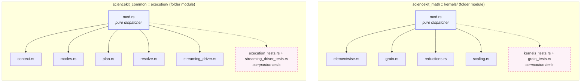

# Module hygiene: folder modules & the tests-at-end rule

A machine-learning library starts as a handful of files and quietly becomes hundreds.
Long before the algorithms get hard, the *organization* gets hard: you open a file to
change one small thing and have to scroll through two thousand lines to find it. In this
chapter we set up the discipline that keeps a growing Rust codebase navigable — a set of
house rules about *where code lives*, not what it computes. We learn how a Rust file
becomes a **folder module**, why a `mod.rs` should be a **pure dispatcher** that carries
no logic, and why tests sit **beside** the implementation they check rather than being
sprinkled through it or parked in a far-away `tests/` directory.

## 1. The problem we were solving

Imagine a library that is really a filing cabinet. Early on, when the cabinet has three
drawers, it does not matter much how you label them. But as the library grows — dozens
of types, dozens of algorithms, thousands of lines — the cabinet fills up, and the way
you organize it becomes the difference between finding a document in seconds or in
hours.

sciencekit had reached that point. It had settled on a convention: when a source file
grows past roughly 200 lines, you split it into a **folder** — a directory with a
special `mod.rs` file that acts as the "label on the drawer", telling the compiler what
lives inside. And tests were supposed to live in **companion files** right beside the
implementation they check.

But rules only help if every drawer follows them. Fourteen `mod.rs` files had drifted:
instead of being just a label (a **pure dispatcher**), each of them had grown the actual
implementation *inline* — the drawer label was also doing the filing. And there was no
written rule at all about where inline tests must sit within a file. The result was a
library where the same file had two jobs, where a small file became a big one and then
a folder but nobody had finished the move, and where tests appeared at the top, middle,
or bottom depending on whoever wrote them.

The change we walk through in this chapter, *module hygiene*, was a **pure refactor**:
no new behavior, no new math, no changed results. It simply made every `mod.rs` a true
pure dispatcher and codified the **tests-at-end** rule. It is the quiet maintenance work
that keeps a codebase pleasant to live in, and it is a great lens for learning how Rust
organizes code.

## 2. The decisions — and the roads not taken

| Decision | Why we chose it | Alternatives we discarded |
|---|---|---|
| **`mod.rs` must be a pure dispatcher** — it only declares submodules and re-exports them, carrying no implementation logic. | A reader opening `kernels/mod.rs` should see the drawer's whole catalogue at a glance, not be handed a wall of math. Every implementation has one obvious home file, so nothing hides. This is exactly the layout already proven in `allocator/`, `builders/`, and `observability/`. | Keeping implementation inline in `mod.rs` (the pre-change drift). It made the catalogue unreadable and gave a single file two jobs. |
| **Split into the minimum descriptive files per concern**, not one file per function. | A tiny 30-line module does not deserve ten micro-files; one descriptive implementation file plus its companion `*_tests.rs` reads cleanly and keeps the split meaningful rather than cosmetic. | Over-fragmentation — one file per function. Creates a drawer full of matchsticks that is harder, not easier, to navigate. |
| **Tests live in companion `*_tests.rs` modules beside the implementation.** | Tests belong next to the code they verify so they are found and updated together; there is no central `tests/` graveyard that drifts out of sync. | A global `tests/` directory at the crate root. It separates tests from what they test and encourages duplication and drift. |
| **The tests-at-end rule**: any inline `#[cfg(test)]` block must sit at the very end of its file; companion test-module declarations go at the end of `mod.rs`. | The implementation reads top-down: a reader reaches the real logic first, then (optionally) the tests. This was codified in `AGENTS.md` and mirrored in the OpenSpec config because it had never been written down. | Allowing inline tests anywhere in the file. A test block in the middle breaks the top-down reading flow and hides the implementation. |
| **A `.rs` file over ~200 lines becomes a standardized folder module.** | The line limit is a tripwire: it tells you, mechanically, when a file is doing too much and should become a folder with `mod.rs`, `core_implementation.rs`, `*_tests.rs`, etc. | No limit (files grow indefinitely, become unreadable) or a limit enforced by emotion rather than a stated number. |

> Scope note: one of the fourteen modules, `backend/`, was deliberately **excluded** from
> this refactor. It was owned by a companion change (`backend-kernel-expansion`) that was
> restructuring it anyway. Splitting it twice would have caused conflicts, so this change
> covered the other thirteen and left `backend/` alone.

## 3. The concepts, taught from zero

### Rust: what a "module" is

In many languages you group related code into "files" and "packages". Rust gives you a
cleaner idea called a **module**. A module is simply a named container of code: it can
hold functions, types, other modules, and even constants. You create one with the
keyword `mod`:

```rust
mod shapes {
    pub struct Circle { radius: f64 }
}
```

This module is named `shapes` and contains a type `Circle`. The `pub` in front of
`struct` says "let other code outside this module see it". Without `pub`, the item stays
**private** — visible only inside `shapes`.

Modules nest. A module inside a module, inside a module... This nesting is exactly what
lets a big codebase be organized like a filing cabinet: each drawer is a module, and a
drawer can contain smaller drawers.

### How a file becomes a module, and then a folder module

Rust has a convenient rule: **the file system can stand in for the module tree.** If you
write `mod shapes;` (note the semicolon, not a block), Rust looks for a file named
`shapes.rs` and makes it the body of the `shapes` module.

But what if `shapes` grows too big for one file? Then you turn it into a **folder**:

```
shapes/            ← a directory
  mod.rs           ← the "label" file: declares the module's contents
  circle.rs        ← one implementation file
  rectangle.rs     ← another implementation file
```

The special file `mod.rs` inside a folder **is** the module. Rust reads
`mod shapes;` and finds the `shapes/` folder with its `mod.rs`, and everything inside
that folder becomes part of the `shapes` module. This is the **folder module** pattern.

### `mod.rs` as a pure dispatcher

Here is the key discipline of this whole chapter: **`mod.rs` should contain no
implementation logic at all.** It has exactly two jobs:

1. **Declare** the submodules with `mod <name>;`.
2. **Re-export** their public items with `pub use`, so that code using the folder can
   reach the items without knowing which file they came from.

A `mod.rs` that only does these two things is called a **pure dispatcher** — it does no
work itself; it just *points* to the files that do the work.

### `pub use`: re-exports

`pub use` is a way to "re-share" an item. Suppose `circle.rs` defines `Circle`. Inside
`shapes/mod.rs` you write `pub use circle::Circle;`. Now anyone who uses the `shapes`
module can write `shapes::Circle` even though `Circle` physically lives in
`circle.rs`. This gives you freedom: you can rearrange the files inside the folder
without changing anything for the code that *uses* the folder. The `mod.rs` is the
stable public face; the file layout is an internal detail.

### `#[cfg(test)]`: the compile-time "only when testing" gate

`#[cfg(...)]` means "configuration": it tells the compiler to include this item only
under certain conditions. `#[cfg(test)]` means "only include this module when compiling
in test mode". So you can write:

```rust
#[cfg(test)]
mod shapes_tests;
```

This module is compiled only when tests run; in a normal release build it simply does
not exist. This is how test code stays out of your shipped library.

### Two ways to attach tests

You have two main choices for where test code lives:

- **Inline**: a `#[cfg(test)] mod …` block at the *end* of the same file as the
  implementation.
- **Companion module**: a separate `*_tests.rs` file (or folder) *beside* the
  implementation file, declared at the end of `mod.rs`.

sciencekit's rule: tests live in **companion `*_tests.rs` modules beside the
implementation**, and any inline tests must sit at the very end of their file. Never a
global `tests/` directory.

## 4. Each object, explained

#### The folder module (`mod.rs` + submodule files)

**What it is:** A directory whose `mod.rs` declares and re-exports its submodules, with
each implementation living in its own file inside the folder. Triggered by the ~200-line
rule: a single `.rs` file that crosses that length becomes a folder.

**Why it exists:** It bounds the size of any one file, gives every piece of code one
obvious home, and keeps the public interface stable while the internals are free to
rearrange. Opening `mod.rs` shows the whole catalogue at a glance.

**What we rejected:** Keeping long files as single giant `.rs` files (unreadable), and
splitting into one file per function (over-fragmented). The folder module is the middle
path: big enough to hold a real concern, small enough to read.

Let us look at two real pure-dispatcher `mod.rs` files. First, `kernels` from
`sciencekit_math` — the folder that holds the higher-order math kernels:

```rust
//! Higher-order operation kernels built on `azip!`/`par_azip!`/`zip_mut_with`.

mod elementwise;
mod grain;
mod reductions;
mod scaling;

pub use elementwise::{sk_binary_combine, sk_elementwise_transform};
pub use grain::{
    SK_AXIS_SUM_GRAIN, SK_BINARY_COMBINE_GRAIN, SK_ELEMENTWISE_TRANSFORM_GRAIN,
    SK_SCALE_IN_PLACE_GRAIN,
};
pub use reductions::sk_axis_sum;
pub use scaling::sk_scale_in_place;

#[cfg(test)]
mod grain_tests;
#[cfg(test)]
mod kernels_tests;
```

See the structure? Four `mod` declarations, four `pub use` re-exports, then the
`#[cfg(test)]` companion test modules at the end. Zero math logic here. If you want to
know everything the `kernels` folder offers, you read this 27-line file and you are done.

Now `execution` from `sciencekit_common` — the folder that turns a user's requested
execution *intent* into a concrete *plan*:

```rust
//! Execution planning.

mod context;
mod modes;
mod plan;
mod resolve;
mod streaming_driver;

pub use context::SKExecutionContext;
pub use modes::{SKAccessPattern, SKExecutionMode};
pub use plan::SKExecutionPlan;
pub use resolve::sk_resolve_execution_plan;
pub use streaming_driver::{SKStreamDecision, sk_run_streaming_driver};

#[cfg(test)]
mod execution_tests;
#[cfg(test)]
mod streaming_driver_tests;
```

Same shape, slightly bigger: five submodules, five re-export lines, two companion test
modules. The `data_view` and `builders` folders follow the identical pattern. This
consistency is the point — once you have seen one pure-dispatcher `mod.rs`, you have
seen them all.

#### The companion `*_tests.rs` module

**What it is:** A test module that lives beside the implementation it checks, declared
with `#[cfg(test)] mod …_tests;` at the end of `mod.rs`. It may itself be a single file
or a small folder of test files.

**Why it exists:** Tests and the code they verify are updated together, found together,
and reasoned about together. Keeping them adjacent (but in a separate file) means the
implementation file reads top-down while the tests stay close by, never in a distant
global `tests/` directory that drifts out of sync.

**What we rejected:** A global `tests/` directory, and scattering `#[cfg(test)]` blocks
throughout implementation files. Both separate tests from what they test or bury the
implementation.

Here is a real companion test *folder*. The `scorer_traits` folder holds a `mod.rs`
plus a `scorer_traits_tests/` folder whose own `mod.rs` is:

```rust
//! Companion tests for the scoring contracts (split into a folder module to
//! respect the 200-line limit).
pub mod example_contracts;
pub mod scoring_tests;
```

It is itself a tiny pure dispatcher: it just declares the two test files inside it. This
is the folder-module pattern applied *recursively to the tests themselves* — the tests
grew past 200 lines, so they became a folder too.

Compare that with `execution`, where the two test modules are plain single files
(`execution_tests.rs`, `streaming_driver_tests.rs`) because each stayed under the
limit. The rule adapts: small tests, one file; big tests, a folder.

#### The 200-line rule

**What it is:** A stated convention that a `.rs` file over roughly 200 lines becomes a
standardized folder module, with files named by role (`mod.rs`, `core_implementation.rs`,
`*_tests.rs`, and for builders `builder.rs`).

**Why it exists:** It is a *mechanical* tripwire that triggers exactly when a file is
doing too much. You do not need to argue about taste — you count lines, and past the
limit you split. It keeps every file a comfortable size and gives every concern a named
home.

**What we rejected:** No limit (files grow into impenetrable walls of text) and an
emotionally enforced limit (inconsistent — one developer's "fine" is another's
"too long"). A hard, stated number is uniformly applied.

## 5. A real walk-through, using the tests

Tests are our executable documentation, so let us read two real tests and see what the
test-at-end, companion-module organization enables.

### Test 1: prefetching under a streaming plan

This test lives in `execution/streaming_driver_tests.rs` — a companion file to the
`streaming_driver.rs` implementation. It checks a subtle concurrency promise: while one
batch is computing, the driver should already be reading the *next* one (this is called
**prefetch**). The test is `reader_advances_while_compute_runs`:

```rust
#[test]
fn reader_advances_while_compute_runs() {
    let (mut source, read_log, _outstanding, _max) = RecordingSource::new(5, None);
    let finish_log: Arc<Mutex<Vec<(usize, Instant)>>> = Arc::new(Mutex::new(Vec::new()));
    let finish = Arc::clone(&finish_log);
    let update = move |batch: SKDataBatch<f64>, _parallelism: usize, _state: &mut ()| {
        thread::sleep(Duration::from_millis(50));
        finish
            .lock()
            .unwrap()
            .push((batch.position(), Instant::now()));
        SKStreamDecision::Continue
    };
    let mut state = ();
    sk_run_streaming_driver(&mut source, &mut state, update, &streaming_plan()).unwrap();

    let reads = read_log.lock().unwrap().clone();
    let finishes = finish_log.lock().unwrap().clone();
    let read_time = |index: usize| reads.iter().find(|(i, _)| *i == index).map(|(_, t)| *t);
    let finish_time = |index: usize| finishes.iter().find(|(i, _)| *i == index).map(|(_, t)| *t);

    // For every k except the last, batch k+1 was read before batch k finished.
    for k in 0..4 {
        let read_next = read_time(k + 1).expect("batch k+1 must be read");
        let done = finish_time(k).expect("batch k must complete");
        assert!(
            read_next < done,
            "batch {} read after batch {} finished — no prefetch overlap",
            k + 1,
            k
        );
    }
}
```

Let us read it slowly. The test creates a `RecordingSource` with `5` batches (the
`RecordingSource` is a small instrumented stand-in defined right in the test file: it
*logs every read* and records the time). The `update` closure is the "computation": it
simulates work by sleeping 50 milliseconds, then logs which batch *finished* and when.
We then run the streaming driver over the source with this callback.

After the run, the test grabs two logs: `reads` (when each batch was *read*) and
`finishes` (when each batch *finished*). The clever part is the loop. For every batch
`k` from 0 to 3, it asserts that batch `k + 1` was **read before** batch `k`
**finished**:

```rust
assert!(read_next < done, "batch {} read after batch {} finished — no prefetch overlap", ...);
```

If the driver were naive and processed one batch fully before touching the next, batch
`k+1` would be read *after* batch `k` finished, and this assertion would fail. So this
one test pins down the whole prefetch contract: the reader runs ahead while compute
runs. That is a subtle piece of concurrency, expressed clearly in ~20 lines, sitting in
a file right beside the `streaming_driver.rs` code it validates.

### Test 2: pure scoring must not re-infer

This test lives deeper — inside the `scorer_traits/scorer_traits_tests/scoring_tests.rs`
folder. It checks a design contract: a scorer has a "pure" form that scores from
*predictions you already have*, and it must **not** run the model again. Here it is:

```rust
#[test]
fn pure_form_does_not_re_infer() {
    let scorer = accuracy::<f64, ConstantPredictor>();
    let truth = array![1.0_f64, 1.0, 0.0];
    let predictions = array![1.0_f64, 1.0, 1.0];
    let score = <Accuracy as SKSupervisedScorer<f64, ConstantPredictor>>::score_from_predictions(
        &scorer,
        SKTargetView::try_from(truth.view()).unwrap(),
        predictions.view(),
    )
    .unwrap();
    // 2 of 3 correct (predicted 1,1,1 vs true 1,1,0).
    assert!((score - 2.0 / 3.0).abs() < 1e-9);
}
```

The test sets up truth `[1,1,0]` and predictions `[1,1,1]`. A `ConstantPredictor` always
predicts 1.0, so 2 of the 3 predictions match the true labels. The score should be
2/3. We call the *pure* form directly, `score_from_predictions`, handing it both the
truth and the predictions — and check the result equals 2/3 (within floating-point
tolerance, hence the `.abs() < 1e-9`).

The sibling test `convenient_form_runs_inference_and_delegates` then verifies the *other*
path: the convenient form runs the model once to get predictions, then delegates to the
same pure form — and the two scores match. Together, the two tests pin down that the
pure form never re-infers and that both paths agree. All of this lives in a companion
folder *beside* the scoring implementation, exactly as the hygiene rules demand.

### What both walk-throughs show

Neither of these tests is in some far-away `tests/` directory. Each sits beside the code
it tests, in a companion module declared at the end of the relevant `mod.rs`. Because of
the tests-at-end rule, the implementation files read top-down, and because of the
pure-dispatcher rule, their `mod.rs` files are tiny catalogues. When a future engineer
wonders "is prefetching really overlapped?", the test is one folder over.

## 6. Look inside

<div class="sk-box sk-box--info">
<strong>The one insight:</strong> module hygiene is not about style points — it is about
making a large codebase <em>navigable</em>. A pure-dispatcher <code>mod.rs</code> turns
every folder into a one-screen catalogue, and the tests-at-end rule keeps every
implementation file reading top-down. None of this computes a single number; all of it
decides whether a growing library stays pleasant to work in.
</div>

Here is the folder-module tree for a couple of the real modules we studied, showing how
`mod.rs` sits as the dispatcher above implementation files and companion tests:



The solid arrows show `mod.rs` *declaring* its implementation submodules; the dashed
arrows show it declaring the `#[cfg(test)]` companion test modules. Notice that every
solid child is a real implementation file and every dashed child is a test file — and
`mod.rs` itself, at the top of each folder, holds no logic at all.

## 7. Recap

- **A folder module** (`mod.rs` inside a directory) is how Rust lets one conceptual
  module span multiple files once a single `.rs` file passes ~200 lines.
- **`mod.rs` must be a pure dispatcher**: it only `mod`-declares submodules and
  `pub use`-re-exports them. It carries no implementation logic, so it reads as a
  one-screen catalogue.
- **Tests live in companion `*_tests.rs` modules beside the implementation** — never in
  a distant global `tests/` directory — and are declared with `#[cfg(test)]` at the end
  of `mod.rs`.
- **Tests-at-end**: any inline `#[cfg(test)]` block sits at the very end of its file,
  so the implementation reads top-down.
- **This was a pure refactor**: no behavior changed, every test stayed green. The value
  is purely in how the codebase is organized and how easy it is to navigate.

That is the discipline of module hygiene. In the next chapters we put this tidy filing
cabinet to work as we climb back up to the algorithms — now that every folder has a
clean label, we can always find where the math actually lives.