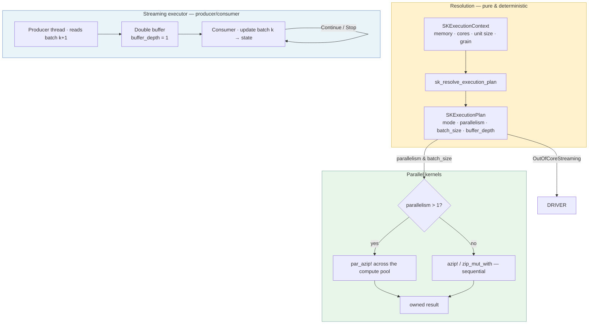
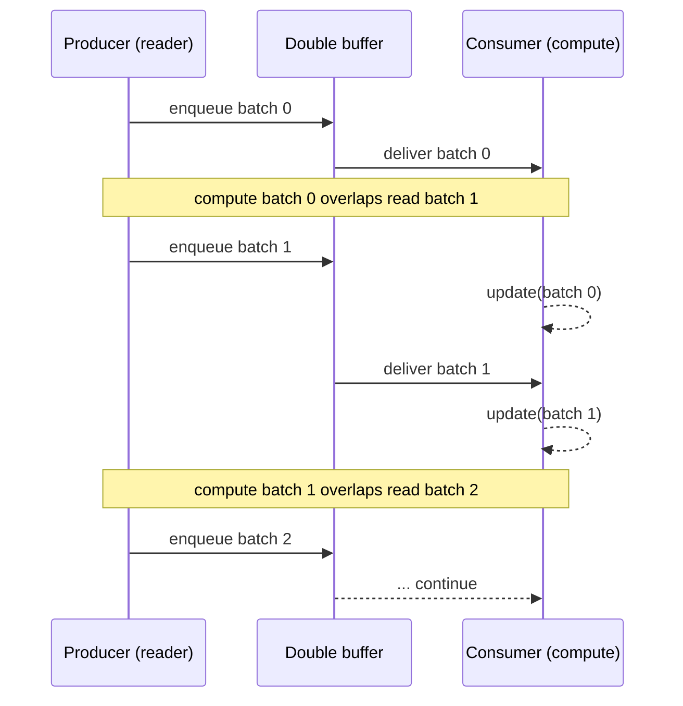

# Ch. 7 — Parallel kernels and the streaming executor

Modern machines have many cores, but your data comes in all sizes. A library that blindly
parallelizes everything wastes time on a 4-element array, and a library that never
parallelizes ignores most of the hardware. And when a dataset is too large to hold in memory,
the same library must keep the disk reader and the CPU working *at the same time*, not one
after the other. This chapter explains how `sciencekit` decides *how much* parallelism each
operation deserves, how the math kernels switch between sequential and parallel execution at
the push of a single number, and how a streaming executor overlaps reading with computing so
big data never idles the CPU.

---

## 1. The problem we were solving

Imagine a kitchen with several cooks. Each cook can chop vegetables independently — that is
*parallelism*. But handing a single carrot to all four cooks is absurd: the time they spend
arguing over who chops which slice is longer than just chopping it. The cooks are only worth
using when there is a *pile* of carrots. Now add an oven: while one cook is *waiting* for the
oven, the other cook can keep chopping the next tray. That overlap — preparing the next batch
while the current one bakes — is what a streaming library must do when the vegetable pile is
bigger than the counter can hold.

Before this change, `sciencekit`'s kitchen was incoherent. The library already had a resolver
that produced an `SKExecutionPlan` with a `parallelism` field — how many threads to use — but
nothing in the math layer actually *read* that field. The scaling kernel parallelized even a
4-element array (four cooks, one carrot), while the elementwise, binary, and reduction kernels
never parallelized at all, no matter how big the data was. Parallelism was decided by
accident, not by a plan.

Three things were missing. First, a **decision rule**: given the data size, the number of
cores, and the known cost of each kernel, how many threads should an operation use — or should
it stay sequential? Second, **kernels that honor the plan**: each math primitive must actually
branch on the resolved parallelism. Third, a **streaming executor**: a reusable piece that runs
the reader and the compute *concurrently* through a double buffer, so out-of-core data is
processed without the CPU ever sitting idle waiting for the disk.

---

## 2. The decisions — and the roads not taken

| Decision | Why we chose it | Alternatives we discarded |
|---|---|---|
| **Parallelism is decided at resolution time, not inside the kernel** | Each kernel takes a `parallelism: usize` and only branches `1 → sequential` / `> 1 → parallel`. All policy lives in `sk_resolve_execution_plan`, which stays pure and deterministic (spec `higher-order-kernels`: kernels "honor the resolved parallelism"). | Unconditional `par_azip!` everywhere (a regression on small data); per-kernel internal thresholds (duplicated policy, untestable without a real machine); separate `_par` function variants (a duplicated API, pushing the decision onto every caller). |
| **The crossover rule is `min(cores, ceil(unit / grain))`, with a grain measured per kernel** | A **grain** is the minimum elements per thread needed to amortize parallel-dispatch overhead. The number of threads is `ceil(unit / grain)` clamped to cores, so a unit below one grain stays sequential. Each kernel gets its *own* measured grain (cheap, medium, expensive closures over sizes 10¹–10⁷), reused identically in memory and streaming (design: "reuse one measured grain per kernel across regimes"). | A single global threshold constant (wrong for at least one of machine, algorithm, or data); closure-cost hints plumbed into resolution (possible future extension, deferred until benches justify it). |
| **Conservative grain direction: large in-memory, full streaming** | In memory, an expensive closure parallelizing "late but well" is the safe error, so the grain errs large. In streaming, `parallelism = cores` by default: excess compute parallelism is nearly free while the pipeline is I/O-bound (cores idle between batches), but starvation when compute-bound loses the whole speedup. | `parallelism = 1` while streaming (discards compute-bound speedup, assumes disk-bound); runtime-adaptive measured downscaling (breaks the pure-resolution contract as a first version). |
| **One generic streaming driver, not per-algorithm pipelines** | A single `sk_run_streaming_driver` in `sciencekit_common` owns the prefetch pipeline — ordering, error propagation, final-batch delivery, early stop — so algorithms only write an `update(batch, state)` step. Concurrency subtleties get written and tested *once*. | Per-algorithm prefetch loops (N copies of subtle concurrency code); a Tokio pipeline for disk sources (unnecessary dependency for synchronous iteration). |
| **Axis-0 reductions parallelize via per-chunk partial accumulation** | Parallel column sums split rows into chunks; each chunk accumulates into its *own* partial vector, then the partials are combined. No two threads ever write the same accumulator, so there is no race and no shared-mutable-state bookkeeping. | Atomics on a shared accumulator (contention and a different summation order each run); keeping axis-0 sequential (asymmetric loss — it is the common shape for column statistics). |

---

## 3. The concepts, taught from zero

### Rust concept 1: `rayon` and parallel iterators

`rayon` is a Rust library for easy data parallelism. Instead of writing a loop that visits each
element, you hand rayon an iterator and it splits the work across a pool of threads, giving
you the result as if you'd run the loop sequentially — but faster.

The clever part is that a *normal* iterator and a *parallel* iterator have the same shape, so
switching costs one word. An iterator produces items one at a time via a method that yields an
`Option` (an optional value: `Some(item)` or `None`). A **parallel iterator** (`into_par_iter`,
`par_iter`) distributes those items across threads. The whole point of this chapter's design
is that the kernels use the **same higher-order iteration** for both paths, only changing the
*kind* of iterator based on the resolved parallelism.

### Rust concept 2: `azip!` and `par_azip!` — looping without index arithmetic

`ndarray` is the array library `sciencekit` uses. The macros `azip!` and `par_azip!` are its
idiomatic way to visit all elements of one or more arrays together — the "apply `f` pairwise
across these arrays" operation. `azip!` is sequential; `par_azip!` is the rayon-parallel
version. They share the same syntax, which is exactly why the kernels can swap them with a
one-line branch.

```rust
use ndarray::{Array, ArrayView, azip, par_azip};

let mut output = Array::zeros(input.dim());
if parallelism > 1 {
    par_azip!((out in &mut output, a in input) { *out = transform(*a); });
} else {
    azip!((out in &mut output, a in input) { *out = transform(*a); });
}
```

Inside the macro body, `out` is a mutable reference to each output element and `a` is a
reference to each input element. The macro visits every element position once, pairing the
output slot with its input element. This is a **higher-order** form — you provide the closure
(the `{ ... }` body) and the library provides the traversal. The project's rule is *never a
manual index loop*: writing `output[i] = f(input[i])` by hand is forbidden, because the macro
form is clearer, safer, and lets the same body run parallel with a one-word change.

### Rust concept 3: closures capturing by move

A **closure** is an anonymous function you can define inline and pass around. `|x| 2.0 * x +
1.0` takes one argument and returns twice it plus one. A closure can *capture* variables from
the surrounding scope — "remember" them. In `sciencekit`'s kernels the closure must be `Sync +
Send`:

```rust
pub fn sk_elementwise_transform<F: SKFloat>(
    input: &ArrayView<F, ndarray::Ix1>,
    transform: impl Fn(F) -> F + Sync + Send,
    parallelism: usize,
) -> Array<F, ndarray::Ix1>
```

- `Sync` means the value is safe to be *referenced* from multiple threads at once.
- `Send` means it is safe to be *moved* to another thread.

These bounds are required because `par_azip!` takes the closure and runs it on the rayon pool
— across many threads simultaneously. The compiler enforces this: if you try to capture a
value that is not `Sync + Send`, the code **will not compile**. This is Rust pushing the
mistake out of the running program and into the compiler: a closure that cannot safely run in
parallel is rejected before it ever runs.

### Numerical concept 1: what "grain" means

Parallelism has a fixed **dispatch overhead**: splitting work, coordinating threads, and
rejoining them all cost time. A single thread on a tiny array is therefore *faster* than many
threads, because the overhead swamps the tiny amount of work. The **grain** is the minimum
number of elements per thread that makes a thread worth spawning.

Think of it as the "amortization" point. If a thread must process at least *g* elements to pay
for the cost of spawning it, then for a unit of *u* elements you can afford at most
`ceil(u / g)` threads. The resolver computes:

```
threads = min(cores, ceil(unit_elements / grain))
```

- If `unit_elements < grain`, then `ceil(unit / grain) = 1`, so it runs on one thread —
  *sequential*.
- If `unit_elements` is huge, `ceil` climbs toward the core count, where it is capped.

The **grain** is measured per kernel by a calibration benchmark, not guessed. `grain.rs` records
the measured crossover for each kernel on a specific machine and date — that is called
*provenance* (where the number came from) — so a magic constant is never unexplained. The same
grain applies to in-memory and streaming work, because dispatch overhead and per-element cost
do not change just because the data came from disk.

### Numerical concept 2: the "work unit" — whole dataset vs one batch

The grain needs a *unit* to be applied to: the number of elements we are parallelizing *over*.
This is where mode matters:

- **In-memory**: the work unit is the whole dataset. `unit = dataset_elements`.
- **Streaming**: compute happens one batch at a time, so the work unit is one batch.
  `unit = batch_size_hint`.
- **Memory-mapped**: an arbitrary shard can be touched, so `unit` is treated as "always large"
  and resolves to `cores`.

This is why the same `parallelism` field means "threads for the current operation's unit",
decided once at resolution and carried in the plan down to each kernel.

### Numerical concept 3: double buffering — the producer/consumer overlap

Reading from disk (or any slow source) and computing are two different speeds. If they run
strictly one after the other, one of them is always idle: the disk waits while the CPU
computes, then the CPU waits while the disk reads.

**Double buffering** fixes this with a *producer/consumer* relationship:

- A **producer** (the reader) fetches batches from the source.
- A **consumer** (the compute side) processes them.
- Between them sits a **bounded buffer** — a fixed-size queue of batches.

The producer and consumer run on different threads. While the consumer computes batch *k*, the
producer reads batch *k+1* into the buffer. When the consumer finishes batch *k*, batch *k+1*
is already waiting — no idle time. The buffer is *bounded* (it holds at most `buffer_depth`
prefetched batches, plus the one being computed) so the reader never runs unboundedly ahead.

The name "double buffering" refers to the simplest bound: `buffer_depth = 1`, so at most one
batch is computing and one is prefetched — two resident batches. That is why the resolver
checks `2 × batch ≤ available memory` before it will even allow a streaming plan: two batches
must fit in RAM. The plan field is literally called `buffer_depth`, and `1` is double buffering.

### Numerical concept 4: closures for per-element math, not shared accumulators

When a kernel reduces many rows into one answer (a sum), the naive parallel temptation is a
single shared accumulator every thread adds to. That needs locking (slow) or atomics (also
slow, and order-dependent). The design instead gives each chunk its **own** partial accumulator,
computed in parallel with no sharing, then combines the partials at the end. This is
lock-free and race-free by construction: no two threads ever touch the same memory while
running. (The trade-off is that floating-point addition is *not* associative, so a parallel
sum may differ from a sequential one in the last bits — which is why the tests compare with a
tolerance, never bit-for-bit equality.)

---

## 4. Each object, explained

### `parallelism_for` (private, but the heart of the decision)

*What it is:* A private helper inside the resolver (`resolve.rs`) that computes the
`parallelism` for a resolved mode: `min(cores, ceil(unit / grain))`. It returns `1` if there
are at most one core, if the unit is unknown or zero, or if the unit is below one grain.

*Why it exists:* It is the single, pure place where "how many threads?" is answered from the
*size of the work unit* — whole dataset for in-memory, one batch for streaming, `∞` (so
"always cores") for memory-mapped shards. Because it is a pure function of the context, it is
testable by injecting simulated values with no real machine involved (see `grain_governs_resolution_across_regimes` below).

*What we rejected:* A fixed global threshold, reading `sysinfo` inside the resolver, and
deciding parallelism per-kernel at the point of execution. All of those either couple the
decision to the physical machine or duplicate the policy. The number, the unit, and the grain
all flow through this one formula, deterministically.

### `sk_elementwise_transform`

*What it is:* The free-scope kernel `sk_elementwise_transform(input, transform, parallelism)
-> Array`, which maps `x → transform(x)` over a 1-D vector and returns a brand-new owned array.
It branches on `parallelism`: `1` runs the sequential `azip!`, `> 1` dispatches `par_azip!`.

*Why it exists:* It is the most basic building block of "do something to every element." It
must exist in both sequential and parallel form because a `transform` closure can be cheap
(e.g. multiply) or expensive (e.g. `sin`), so the right amount of parallelism changes. The
iterator form (never a manual index loop) honors the project's higher-order-function rule.

*What we rejected:* A single always-parallel version (a regression on the cheap-closure,
small-array case) and two separate functions for the two paths (a duplicated API that pushes
the decision onto every caller). One function, one `parallelism` number, two internal paths.

### `sk_binary_combine`

*What it is:* The kernel `sk_binary_combine(left, right, combine, parallelism) -> Array`,
pairing each element of `left` with the corresponding element of `right` and applying
`combine(left_value, right_value)`. It asserts the two inputs have equal length, seeds the
output from `left`, then branches: `> 1` uses a three-array `par_azip!`, `1` uses the
sequential `zip_mut_with`.

*Why it exists:* Many operations (adding two matrices, elementwise products, comparisons) take
two inputs and produce one output. It needs the same parallel/sequential switch as the
unary transform. Its measured grain is the largest of the set (10⁷) precisely because a
*three*-array `par_azip!` has the highest dispatch overhead — a measured fact recorded in
`grain.rs`, not a guess.

*What we rejected:* Running `combine` on an index loop; writing into one input in place without
seeding from `left` (that would destroy `left`); and a shared-accumulator approach. The
three-array zip keeps all three buffers aligned by construction.

### `sk_axis_sum`

*What it is:* The reduction kernel `sk_axis_sum(input, axis, parallelism) -> Array`, summing a
2-D array along one axis into a 1-D result. `axis = 0` collapses rows (per-column sums, length
= columns); `axis = 1` collapses columns (per-row sums, length = rows). It has four paths:
sequential and parallel for each axis.

*Why it exists:* Reductions are where parallelism is most valuable *and* most dangerous. The
axis-0 parallel path uses per-chunk partial accumulation: rows are split into chunks, each
chunk sums into its own partial vector, then the partials are combined. This never writes a
shared accumulator concurrently. Axis-1 parallelizes trivially, one independent row per thread.
The sequential fallbacks exist so small data (or `parallelism = 1`) avoids all dispatch.

*What we rejected:* Atomics on a shared accumulator (contention and nondeterministic order),
and a single shared output array written by all threads (a data race). The partial-accumulation
design is race-free by construction and only reorders the final floating-point additions by a
few bits — which the tolerance-based `assert_close` contract in the tests accepts.

### `sk_run_streaming_driver`

*What it is:* The free-scope executor `sk_run_streaming_driver(source, state, update, plan) ->
Result<(), SKError>`. It spawns a dedicated producer thread that reads batches from an
`SKLazySource` into a bounded double buffer, while the caller's thread consumes each owned
`SKDataBatch` and applies the algorithm-supplied `update(batch, parallelism, state)` closure.
`update` returns an `SKStreamDecision` — `Continue` or `Stop` — to steer the pipeline.

*Why it exists:* It is the reusable embodiment of the I/O ∥ CPU overlap. Ordering, error
propagation, final-batch delivery, and early stop are written and tested *once*; an algorithm
gains streaming by writing only its `update` step. The compute side never blocks on input waits
— the producer thread does the waiting, on its own thread, while rayon computes on the pool.

*What we rejected:* Reading and computing on the same thread (no overlap); letting the producer
read unboundedly ahead (hence the bounded `buffer_depth`); and a Tokio-based pipeline for
synchronous disk sources (an unnecessary dependency). A plain scoped thread is enough for the
synchronous `SKLazySource` contract.

---

## 5. A real walk-through, using the tests

The most convincing way to learn is to read actual passing tests. Here are three: two from
`grain_tests.rs` that exercise the decision rule, and one from `kernels_tests.rs` that proves a
parallel reduction equals the sequential reference.

### Test 1: `grain_governs_resolution_across_regimes`

This test proves that a unit below the grain stays sequential (`parallelism = 1`) and a unit
far above it parallelizes — using only a simulated context, never the physical machine.

```rust
#[test]
fn grain_governs_resolution_across_regimes() {
    let grain = SK_AXIS_SUM_GRAIN;
    let below = context(Some((grain - 1) as u64), grain, 8);
    let above = context(Some((grain * 8) as u64), grain, 8);

    let below_plan = sk_resolve_execution_plan(SKExecutionMode::Automatic, &below).unwrap();
    let above_plan = sk_resolve_execution_plan(SKExecutionMode::Automatic, &above).unwrap();

    assert_eq!(below_plan.parallelism, 1);
    assert_eq!(above_plan.parallelism, 8);
}
```

Line by line:

1. `let grain = SK_AXIS_SUM_GRAIN;` — we grab the axis-sum kernel's measured grain
   (100,000 elements) directly from the constant in `grain.rs`.
2. `let below = context(Some((grain - 1) as u64), grain, 8);` — the test helper `context`
   builds an `SKExecutionContext` by hand. The `Some(grain - 1)` is the dataset element count:
   one *fewer* than one grain. The `grain` argument is the kernel's grain, and `8` is the
   simulated core count. So this context says: 99,999 elements, grain 100,000, 8 cores.
3. `let above = context(Some((grain * 8) as u64), grain, 8);` — a dataset of *eight grains*
   (800,000 elements) on the same 8 cores.
4. We resolve an `Automatic` plan for each. `.unwrap()` asserts resolution succeeds.
5. `assert_eq!(below_plan.parallelism, 1)` — because `ceil(99,999 / 100,000) = 1`, the plan is
   **sequential** even though 8 cores are available. The work is too small to pay for threads.
6. `assert_eq!(above_plan.parallelism, 8)` — `ceil(800,000 / 100,000) = 8`, clamped to the 8
   cores, so it parallelizes fully.

The lesson: the grain is the throttle. The same resolver, same cores — only the *size* changed,
and the parallelism followed the `min(cores, ceil(unit / grain))` rule exactly. Nothing about a
real machine was read.

### Test 2: `every_kernel_exposes_a_positive_grain`

This short test guards the provenance: every kernel must have a real, positive grain constant —
never a zero or a placeholder that would silently disable parallelization.

```rust
#[test]
fn every_kernel_exposes_a_positive_grain() {
    for grain in [
        SK_ELEMENTWISE_TRANSFORM_GRAIN,
        SK_BINARY_COMBINE_GRAIN,
        SK_AXIS_SUM_GRAIN,
        SK_SCALE_IN_PLACE_GRAIN,
    ] {
        assert!(grain > 0);
    }
}
```

Line by line:

1. The test iterates over the four measured grain constants from `grain.rs`.
2. `assert!(grain > 0)` — each must be strictly positive. A `grain = 0` would make
   `ceil(unit / 0)` a division-by-zero hazard; a `grain` of `usize::MAX` would effectively
   disable parallelism forever. This test pins the constants to a sane, measured range.

The lesson: these are *measured* numbers with provenance (machine, date, protocol) recorded in
`grain.rs`, and this test keeps them honest. A kernel whose grain was never calibrated cannot
silently ship a wrong constant.

### Test 3: `parallel_axis_zero_sum_matches_sequential_reference`

This test proves the race-free parallel axis-0 reduction equals the sequential column sums
within floating-point tolerance — across many rows, where a naive shared accumulator could
race.

```rust
#[test]
fn parallel_axis_zero_sum_matches_sequential_reference() {
    let (rows, cols) = (4096, 256);
    let input: Array2<f64> =
        Array2::from_shape_fn((rows, cols), |(i, j)| (i as f64) * 0.001 + (j as f64) * 0.5);
    let sequential = sk_axis_sum(&input.view(), 0, 1);
    let parallel = sk_axis_sum(&input.view(), 0, 8);
    assert_close(&sequential, &parallel);
}
```

Line by line:

1. `let (rows, cols) = (4096, 256);` — a wide, tall matrix: 4,096 rows and 256 columns.
2. `Array2::from_shape_fn((rows, cols), |(i, j)| ...)` — build the array by computing each cell
   from its position `(i, j)`. This avoids listing 1M numbers by hand and gives every element a
   deterministic value. The closure `|(i, j)| (i as f64) * 0.001 + (j as f64) * 0.5` blends row
   and column contributions so the columns are genuinely different.
3. `let sequential = sk_axis_sum(&input.view(), 0, 1);` — reduce along axis 0 (per-column sums)
   with `parallelism = 1`, which runs the plain sequential path.
4. `let parallel = sk_axis_sum(&input.view(), 0, 8);` — the *same* reduction with
   `parallelism = 8`, which takes the parallel path: rows split into chunks, each chunk sums
   into its own partial vector, then the partials are combined.
5. `assert_close(&sequential, &parallel)` — compare the two within a relative floating-point
   tolerance (`1e-9`, scaled by magnitude). Because the parallel path reorders the floating-point
   additions (chunk partials summed in a different order), the result may differ in the last
   bits — but never beyond tolerance. This is the contract the design documents: parallel is
   *correct*, not *bit-identical*.

The lesson: the parallel path produces the right column sums across 4,096 rows without any
shared-accumulator race — and the tolerance-based comparison is what makes "parallel equals
sequential" a testable guarantee rather than a hope.

---

## 6. Look inside

<div class="sk-box sk-box--tip">
  <p><strong>One strong insight:</strong> parallelism is not a property of a kernel — it is a
  <em>decision</em> made once, from the size of the work unit and a measured per-kernel grain,
  carried in the plan down to every math primitive. The kernels themselves are embarrassingly
  boring: one number, one branch, `azip!` or `par_azip!`. And the streaming executor reuses that
  same plan on the compute side while a producer thread keeps the disk busy — so the decision
  and the overlap are each written once and reused everywhere.</p>
</div>

Here is the full pipeline, from resolution to a parallel kernel, and the double-buffer
producer/consumer that keeps streaming from ever idling the CPU:



Reading the left branch: resolution decides `parallelism` from the context's unit size and the
kernel's grain, and each kernel branches on that one number to pick its sequential or parallel
iterator. Reading the right branch: a streaming plan hands the same `parallelism` to the driver,
whose producer thread prefetches batch *k+1* while the consumer computes batch *k* on the rayon
pool — compute never blocks on input, and the reader never runs more than `buffer_depth` ahead.

Here is that double-buffer overlap as a timeline, showing the producer and consumer advancing
in step:



The producer and the consumer advance on different threads, so while the consumer runs
`update(batch k)`, the producer is already enqueuing batch *k+1*. That is the I/O ∥ CPU overlap
the spec `streaming-executor` requires, bounded by the plan's `buffer_depth`.

---

## 7. Recap

- **Parallelism is a decision, not a kernel trait.** `sk_resolve_execution_plan` computes
  `min(cores, ceil(unit / grain))` once, and every kernel honors the resulting `parallelism`
  with a single `azip!`/`par_azip!` branch.
- **The grain is measured, with provenance.** Each kernel's grain (minimum elements per thread)
  comes from a calibration benchmark on a specific machine and date — not a guessed constant —
  and a positive-grain test keeps the constants honest.
- **The work unit changes with the mode.** In-memory parallelizes over the whole dataset,
  streaming over one batch, memory-mapped over arbitrary shards — but the same grain rule
  governs all three.
- **Reductions are parallelized race-free.** Axis-0 sums use per-chunk partial accumulation,
  never a shared accumulator, and compare against the sequential reference within float
  tolerance rather than bit-identity.
- **The streaming executor overlaps I/O and compute.** `sk_run_streaming_driver` runs a
  producer thread into a bounded double buffer while the consumer computes on the rayon pool,
  delivering ordered, owned batches and stopping early on request.

*Next chapter:* now that an operation can parallelize its math and stream its data, we look at
how the whole workspace is shaped into crates — the boundaries that keep kernels, execution,
and the umbrella library decoupled and testable.