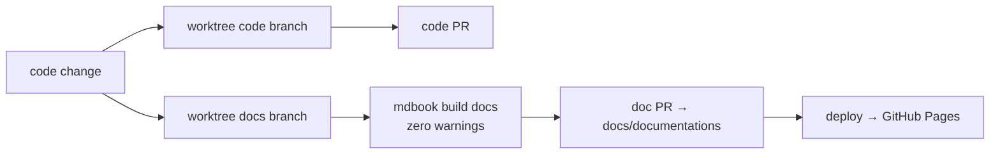

# Maintaining this book

A textbook is only worth reading if it stays true. This book explains *why* sciencekit is
built the way it is, and sciencekit is not finished — the roadmap (`docs/PRD.md`) maps out
new algorithms in phases that stretch from preprocessing all the way to trees, ensembles,
clustering and Python bindings. Every one of those algorithms will change the library, and
every change risks turning a sentence in this book into a lie. This chapter is the
*contract* that keeps the book truthful: a small set of rules that decide when to add a
chapter, when to edit one, and how every update flows safely from a branch to the published
site.

---

## 1. The problem we were solving

Documentation rots. It is not a bug in any single sentence; it is a slow drift. Someone adds
a new algorithm, nobody updates the matching page, and six months later the book describes a
`SKKNeighborsClassifier` that behaves nothing like the code. A reader who trusts the book
builds the wrong mental model, and the wrong mental model produces subtle, expensive bugs.

You cannot stop change, so the only fix is to make *keeping up* a mechanical habit. sciencekit
already commits to this habit at the repository level — its `AGENTS.md` requires that every
code change ships a companion documentation change on its own branch, merged separately.
This chapter is where that general rule becomes a concrete procedure for *this* book: when a
feature lands you add a chapter; when behavior changes you update the chapter; and both are
done through the same worktree-and-branch machinery that keeps `main` clean.

---

## 2. The decisions — and the roads not taken

| Decision | Why we chose it | Alternatives we discarded |
|---|---|---|
| **A new feature or algorithm → a NEW chapter** | A genuinely new algorithm is a new concept with new objects, new tests and new rationale. It deserves a teaching arc of its own; bolting it onto an existing chapter would bury it and make that chapter too long to follow. The roadmap's phases arrive one algorithm at a time, so the book grows one chapter per algorithm. | Amending every feature into a giant "everything" chapter — it becomes an unreadable dump. |
| **A bug fix or refactor → UPDATE the existing chapter** | A bug fix or refactor changes *behavior*, not *concept*: the chapter's question ("why does this object exist?") stays valid, but some of its answers change. Editing in place keeps the story honest without duplicating it. The rule is therefore *update, never fork* — do not leave a stale chapter and add a "new and improved" twin. | Copying the chapter and writing a parallel "v2" version — two chapters drift apart and readers never know which is current. |
| **Every doc change ships on its own `docs/<name>` branch merged into `docs/documentations`** | The book is a deployable artifact: pushing to `docs/documentations` rebuilds and publishes it to GitHub Pages. Working on a dedicated branch means `main` and `docs/documentations` never receive half-finished prose, and the same change can be reviewed independently of the code PR that motivated it. | Committing doc edits straight to `docs/documentations` — risky, unreviewed, and it bypasses the two-worktree discipline used for code. |

---

## 3. The concepts, taught from zero

### What "shipping a doc change" means

In most projects you might finish a feature and *also* remember to update the docs. In
sciencekit that is not optional and not deferred: `AGENTS.md` says every code change is
*paired with* a documentation change that updates the mdBook for the newly introduced
behavior, "on its own doc branch and its own PR merged into `docs/documentations`". The doc
branch is created at the same time as the code change, not after it.

### The two documentation branches

- **`docs/documentations`** is the *landing* branch: the finished book lives here, and the
  GitHub Actions workflow (`.github/workflows/deploy-documentation.yml`) builds and deploys
  it to GitHub Pages on every push.
- **`docs/<name>`** is a *working* branch. You never write on `docs/documentations` directly;
  you open a worktree for your change and merge it in when it is ready.

This is deliberately separate from the `-openspec` planning branch, which only holds the
OpenSpec planning artifacts. Documentation (the book) and planning (the spec) are two
different concerns and use two different branches.

### What "worktree" means here

A git worktree lets you check out a branch into a separate folder without disturbing your
current checkout. Every docs change lives in `temporary/worktrees/docs/<name>` on branch
`docs/<name>`. `temporary/` is git-ignored, so these working copies are never committed —
they are scratch space that keeps each change isolated.

---

## 4. Each object, explained

### The chapter file

*What it is* — a markdown file under `docs/src/development-explained/`, one per chapter,
following the anatomy in the chapter template (`CHAPTER_TEMPLATE.md`).

*Why it exists* — each chapter is the durable record of one concept's design rationale,
taught from zero for a reader who knows programming but not Rust or numerical computing.

*What we rejected* — putting everything in one huge page; a single page cannot teach or be
maintained.

### The worktree and branch

*What it is* — `temporary/worktrees/docs/<name>` on branch `docs/<name>`.

*Why it exists* — it isolates a doc change so the deployable `docs/documentations` branch
only ever receives finished, reviewed prose.

*What we rejected* — editing `docs/documentations` directly; unreviewed edits reach the
published site immediately.

### The build gate

*What it is* — `mdbook build docs`, run locally before pushing.

*Why it exists* — it validates every chapter and its links before the change is merged; the
book's config uses `create-missing = false`, so a broken link fails the build rather than
silently generating an empty page. The gate must pass with zero warnings.

*What we rejected* — relying on the remote deploy workflow to catch errors; that would let
broken content reach the published book.

---

## 5. A real walk-through: adding an algorithm's chapter

Here is the exact procedure, using a hypothetical new algorithm from a later roadmap phase
(say a tree model arriving in Phase 4).

**Step 1 — open the worktree.** Create the docs change alongside the code change:

```bash
git worktree add temporary/worktrees/docs/sk-decision-tree docs/sk-decision-tree
```

**Step 2 — write the chapter.** Create `docs/src/development-explained/chNN-*.md` following
the template: the plain-language problem, the decisions table, concepts taught from zero,
each object explained, and a walk-through built from the real `*_tests.rs` tests. Keep code
identifiers exactly as they are in the source.

**Step 3 — register the chapter.** Add it to the table of contents in
`docs/src/SUMMARY.md` under the right part of the book, in the position that matches the
reading order.

**Step 4 — run the gate.**

```bash
mdbook build docs
```

Fix every warning. A warning here means the published book could be broken.

**Step 5 — merge.** Open a PR for branch `docs/sk-decision-tree` into `docs/documentations`.
When it merges, the deploy workflow rebuilds and publishes the book automatically.

### Updating, not forking

If the change is a bug fix or refactor, *replace* the affected part of the existing chapter —
the decisions table, the object descriptions, the walk-through — and adjust any prose that
now contradicts the code. Do not copy the chapter and add a "v2". The book stays truthful
because there is exactly one place where a given behavior is explained, and it is always the
current explanation.

<div class="sk-box sk-box--info">
  <strong>Keep the numbers honest.</strong> The book is a textbook, but it is also a status
  document: algorithm counts, phase pills and roadmap states must match the real roadmap
  state in <code>docs/PRD.md</code>. When a roadmap phase flips from "Planned" to "In
  progress", the roadmap page and the new chapter should move together.
</div>

---

## 6. Look inside



The docs branch is created at the same moment as the code branch, runs through its own build
gate, and lands on `docs/documentations` through its own PR — the same "two coexisting
worktrees, two separate PRs" discipline that governs code.

---

## 7. Recap

- A **new feature or algorithm** → add a **new chapter**, registered in `SUMMARY.md`.
- A **bug fix or refactor** → **update the existing chapter** in place; never add a parallel
  twin.
- Every code change **ships its doc change on a `docs/<name>` branch merged into
  `docs/documentations`** — created alongside the code change, never deferred.
- **`mdbook build docs` must pass with zero warnings** before you push; broken links fail the
  build, and the deploy happens automatically on merge.
- Keep counts, phases and status in sync with `docs/PRD.md`.

Next chapter: we step down from the meta and back into the code, and see how one of those
future algorithms will actually be built.