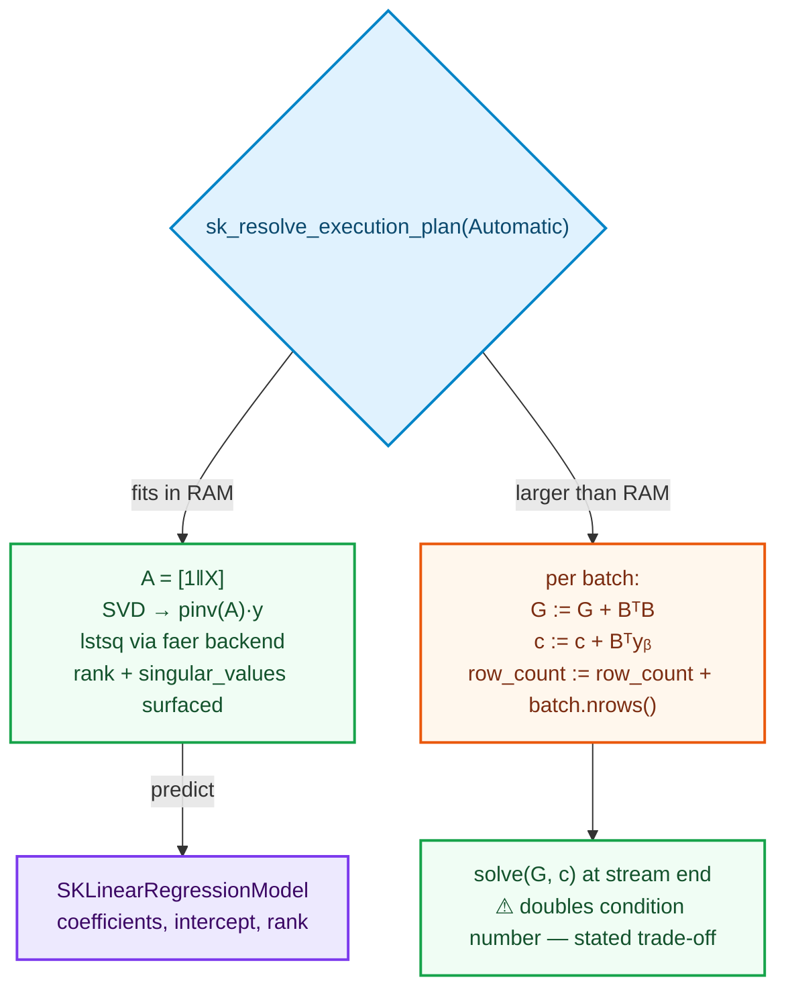

# Adding a Linear Model — `SKLinearRegression`

> Pre-read: [How to add an Algorithm](how-to-add-an-algorithm.md) (§5 planning, §7 streaming)
> and [Adding a Transformer](adding-a-transformer.md) (the moments state that combines — keep it
> in mind; the state here is its first **supervised** cousin).

Linear regression looks like the easiest algorithm in the catalog and is the best
teacher of the two most important numerical-preserving decisions in the whole library:
**which decomposition** carries the solve, and **what a streaming formulation of a dense
linear system means** — including the trade-off that makes it not just a "divided fit".

## 1. Story & decisions

| Decision | Chosen | Roads not taken — and the reason they are traps |
|---|---|---|
| Solver | **SVD least squares** through the backend (`lstsq` = pseudoinverse path) | **Normal equations** (`solve(AᵀA, Aᵀy)`) — the textbook one-liner — squares the condition number: `κ(AᵀA) = κ(A)²`. For even moderately ill-conditioned real data this is the difference between 13 and 7 significant digits, and it silently produces wrong answers exactly where practitioners most need trust (correlated features). §2 walks the numbers. |
| Rank deficiency | Keep `rank` and `singular_values` from `SKLeastSquaresSolution`; thin support surfaced today | Silently computing with a rank-deficient matrix and returning a solution that claims "the" answer is a subtraction bug hidden in plain sight — SVD hands rank and singular values for free, so we surface them. |
| Intercept handling | Design-matrix augmentation (prepend a column of ones) unless `include_intercept` is `false` — the PRD forbids
scikit-learn abbreviations, so `include_intercept` is the name that carries this chapter | Solving for intercept separately via two means collapses rank prematurely on rank-deficient designs. |
| Streaming | **Gram accumulation per batch**: carry `AᵀA` and `Aᵀy` (and `row_count`) in the stream state, and solve at the end — **the same form the in-memory path never had to use — and the honest precision trade-off is stated.** | Two-pass streaming (means then squares) re-reads the data — the streaming mode exists precisely because we cannot. |
| Dtype | `F: SKFloat` on features; targets arrive as `f64` (`SKTargetView::Continuous`) | Type application binds feature dtype; the *model's* coefficients rise to the solve's precision policy (f64 state, see §3). |

Mermaid, both regimes at a glance:



---

## 2. Theory from zero — least squares, and why one line hides a lie

**The problem.** We have rows `xᵢ ∈ ℝᵖ` and targets `yᵢ ∈ ℝ`. We want a vector of
coefficients `β` and a scalar intercept `b₀` so that `xᵢ·β + b₀ ≈ yᵢ`. "Best" is
least-squares: minimize `Σᵢ (yᵢ − xᵢ·β − b₀)²`. With the augmented design matrix
`A = [1 | X]` (ones in the first column), that is one matrix equation: minimize `‖Aβ − y‖₂`.

Three roads to `β`, and the difference between them is not style — it is **numerics**:

**Road 1 — Normal equations.** Set the gradient of `‖Aβ − y‖₂²` to zero:
`AᵀAβ = Aᵀy`. One triangular solve afterwards. The seductive part: `AᵀA` is *smaller*
than `A` when rows ≫ columns (a `p×p` object instead of `n×p`), which made it the
pedagogical favorite for decades. The catch is measurable and unforgiving:

> `κ(AᵀA) = κ(A)²` — the condition number squares.

Condition number is the ratio by which a linear solve can amplify input rounding;
counting doubles means doubling the exponent of the loss: if `A` has condition `10⁷`,
`AᵀA` has `10¹⁴`, and a 64-bit float has 16 digits — with `AᵀA` the solve is allowed
about **two digits** of trust at exactly the kind of gritty, correlated-feature datasets
scikit-learn gets asked to process daily. And near-multicollinearity is not exotic: it is
*any* pair of features that happen to co-move (age and years-of-experience; two sensors
reading the same room).

**Road 2 — QR.** Orthogonalize `A` (`A = QR`), then `β = R⁻¹Qᵀy`. `κ(QR) = κ(A)` — the
condition number is *not* squared, because the orthogonal factor is perfectly conditioned
by construction. Stable, `O(np²)`, the classic library workhorse.

**Road 3 — SVD (the mvp of the "if it is important enough to be in the catalog, it must be
stable enough to be in the intro" school).** `A = UΣVᵀ`, so
`β = Σᵢ σᵢ≠0 (uᵢ·y / σᵢ) vᵢ` — the pseudoinverse solution. It costs more than QR *and*
does something QR does not: **it shows you the rank**. Singular values near zero declare
the exact features that make the problem degenerate, and the pseudoinverse path
(`pinv`, `rcond = ε·max(m,n)` in our backend) is exactly how a *least-squares* solve
degrades gracefully when `A` is not full-rank, returning (i) the minimum-norm solution
and (ii) the information that it did so.

The library's decision: **go through SVD** — exposed as the backend's `lstsq`, which
returns `solution`, `rank`, `singular_values` and residual sums — with QR available for the
day a profile demands a cheaper decomposition. One product line (feature `blas-backend`)
selects ndarray-linalg vs faer; the *algorithm* never sees either (§5 anchor — backends are
injectable, dispatch-level truths).

**Sources to learn the numerics:**

* Golub & Van Loan, *Matrix Computations* — chapters on least squares, condition numbers,
  and pseudoinverse: the canonical reference
* Trefethen & Bau, *Numerical Linear Algebra* — lectures 4–5 and 11–19 build SVD and
  least squares in a way a working engineer reads in an afternoon
* Higham, *Accuracy and Stability of Numerical Algorithms* — if you want to *prove* the
  claims about normal equations; the chapter's warnings are his §20

### 2.1 The streaming road

Streaming sits on the same skeleton — but the naive intuition here *doubles down* on the same
hole. The tempting "solve least squares per batch and average the β" is almost never right: a
weighted average hides how the covered rows distributed, and per-batch ranks do not
compose.

What *composes* is the raw material of the normal equations — and that is the honest
finding: the streaming regions re-shape the choice to Gram:

```text
G := AᵀA        (p × p, symmetric)
c := Aᵀy        (p, right-hand side)
```

Each update adds a rank-|B| contribution: for each batch B (rows × p),

```text
G := G + BᵀB
c := c + Bᵀy_batch
```

At the end, one solve of `Gβ = c` obtains the coefficients. Exactly one extra fact dumps the
price tag on the table: **we computed `AᵀA`, so we are square-conditioning again**. Thus the
streaming trade-off reads, honestly:

| | in-memory SVD | streaming Gram |
|---|---|---|
| Significant digits at `κ(A)=10⁷` | ~9 (16 − log₁₀κ) | ~3–5 (the squared condition eats double) |
| Memory per stream step | O(n·p) | O(p²) — the entire point |
| Rank detection at stream end | native | only via `G`'s own singular values (≈ σᵢ² of A) |

This is also why the streaming chapter of the *optimizer* family (next chapter) prefers SGD
on day one: SGD never forms `AᵀA`, and its engine turns *streaming* from a constraint into
the algorithm's natural home.

---

## 3. The state — Gram, and what to carry besides

```rust
// crates/sciencekit_linear_model/src/linear_regression/core_implementation.rs
#[derive(Debug, Clone, Default)]
pub struct SKGramState<const WITH_INTERCEPT: bool> {
    row_count: u64,
    gram: ndarray::Array2<f64>,  // AᵀA, (p + intercept) × (p + intercept)
    rhs: ndarray::Array1<f64>,   // Aᵀy,  (p + intercept)
}
```

Notes that carry design weight:

- statistics once again accumulate in **f64** unconditionally, like the moments state —
  when you accumulate `BᵀB` products, f32×f32→f32 products cross 3 magnitudes of drift per
  row in adversarial inputs, and the covariates' first digits are exactly what matters;
- `const WITH_INTERCEPT: bool` carries through; a `1` turns into a prepended column that
  the *gram absorb* adds by chain rule, no separate pass needs reading the data;
- `row_count` is needed for the residual computation only, not the solve.

---

## 4. The crown code, both regimes

```rust
impl<F: SKFloat> SKSupervisedFit<F> for SKLinearRegression {
    type Model = SKLinearRegressionModel;
    type Error = SKError;

    fn fit<'a, X, T>(&self, features: X, targets: T) -> Result<Self::Model, SKError>
    where
        X: TryInto<SKDataView<'a, F>, Error = SKError>,
        T: TryInto<SKTargetView<'a>, Error = SKError>,
    {
        let view = features.try_into()?.as_dense()?;
        let target = targets.try_into()?.as_continuous()?.into_owned();

        sk_run_operation(
            SKOperationAttributes {
                operation: SKOperationKind::Fit,
                rows: view.nrows(),
                columns: view.ncols(),
                execution_mode: self.execution_intent(),
                backend: SKBackendKind::Faer,
            },
            || {
                // 1 · PLAN — same four lines as every algorithm
                let mut context = SKExecutionContext::real();
                context.dataset_size_bytes = view.len() as u64 * size_of::<F>() as u64;
                context.dataset_elements = Some(view.len() as u64);
                context.access_pattern = SKAccessPattern::Sequential;
                context.grain = SK_BINARY_COMBINE_GRAIN; // closeness-of-fit of the batch
                                                          // kernel; the GEMM grain is not yet
                                                          // calibrated — see the note below
                let plan = sk_resolve_execution_plan(self.execution_intent(), &context)?;

                // 2 · SOLVE — through the backend; vanilla-f64 design matrix
                let backend: Box<dyn SKMathBackend<F>> = Box::new(SKFaerBackend::new());
                let (design, target_f) = self.build_design(view, target);
                let least_squares = backend.lstsq(
                    design.view(),              // A, n × p (+1)
target.view().insert_axis(Axis(1)),  // y as n × 1
                )?;

                // 3 · SURFACE — rank and singulars are information, not noise
                SKLinearRegressionModel::from_least_squares(least_squares, self)
            },
        )
    }
}
```

and the streaming twin, which really is "the same data pages, a different sink":

```rust
impl SKLinearRegression {
    pub fn fit_streaming_source<S, F>(&self, source: &mut S, plan: &SKExecutionPlan)
    -> Result<SKLinearRegressionModel, SKError>
    where
        F: SKFloat + Send,
        S: SKLazySource<F> + Send,
    {
        let mut state = SKGram::zeros(design_width);   // AᵀA & Aᵀy carry the regression
        sk_run_streaming_driver(source, &mut state, |batch, parallelism, state| {
            sk_run_operation(
                SKOperationAttributes {
                    operation: SKOperationKind::PartialFit,
                    rows: batch.data().nrows(), columns: batch.data().ncols(),
                    execution_mode: self.execution_intent(),
                    backend: SKBackendKind::Faer,
                },
                || state.absorb_batch(&batch.data(), parallelism),
            )?;
            SKStreamDecision::Continue
        }, plan)?;

        // solve at stream end — rank checks ride on G's singular values (≈ σᵢ² of A)
        SKLinearRegressionModel::from_gram(state.solve_with_backend(...)?)
    }
}
```

`predict` on the model, honest minimum:

```rust
impl<F: SKFloat> SKRegressorPredictor<F> for SKLinearRegressionModel {
    type Error = SKError;
    fn predict<'a, X>(&self, features: X) -> Result<ndarray::Array1<F>, Self::Error>
    where X: TryInto<SKDataView<'a, F>, Error = SKError> {
        let view = features.try_into()?.as_dense()?;
        let (rows, _cols) = view.dim();
        let mut out = ndarray::Array1::zeros(rows);
        azip!((row in view.rows(), value in &mut out) {
            let mut acc = self.intercept_expectation();
            for (coefficient, feature) in self.coefficients.iter().zip(row) {
                acc += coefficient * (*x).get();
            }
            *value = acc;
        });
        Ok(out)
    }
}
```

---

## 5. Tests — the numerics-labeled set

```rust
// linear_regression_tests.rs
#[test]
fn recovers_exact_coefficients_to_epsilon() {
    // let x = array![[1.0, 0.0], [0.0, 1.0], [1.0, 1.0], [2.0, 1.0]];
    let true_coefficients = [3.0, -2.0];
    let y: Array1<f64> = x.map(|row| row.dot(&true_coefficients) + 0.5);
    let model = SKLinearRegression::new().build().unwrap().fit(x.view(), y.view()).unwrap();
    assert!((model.coefficients()[0] - 3.0).abs() < 1e-12);
    assert!((model.coefficients()[1] - (-2.0)).abs() < 1e-12);
    assert!((model.intercept() - 0.5).abs() < 1e-12);
}

#[test]
fn rank_deficiency_is_surfaced_not_hidden() {
    // feature columns linearly dependent — rank < p known ahead
    let x = array![[1.0, 2.0], [2.0, 4.0], [3.0, 6.0]];   // second column = 2 · first
    // SVD path: solution & rank reported; NOT silently mis-answered
    let sol = ...fit(x, y) — asserts `rank() == 1` and the minimum-norm answer is returned
}

#[test]
fn streaming_gram_matches_full_array() { /* the streaming state carries exactly
    gram + rhs + row_count; absorb_batch vs full-array G agree to 1e-13 (f64) */
}
```

(walk-through note to keep in the shipped pages: the third test exists to *show* how the
streaming path's accuracy gate — *same fixtures in memory vs streaming* — is how normal
equations got *kept* streaming but with the §2 caveat printed as a test contract.)

---

## 6. Acceptance walk-through & sources

| Acceptance criterion (PRD §8.7) | Landing on the tests (§5) |
|---|---|
| Lots and little data | four-row exact fixture and the rank-deficient one — two shapes, one solver |
| Under concurrency | model is `Sync` + `Copy`-safe; scoring under rayon exercised in the scorers chapter |
| Model export | coefficients + intercept + design options serialize (export conventions live in the model chapter of the anchor) |
| Metrics | `SKSupervisedScorer` (regressor) / `SKLabelScorer` (classifier) give `score()` free — the R² chapter exercises it against these models |

**Chapter sources:**

- Golub & Van Loan — §5.3–5.6 (least squares), §12 (SVD applications)
- Trefethen & Bau — lectures 11–12 (SVD), 18–19 (conditioning)
- Higham (2002) — §20 (the condition-number evidence for the normal-equations trap)
- scikit-learn `sklearn.linear_model.LinearRegression` — the *semantics* you are matching, and one honest sanity-check: its least-squares dispatch is the SVD-based LAPACK `gelsd` family — exactly the pseudoinverse path this chapter's backend code takes

Next: the family where streaming is not an adaptation but the *home* — gradient descent,
state-as-accumulator, and why in-memory training is just "the batch of everything".
