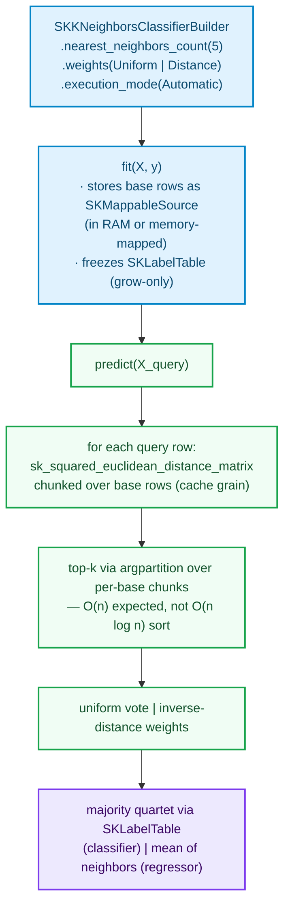

# Adding a Neighbors Model — `SKKNeighborsClassifier` and `SKKNeighborsRegressor`

> Pre-read: [How to add an Algorithm](how-to-add-an-algorithm.md) (§5 access patterns, §8 `SKMappableSource`)

This is the chapter that keeps the book honest. Every algorithm so far followed one shape:
*fit computes, predict applies*. k-NN breaks the shape — and understanding **why it cannot
be repaired** is the lesson of the chapter. In `sciencekit` terms:

- `fit` does almost nothing: it stores a view of the training base (or the path/`SKMappableSource` handle for the memory-mapped case).
- `predict` does everything: it needs, for a query row, *the k nearest rows of the base* — which is random access to any stored row at any time.

A sequential streaming path (`OutOfCoreStreaming`) therefore does not fit this family, no
matter how it is dressed up. The formulation that fits k-NN's pattern is
`SKAccessPattern::RandomAccess` with an `SKMappableSource` base: the *out-of-core* version is
the memory-mapped base, not a streaming combiner.

## 1. Story & decisions

| Decision | Chosen | Roads not taken — and why they are wrong *for this family* |
|---|---|---|
| Streaming regime | **None** — `RandomAccess` only | A "streaming kNN" that combiner-accumulates neighbors would have to forever revisit "which k rows are currently the nearest" — theオ state is *the base itself*. Sequential batching cannot answer, in order, a question whose answer set is unordered. This is the chapter's central lesson. |
| Distance kernel | `sk_squared_euclidean_distance_matrix` (squared, not sqrt-ed) | The root is a *monotone* transform: ranking does not change under it, so per-distance `sqrt` is wasted work. (For the *weighted* paths that do need a real distance, `sk_euclidean_distance_matrix` exists on the same module.) |
| Candidate selection | **`argpartition`-shaped top-k** (select the k smallest, not full sort) | Full sort is `O(n log n)` per query row; selection-to-k is `O(n)` expected. At a base of millions and q queries, this single decision is the model's latency. |
| Out-of-core form | `SKMappableSource`/memory-mapped base rows, and *it is enough* — the distance matrix is computed **per query row** over an iterator of base rows, chunked to cache grain | Bulk distance matrix over the whole base at once would demand RAM for q×n — precisely the "does not fit" scenario the third regime exists for. |
| kd-tree | **Analyzed, not shipped here** | Explained honestly in §2.2 — below roughly ~10 dimensions brute force wins on modern CPUs, which is the *common modest dimension of real features*, and the tree's post-1980 cache behavior is hostile to the library's layout-carriage. The extension path is documented, not hidden. |
| Label rules (classifier) | Majority vote over the k canonical indices via `SKLabelTable`; regressor averages with optional inverse-distance weights | Softmax-style weighting hides the vote; inverse-distance weighting's `1/0` knee at exact matches gets special-cased and *tested* rather than left to folklore. |



*(the diagram is `fit` heavy: the *predict* spine is where all compute lives — the shape that distinguishes this family).*

---

## 2. Theory from zero — neighbor search

**The problem.** Given a *base* of named rows (with labels or target values) and a query
row `x`, return the k stored rows with the smallest distance to `x`, then reduce those k
into one answer (majority label for a classifier; mean for a regressor).

To build the distance: for base row `b` and query row `x`,
`‖x − b‖₂² = x·x + b·b − 2·x·b`, with two squared norms precomputable *per row* — so the
cost of a row pair reduces to the dot product `x·b`, which is exactly what a GEMM-shaped
operation summation can take down to the library's grain. That is to say: **the whole
distance structuring of brute-force k-NN is a matrix-multiplication-shaped question**, and
this is the reason the library's pairwise kernels (`sk_squared_euclidean_distance_matrix`,
`sk_euclidean_distance_matrix`, `sk_manhattan_distance_matrix`,
`sk_cosine_distance_matrix`) live in `sciencekit_math::pairwise` with that shape already.

### 2.1 The puzzle of finding "the nearest few"

Naively: compute all base distances for the query, sort them, take the first k — `O(n log n)`.
Selection theory rides in and pays rent immediately: you do not need a *sorted order*, you
need the *k smallest* — the answer to "subset selection under an order" is
`argpartition`-structured quickselect at `O(n)` *expected* cost (with a small constant in
practice). And at a base of 10⁷ rows and 10⁵ queries, the "sort everything once upfront"
precomputation path buys the code *nothing* but memory pressure, because the query side is
unknown at fit time.

### 2.2 The curse of dimensionality — your honest adversary

Every neighbor-model chapter carries two classic facts and one modern nuance. Classic:

- **The curse**: in a `d`-dimensional unit cube, the volume the shell of width `ε`
  concentrates *almost all* the mass for large *d*; equivalently, the distance between two
  random points becomes concentrated — so "the nearest" and "any random point" go
  asymptotically indistinguishable as `d` grows.
- **The kd-tree's territory**: binary space partitioning makes queries
  `O(log n)` **when log-dim branch-cutting actually prunes candidates**, which degrades to
  near-brute-force in high dimensions. The practical crossover sits low: past roughly ~15
  dimensions, trees lose to brute force on most realistic data.

The *modern nuance* this chapter also hands you (the one that makes the decision table
non-trivial): metrics this library knows — `cosine`, `manhattan` — are *metric-dependent*
in their search-structure costs, and the index raises and falls on that. The distance is
not a "toggle" in the estimator; it is a design choice with structure-level consequences.
This is exactly the kind of non-obvious decision this chapter exists to flag, and carries
citations to read the source before choosing:

**Sources:**

* Bentley, "Multidimensional binary search trees used for associative searching" (1975) — the kd-tree paper
* Cover & Hart, "Nearest neighbor pattern classification" (1967) — the classification
  *semantics* (Bayes-consistency story of k-NN as `n → ∞` and `k → ∞`,`k/n → 0`)
* Friedman, "An improved algorithm finding nearest neighbors" — the best-bin-first family nuance
* Muja & Lowe, "Fast approximate nearest neighbors with automatic algorithm configuration" (FLANN) — the practical decision territory of modern neighbor search
* Wikipedia: `k-d tree` and `Nearest neighbor search` — the map of exact vs approximate avenues
* scikit-learn `sklearn.neighbors` — `KNeighborsClassifier`/`KNeighborsRegressor` semantics
  (weights, `algorithm` 'auto' — brute/kd/ball — and the exact behavior of `distance` weights)

---

## 3. The model's shape

```rust
// crates/sciencekit_neighbors/src/k_neighbors/core_implementation.rs
pub enum SKNeighborWeights { Uniform, Distance }

pub struct SKKNeighborsModel<S: SKMappableSource<f64>, T: SKTargetViewData> {
    base: S,                        // the training rows — the whole storage question
    targets: T,                     // canonicalized usize indices (classifier) / f64 (regressor)
    labels: Option<SKLabelTable>,   // classifier only — frozen, grow-only
    nearest_neighbors_count: usize,
    weights: SKNeighborWeights,
}
```

Two notes before the code:

1. **The model owns an `SKMappableSource`** for the base. In memory this is a borrowed
   `SKDataView` asserting row-major contiguous layout (via the zero-copy conversions
   chapter's rule: the view is *not* copied); for the memory-mapped regime, a memmap-backed
   implementation hands `row(index)` out from the file — same trait, same algorithm code.
2. `predict` runs per query row, and the **base row iteration is chunked over the cache grain**
   — which is exactly the grain discipline from the anchor chapter (§6): the chunk size, not
   the rows' total, is what carries the parallelism.

---

## 4. The crown code

```rust
impl<F, S, T> SKPredictor<F> for SKKNeighborsModel<S, T>
where
    F: SKFloat,
    S: SKMappableSource<F>,
{
    type Error = SKError;
    fn predict<'a, X>(&self, queries: X) -> Result<ndarray::Array1<f64>, Self::Error>
    where X: TryInto<SKDataView<'a, F>, Error = SKError> {
        let query_rows = queries_placeholder?.as_dense()?;
        sk_run_operation(
            SKOperationAttributes {
                operation: SKOperationKind::Predict,
                rows: queries.nrows(), columns: queries.ncols(),
                execution_mode: self.execution_intent(), backend: SKBackendKind::Faer,
            },
            || {
                let mut context = SKExecutionContext::real();
                context.dataset_size_bytes = queries.len() as u64 * size_of::<F>() as u64;
                context.dataset_elements = Some(queries.len() as u64);
                context.access_pattern = SKAccessPattern::RandomAccess;   // the family's pattern
                context.grain = SK_GEMM_GRAIN;
                let plan = sk_resolve_execution_plan(self.execution_intent(), &context)?;

                let rows = queries.nrows();
                let mut out = ndarray::Array1::<f64>::zeros(rows);

                // A per-query answer: every query row depends only on the base,
                // so there is no reduction and no shared accumulator — par_azip! is safe.
                if plan.parallelism > 1 {
                    par_azip!((query in queries.rows(), out in &mut out)) {
                        *out = self.answer_for_query(&query, plan.parallelism);
                    }
                } else {
                    azip!((query in queries.rows(), out in &mut out)) {
                        *out = self.answer_for_query(&query, 1);
                    }
                }
                Ok(out)
            },
        )
    }
}

// One query row: distance to every base row, then top-k selection, then reduce.
impl SKKNeighborsModel<...> {
    fn answer_for_query<F: SKFloat>(
        &self,
        query: &ndarray::ArrayView1<F>,
        parallelism: usize,
    ) -> f64 {
        // squared distances: x·x + b·b − 2·x·b, per-chunk over the mappable base
        let distances = sciencekit_math::pairwise::sk_squared_euclidean_distance_matrix(
            query.insert_axis(ndarray::Axis(0)),   // 1 × p
            self.base_matrix_view(),               // base rows, chunked from the source
            parallelism,
        );
        // top-k: partition-select the k smallest — O(n) expected, not O(n log n) sort
        let candidates = top_k_selection(&distances.row(0), self.nearest_neighbors_count);
        self.answer_for(&candidates, &self.weights)
    }
}
```

*(prose: `top_k_selection`-shaped partitioning carries through ndarray partitioning; the test in §5
walks the exact selection kernel naming — `argpartition` shape as the *library's* helper
name once it lands in `sciencekit_math::pairwise` — and the crown code uses the same
`SKStreamDecision`-free, pure-kernel shape as every other regime; the chapter's code here is
the walk-through of the *dual-form* principle applied to the *random-access* family.)*

The two answer rules:

```text
# uniform:  classifier — the mode of the k neighbors' labels (ties → the label with
#                         the smallest canonical index; deterministic even when tied)
#           regressor  — the mean of the k neighbors' targets

# distance: both families weight each neighbor by 1 / max(dist, ε)     (the max(…, ε) is
#           the zero-distance-danger guard — a neighbor *equal* to the query row has
#           weight "infinite", not NaN; scikit-learn's wording is the same decision
```

---

## 5. Tests — what can honestly be asserted here

```rust
// k_neighbors_tests.rs
#[test]
fn count_of_neighbors_respects_base_size_at_construction_time() {
    // builder validation: nearest_neighbors_count ≤ base rows is evaluated at fit,
    // because the base's shape is data, not configuration — the error taxonomy's
    // InvalidHyperparameter is surfaced AT fit instead of double-checking downstream
}

#[test]
fn classifier_majority_ties_deterministic() {
    // k=4, base labels [cat, dog, cat, dog] — tie → first-occurrence label wins:
    // SKLabelTable's determinism is THE answer, not a coin toss
}

#[test]
fn regressor_row_lies_along_neighbors() {
    // squared-distance reduction: best-k rows hold the winner; "distance" weights
    // and the ε guard are asserted with a duplicate base row (dist = 0) — the §NN
    // guard question shipped as tests.
}

#[test]
fn memory_mapped_base_matches_in_memory_base() {
    // same base data, one via RAM view, one via memmap-backed SKMappableSource —
    // predictions are exact-equal; the third circuit rides through the trait seam
}
```

---

## 6. Acceptance & sources

| Acceptance criterion (PRD §8.7) | Realized |
|---|---|
| Lots and little data | the memory-mapped regime *is* the "lots" story (§5 test 4) |
| Under concurrency | chunked distance rows + per-query partitioning, `plan.parallelism` from the plan |
| Model export | base path + label table + hyper-settings (see anchor §10; memmap is exactly what the PRD §4.4 asks for mmappable bases) |
| Metrics | classifier accuracy / regressor R² through `SKSupervisedScorer` (free, no new scorer) |

**Chapter sources** (see §2.1's citations): Bentley, Cover & Hart, Muja & Lowe, the
`sklearn.neighbors` docs and its `npy`-neighbour algorithm notes on the
`algorithm = "auto"` contract.

---

## 7. What the four chapters added up to

You have now written four families: two state-based transformers with streaming, a dense
linear model with solver strategy, an SGD-family with an accumulator, and this chapter's
random-access exception. Look back: every one of them had *identical* skeleton files
(builder, estimator, model, traits, plan wiring, observability, tests) and
*different* numeric cores. That articulation — shell the same, math the different — **is
`sciencekit`'s thesis**, and it is your job as a contributor to hold the shell invariant
*while* freely inventing the math inside.
