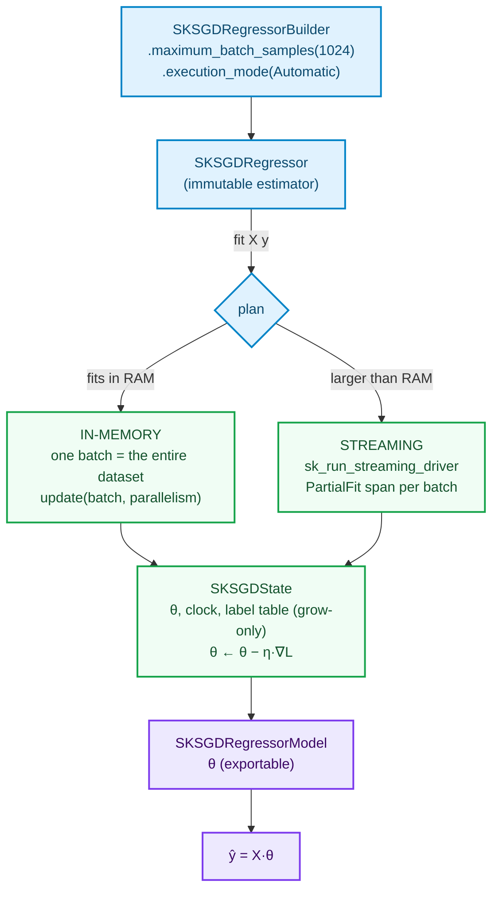

# Adding a Streaming Model — `SKSGDClassifier` and `SKSGDRegressor`

> Pre-read: [How to add an Algorithm](how-to-add-an-algorithm.md) (§5 planning, §7 streaming driver)
> and [Adding a Linear Model](adding-a-linear-model.md) (§2's condition-number warning — this
> chapter is the escape route it promised).

This is the chapter where the library's architecture stops being a compromise. Gradient
descent **is** streaming-native: it consumes one sample (or one batch) at a time, updates an
accumulator, and never asks "give me everything". So the reference code here does not add
streaming to a batch algorithm — it presents the estimator **as a state machine whose
in-memory fit is simply the degenerate case of one batch carrying everything**, exactly the
"one formulation, two regimes" principle from the Tutorials index.

## 1. Story & decisions

| Decision | Chosen | Roads not taken — and why they are wrong here specifically |
|---|---|---|
| Update granularity per step | **mini-batch** (a whole `SKDataBatch` per `update`) | Pure online per-sample SGD (n=1) maximizes streaming purity but wastes the library's core competence: vectorized kernels over a batch. One `azip!`-shaped pass over a batch is what the CPU actually likes. |
| In-memory path | The **same** batch update over one batch containing the full array | A separate closed-form/batch route would fork the semantics: two "fits" with answers that drift apart on ill-conditioned inputs — the exact problem the dual-regime principle exists to prevent. |
| Learning-rate schedules | `constant` and `inverse_scaling` (ηₜ = η₀·t^−power_t); scikit-learn's `optimal` analyzed, not shipped | `optimal` ηₜ = 1/(α·(t+t₀)) comes with a *theory-installed* constant (per Bottou's fine-print in "SGD Tricks"), not a portable default; the honest move is to state why, cite it, and leave the door open. §2.1 details it. |
| Losses | Regressor: squared error. Classifier: log-loss. Regularization: L2 (ridge, λ) | Huber loss is the honest loss for outliers but adds scale-parameter bookkeeping this introductory chapter should not carry; it stays a documented extension. λ = 0 is legal here — the builder accepts it — with one note: a fully quadratic, unregularized problem already has a better home in [SKLinearRegression](adding-a-linear-model.md). |
| PartialFit spans | Every batch's `update` wrapped in one `SKOperationKind::PartialFit` span | One fit-wide span for a 10⁵-batch job reports *nothing*; per-batch spans form the legible trace that makes streaming jobs debuggable. |
| Classifier labels | `sk_canonicalize_labels`-shaped **grow-only table**: indices frozen at first occurrence, extensible forever | Per-batch `HashMap` label→index without a frozen table would silently re-index history: batch 4 introducing `"dog"` must not move `"cat"`'s index 0 — and nothing in `Array2<F>`'s shape would catch it. Shapes lie; freeze the table. |



*(`Acc` marks the accumulator the two regimes share; the classifier carries `SKLabelTable`
in the same state slot.)*

## 2. Theory from zero — gradient descent, without the magic

Both families are supervised, so let us be explicit about the data: you have
rows `xᵢ ∈ ℝᵖ`, and either

- **regressor:** continuous `yᵢ`; the loss is squared error `L(θ) = ½ Σᵢ (xᵢ·θ − yᵢ)²`;
- **classifier:** labels `yᵢ ∈ {0..C−1}`; the loss is log-loss over a linear map, with
  softmax turning the class scores into probabilities, and each class carrying its own
  weight column.

**The property that carries this chapter is convexity.** Squared error is a quadratic in θ;
log-loss with a linear map is convex. Both are convex, so **plain gradient descent
converges *provably*** (cited: Bottou 2010 rate analysis; Ruder's survey as the map).
No second-order machinery, no adaptive friend — the bare minimum the modern frameworks
demand before their own elaborate bells are even *considered*.

### 2.1 The single formula to understand

For a mini-batch Xᵦ (a `batch.nrows() × p` block) and targets yᵦ, with ridge penalty λ weighed on the coefficient vector:

```text
gradient(θ)   = (1/|B|) · X_Bᵀ (X_B θ − y_B) + λ θ     ← regressor; squared error's gradient
θ_new         = θ − ηₜ · gradient(θ)
```

Separate facts carry each symbol, and each one is a classic textbook door:

- **ηₜ, the learning rate** — how far to travel per step. Too high = divergence; too low =
  days to converge. The two shipped schedules:
  - `constant`: `ηₜ = η₀` — the simplest; tuning sensitivity then lands on the batch length;
  - `inverse_scaling`: `ηₜ = η₀ · t^(−power_t)`, `power_t = 0.25` matching scikit-learn's
    default — the Robbins–Monro annealing family, "give a different step scale across
    the training wave".
  - **`optimal` (why we analyzed it, not shipped it):** scikit-learn's `optimal` schedule
    ηₜ = 1/(α·(t+t₀)) is, in the Pegasos framework, a theorem-coupled rate whose t₀ is
    derived per Bottou's practical rules (Bottou 2012, "Stochastic Gradient Descent Tricks"):
    the constant is *dataset-state dependent*, and a partial-fit **resumable** schedule must
    reproduce that derivation exactly across process restarts to stay a theorem. That is a
    textbook-level claim worth the chapter's citation, but not its default: shipping it as
    pseudo-code without the derivation would hand the reader an unverifiable constant.
- **λ (ridge), as the L2 penalty you already know from the PRD** — the coefficient
  shrink is *temporal-independent*: the same penalty every step; the library holds λ = 0 as
  *legal but noted* — a fully quadratic, non-regularized problem is exactly
  [SKLinearRegression](adding-a-linear-model.md), shipped elsewhere by design (convex but *closed-form*).

**Sources:**

* Bottou, "Large-scale machine learning with SGD" — the classic: convergence as *rates*,
  and the online-vs-batch discussion worth reading before writing
* Ruder, "An overview of gradient descent optimization algorithms"
* Robbins & Monro, "A stochastic approximation method" (1951) — the theorem behind ηₜ ≈ 1/t
* Bottou, "SGD Tricks" (2012) — the practically-correct lemma behind scikit-learn's `optimal`
* Shalev-Shwartz et al., "Pegasos: primal estimated sub-gradient solver for SVM" — the
  theoretical framework tying loss + regularization to convergence with the theoretical learning rate

### 2.2 Why the classifier's labels survive streaming (`SKLabelTable`)

A streaming classifier sees classes as they arrive: batch one shows `["frog", "cat"]`,
batch four introduces `"dog"` — the label table must grow **without changing the meaning of
any earlier index**. The label table's deterministic first-occurrence canonicalization is
exactly that mechanism: existing labels' indices are frozen at construction, so batch 4
extends the table from `["frog","cat"]` to `["frog","cat","dog"]` and index 0/1 are
*cannot change* after first occurrence). A classifier
whose coefficient matrix re-indexes labels per batch is buggy in a way that type safety
will *not* catch (shapes stay `p × C`); §5's test is the boundary.

## 3. The combinable state, spelled out

```rust
// crates/sciencekit_linear_model/src/sgd/core_implementation.rs
pub struct SKSGDState {
    /// the schedule's t: number of `absorb_batch` calls the state has survived
    pub clock: u64,
    /// (p, C) — C = 1 for the regressor; f64 state unconditionally, per the anchor
    pub coefficients: ndarray::Array2<f64>,
    pub intercept: ndarray::Array1<f64>,
    /// classifier only — grow-only first-occurrence canonicalization
    pub labels: Option<SKLabelTable>,
}

impl SKSGDState {
    /// THE "partial fit". One batch in; one (θ, t) update out. This is EXACTLY the
    /// closure body handed to `sk_run_streaming_driver` — no outer loop re-derives it.
    pub fn absorb_batch<F: SKFloat>(
        &mut self,
        batch: &ndarray::ArrayView2<F>,
        targets: &ndarray::ArrayView1<'_, f64>,
        parallelism: usize,
        hyper: &SKSGDHyperparameters,
    ) {
        // gradient runs through the vectorized kernels (partial per worker — as in §6
        // of the transformer chapter), so no thread sees another's accumulator:
        let gradient = compute_batch_gradient(batch, targets, &self.coefficients, hyper);
        let rate = self.schedule_rate();   // constant | inverse_scaling by the clock
        self.coefficients = &self.coefficients - &gradient.mapv(|g| rate * g);
        self.intercept = ...;  // same update for the intercept row, per schedule
        self.clock += 1;
    }
}
```

## 4. Fit, predict, and the twins

`SKSupervisedFit` goes the same plan-setting four lines as every algorithm (§5 of the anchor) and then, per `plan.mode`:

```rust
impl<F: SKFloat> SKSupervisedFit<F> for SKSGDRegressor {
    type Model = SKSGDRegressorModel;
    type Error = SKError;
    fn fit<'a, X, T>(&self, features: X, targets: T) -> Result<Self::Model, SKError>
    where
        X: TryInto<SKDataView<'a, F>, Error = SKError>,
        T: TryInto<SKTargetView<'a>, Error = SKError>,
    {
        let view = features.try_into()?.as_dense()?;
        let target = targets.try_into()?.as_continuous()?.into_owned();
        sk_run_operation(
            SKOperationAttributes {
                operation: SKOperationKind::Fit,
                rows: view.nrows(), columns: view.ncols(),
                execution_mode: self.execution_intent(), backend: SKBackendKind::Faer,
            },
            || {
                let mut context = SKExecutionContext::real();
                context.dataset_size_bytes = view.len() as u64 * size_of::<F>() as u64;
                context.dataset_elements = Some(view.len() as u64);
                context.scalar_size_bytes = size_of::<F>() as u64;   // buffer guard precision
                context.access_pattern = SKAccessPattern::Sequential;
                context.grain = SK_ELEMENTWISE_TRANSFORM_GRAIN;   // the update's dominant kernel
                context.batch_size_hint = Some(self.maximum_batch_samples());
                let plan = sk_resolve_execution_plan(self.execution_intent(), &context)?;

                use SKExecutionMode::*;
                match plan.mode {
                    InProcessSynchronous | InProcessAsynchronous => {
                        // THE degenerate batch: the entire array is one batch
                        let mut state = SKSGDState::zeros(view.ncols(), self.hyperparameters());
                        state.absorb_batch(&view, &target.view(), plan.parallelism, &self.hyperparameters());
                        Ok(SKSGDRegressorModel::from_state(state))
                    }
                    OutOfCoreMemoryMapped => Err(SKError::ExecutionModeIncompatible {
                        mode: "OutOfCoreMemoryMapped", pattern: "sequential-batch SGD",
                    }),
                    OutOfCoreStreaming => Err(SKError::ExecutionModeIncompatible {
                        mode: "OutOfCoreStreaming", pattern: "in-memory fit entry point (use fit_streaming_source)",
                    }),
                    Automatic => unreachable!("resolve always returns a concrete mode"),
                }
            },
        )
    }
}
```

and the streaming twin (the natural home):

```rust
impl SKSGDRegressor {
    pub fn fit_streaming_source<S, F>(
        &self, source: &mut S, plan: &SKExecutionPlan,
    ) -> Result<SKSGDRegressorModel, SKError>
    where
        F: SKFloat + Send,
        S: SKLazySource<F> + Send,
    {
        let mut state = SKSGDState::zeros(...);
        sk_run_streaming_driver(source, &mut state, |batch, parallelism, state| {
            sk_run_operation(
                SKOperationAttributes {
                    operation: SKOperationKind::PartialFit,   // one span per batch
                    rows: batch.data().nrows(), columns: batch.data().ncols(),
                    execution_mode: self.execution_intent(), backend: SKBackendKind::Faer,
                },
                || {
                    state.absorb_batch(&batch.data(), &batch_targets, parallelism, &self.hyperparameters());
                    SKStreamDecision::Continue   // keep streaming until the source ends
                },
            )?,
        }, plan)?;
        Ok(SKSGDRegressorModel::from_state(state))
    }
}
```

The exact update closure (sketch carried faithfully into chapter 3):

```text
one batch in: Xᵦ, yᵦ → gradient(θ) ← (1/|B|) (Xᵦ θ − yᵦ)ᵀ Xᵦ + λ θ
              rate ← schedule(η₀, t)         # one of {constant, inverse_scaling}
              θ   ← θ − rate·gradient        # the ONLY sequential-mutating side of the family
              t   ← t + 1
```

### 5.6 `predict` and the label table's reverse map

The classifier's `predict` reduces probabilities across categories via the *same* label
table — `argmax` over the class weights, then `SKLabelTable::label_of(index)` decodes the
integer back into its frozen label string. The regressor simply returns one `F` per row —
matching the anchor §3.2 rule: `SKRegressorPredictor<F>` returns `Array1<F>`.

The structural rule this encodes: label lookups always go *through* the table, never an
ad-hoc map in the model — §5's grow-only test is the enforcement.

## 5. Tests — the streaming-native four

```rust
// sgd_tests.rs
#[test]
fn in_memory_equals_single_batch_streaming() {
    // identical answers: fit(whole array) == fit_streaming(one batch holding the array)
    // — the anchor principle, tested at the numerical level
}

#[test]
fn learning_rate_schedule_matches_specified() {
    // schedule-only change: constant vs inverse_scaling on the SAME fixture batch
    // (θ paths differ *by the schedule formula*, nothing else)
}

#[test]
fn labels_table_is_grow_only_in_stream() {
    // batch 1: ["frog","cat"]; batch 4 introduces "dog"
    // asserts: pre-"dog" indices unchanged after the fourth batch, first-occurrence
    // — inference at `sk_canonicalize_labels` — and prediction decodes via `label_of`
}

#[test]
fn per_batch_partial_fit_spans() {
    // asserts count of PartialFit spans == count of batches — the legible trace
    // that makes streaming jobs debuggable rather than one opaque fit span
}
```

## 6. Acceptance & sources — mapped, not repeated

| Acceptance criterion (PRD §8.7) | Realized |
|---|---|
| Lots and little data | §5 test 1 — literally the regimes-equivalence |
| Under concurrency | gradient is parallel (partial accumulation), θ update sequential; `&self` fit; model `Sync` |
| Model export | θ + clock + label table — plain fitted structure |
| Metrics | `SKSupervisedScorer` (R² for the regressor) / `SKLabelScorer` (accuracy for the classifier through the scorer chapter) |

Standing **study sources** (each also explained §2):

- Bottou, "Large-scale machine learning with SGD" (2010) & "SGD Tricks" (2012)
- Ruder (see §2)
- Shalev-Shwartz et al., Pegasos (see §2)
- Robbins & Monro (see §2)
- scikit-learn `sklearn.linear_model.SGDClassifier`/`SGDRegressor` documentation and the
  `partial_fit` protocol docs — the semantics referenced in this chapter, including the
  honest caveat on `optimal`.

Next: the family where streaming does not apply — and explaining *why* is the lesson.
