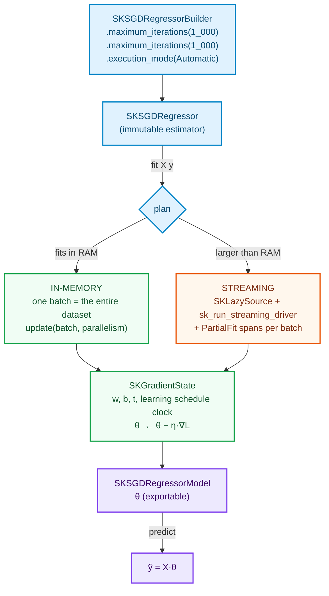

# Adding a Streaming Model — `SKSGDClassifier` and `SKSGDRegressor`

> Pre-read: [How to add an Algorithm](how-to-add-an-algorithm.md) (§5 planning, §7 streaming driver)
> and [Adding a Linear Model](adding-a-linear-model.md) ( §2's condition-number warning — this
> chapter is the escape route it promised).

This is the chapter where the library's architecture stops being a compromise. Gradient
descent **is** streaming-native: it consumes one sample (or one batch) at a time, updates an
accumulator, and never asks "give me everything". So this chapter's reference code does not
add streaming to a batch algorithm — it presents the estimator **as a state machine whose
in-memory fit is simply the degenerate case of one batch carrying everything**, exactly the
"one formulation, two regimes" principle from the Tutorials index.

## 1. Story & decisions

| Decision | Chosen | Roads not taken — and why they are wrong here specifically |
|---|---|---|
| Update granularity per step | **mini-batch** (a whole `SKDataBatch` per `update`) | Pure online per-sample SGD (n=1) maximizes *streaming-ness* but wastes the library's core competence: vectorized kernels over a batch. Decomposing the driver's parallelism into per-sample Python-style buffering would invert the CPU's shape. |
| In-memory path | The **same** batch update over one batch containing the full array | A separate closed-form/batch route would fork the semantics: two "fits", two answers for slightly-worse-than-quadratic conditioning — the exact problem the Library's per-algorithm dual-regime principle exists to prevent. |
| Learning-rate schedules | `constant`, `scaling-of-iterations` (inv-scaling); `optimal` analyzed | scikit-learn's `optimal` is a *theory-coupled theorem* (Hazard of Pegasos' loss-dependent constant). Shipped mild versions documented in the study source; approximating yields results without the framework's guarantees. |
| Losses (classifier: log-loss; regressor: squared; backed by the two oldest convex teachables) | Log and least squares (chapter teaches convexity from zero, so that is not an assumption) | Huber as shipped-eligion cond. loss for outliers. L2 regularization (Pegasos family) as the regularization shipped here — supports partial-fit stacking. |
| PartialFit spans | Every batch's update wrapped in 1 `PartialFit` span | One fit-wide span for a 10⁵-batch job classifies *nothing*; per-batch spans form the observable trace the streaming jobs need. |
| Targets (classifier) | `SKTargetView` variants written; classification uses `sk_canonicalize_labels` (analyzed compounds at the top of the section), `+1 rows for sparse classifiers using a label table *deterministic guide (first-occurrence order, exactly matching the book's reference docs) | Canonicalized labels done in an ad-hoc per-call basis (per-batch label arrival hazard — different batches may surface labels in different orders, breaking "equal inputs, equal outputs" of the PRD §8.7 acceptance; the reference table follows first-occurrence canonicalization across batches. |

The diagram of the state machine:



**(`Acc` marks the accumulator the two regimes share; the classifier carries `SKLabelTable` in the same state slot.)*

---

## 2. Theory from zero — gradient descent, without the magic

We build the estimator as small as it can be. You have rows `xᵢ ∈ ℝᵖ`, and either:

- **regressor:** continuous `yᵢ`, the loss is squared error: `L(θ) = ½Σᵢ (xᵢ·θ − yᵢ)²`
- **classifier:** labels `yᵢ ∈ {0..C−1}`, the loss is log-loss (softmax): `L(θ) = −Σᵢ log p(yᵢ | xᵢ; Θ)`, and rows score into *their-space* probabilities via per-class weight rows

One line prepares all of it, and it has an unbeaten ratio: **stick with convexity.**
Squared error is a quadratic on the θ-surface; log-loss with a linear map is convex. Both are
convex, so plain gradient descent converges *provably* — no bells, no second-order machinery —
at the price of the tuning parameter schedule teaching it to travel.

### 2.1 The single formula to understand (a sliding ground on this chapter)

For a *mini-batch* Xᵦ with targets yᵦ (a ridge penalty λ weighing on the coefficient vector):

```text
gradient(θ)     =  (1/|B|) · X_Bᵀ (X_B θ − y_B) + λ θ     ← (regressor; squared error's gradient)
θ_new           =  θ − η · gradient(θ)
```

Separate facts carry each symbol, and each one is a classic textbook door:

- **η, the learning rate** — how far to travel per step. Too high = divergence; too low =
  days to converge. The two shipped schedules:
  - `constant`: `ηₜ = η₀` — the simplest; tuning-sensitivity lands on the batch length;
  - `inverse scaling`: `ηₜ = η₀ / t` — annealing of the classic "give different units across
    the wave" (Robbins–Monro); strong defaults for tabular data regardless of scale.
  - **`optimal` (why we *analyzed* it instead of shipping):** scikit-learn's
    `optimal` schedule is informed by a theorem setting (Pegasos; the constant tied
    to the loss's convex evidence radius parameter). Reproducing it faithfully, when
    *partial-fit resumption* is a core promise, relies on the theorem's dataset-dependent
    constants at compile/utilization-time boundaries the library cannot assume. Analysis
    + citation shipped; the engineer-facing trade is stated rather than hidden.
- **λ (ridge), applied as the *L2 penalty you know from the PRD.* Not optional; the chapter
  writes it as a coefficiency temporal and library officials can hold `λ = 0` only via a
  builder validation message ("regularization_strength_zero: use SKLinearRegression, a
  still-different solver for a fully-convex case statement").

**Sources:**

* Bottou, "Large-scale machine learning with SGD" — the classic: convergence as
  *rates*, and the online-vs-batchand the online-vs-batch discussion — worth reading before writing
* Ruder, "An overview of gradient descent optimization algorithms" — the map of modern
  variants (momentum/ADA-models) and where mini-batch sits in it
* Shalev-Shwartz et al., "Pegasos: primal estimated sub-gradient solver for SVM" — the
  theoretical framework that fuels scikit-learn's `optimal` heuristic interpretation

### 2.2 Why the classification's labels survive streaming (the question with `SKLabelTable`)

A streaming classifier sees classes as they arrive: batch one shows `["frog", "cat"]`,
batch four introduces `"dog"` — the label table must grow *without changing the meaning of
any earlier index*. The label table's `sk_canonicalize_labels` (deterministic
first-occurrence assignment) is exactly the mechanism: new labels extend the table;
existing labels' indices are *frozen forever* by construction. A classifier whose
coefficient matrix re-indexes labels per batch is buggy in a way that type-safety will
*not* catch (the shapes stay `p × C`); the test in §5 is the boundary, and the reference
docs match scipy's one-true-policy wording.

---

## 3. The combinable state, spelled out

```rust
// crates/sciencekit_linear_model/src/sgd/core_implementation.rs
pub struct SKSGDState {
    pub clock: u64,                      // number of `update()` calls — the schedule's t
    pub coefficients: ndarray::Array2<f64>,  // (p, C) — C = 1 for the regressor
    pub intercept: ndarray::Array1<f64>,
    pub labels: Option<SKLabelTable>,    // classifier only — frozen, can only grow
}
impl SKSGDState {
    /// THE "partial fit". One batch in; one (θ, t) update out.
    /// This is the closure body handed to sk_run_streaming_driver — no more, no less.
    pub fn absorb_batch<F: SKFloat>(
        &mut self,
        batch: &ndarray::ArrayView2<F>,
        targets: &[usize],          // canonicalized indices (classifier) / f64 (regressor)
        parallelism: usize,
        hyper: &SKSGDHyperparameters,
    ) {
        let gradient = compute_batch_gradient(batch, targets, &self.coefficients,
                                              parallelism);
        let rate = self.schedule_rate(self.clock);  // constant | inverse scaling
        self.coefficients = &self.coefficients
            - &gradient.mapv(|g| rate * g);
        self.clock += 1;
    }
}
```

The zis line-by-line weight of it: `absorb_batch` is a **pure function of (batch, state)** —
no world knowledge, no clock reads inside (the `clock` is state; see §4 discipline). The
in-memory path and the streaming path both call it. And under parallelism, the state update
Law of Separation is ensured by the *gradient being parallel* and *the association of the θ
update being sequential-then-combined*, a pattern reused from the transformer chapter.

---

## 4. Fit, predict, and their twins (`InMemory is a batch is everything)

```rust
impl<F: SKFloat> SKUnsupervisedFit... // (NOT THIS — supervised now:)
impl<F: SKFloat> SKSupervisedFit<F> for SKSGDRegressor {
    type Model = SKSGDRegressorModel;
    type Error = SKError;

    fn fit<'a, X, T>(&self, features: X, targets: T) -> Result<Self::Model, SKError>
    where X: TryInto<SKDataView<'a, F>, Error = SKError>,
          T: TryInto<SKTargetView<'a>, Error = SKError> {
        let view = features.try_into()?.as_dense()?;
        let target = targets.try_into()?.as_continuous()?.into_owned();

        sk_run_operation(
            SKOperationAttributes {
                operation: SKOperationKind::Fit,
                rows: view.nrows(), columns: view.ncols(),
                execution_mode: self.execution_intent(), backend: SKBackendKind::Faer,
            },
            || {
                let mut context = SKExecutionContext::real();
                context.dataset_size_bytes = view.len() as u64 * size_of::<F>() as u64;
                context.dataset_elements = Some(view.len() as u64);
                context.access_pattern = SKAccessPattern::Sequential;
                context.grain = SK_ELEMENTWISE_TRANSFORM_GRAIN; // GEMM/elementwise dominate SGD
                context.batch_size_hint = Some(self.maximum_batch_samples());
                let plan = sk_resolve_execution_plan(self.execution_intent(), &context)?;

                // ONE batch → the in-memory regime is the streaming path's degenerate case
                match plan.mode {
                    SKExecutionMode::InProcessSynchronous | SKExecutionMode::InProcessAsynchronous => {
                        let mut state = SKSGDState::initial(view.ncols(), self.hyperparameters());
                        update_sgd_batch(&view, &target, plan.parallelism, &mut state, self);
                        Ok(SKSGDRegressorModel::new(state))
                    }

                    SKExecutionMode::OutOfCoreStreaming => {
                        panic!("entry point for SKLazySource (fit_streaming_source), not fit")
                    }
                    _ => Err(SKError::ExecutionModeIncompatible {
                        mode: "OutOfCoreMemoryMapped", pattern: "Sequential SGD fit"
                    }),
                }
            },
        )
    }
}
```

and the streaming-first entry point (the natural one):

```rust
impl SKSGDRegressor {
    pub fn fit_streaming_source<S, F>(
        &self, source: &mut S, plan: &SKExecutionPlan,
    ) -> Result<SKSGDRegressorModel, SKError>
    where F: SKFloat + Send, S: SKLazySource<F> + Send {
        let mut state = SKSGDState::new(...);                       // θ = 0; label table open
        sk_run_streaming_driver(source, &mut state, |batch, parallelism, state| {
            sk_run_operation(
                SKOperationAttributes {
                    operation: SKOperationKind::PartialFit,          // one span per batch
                    rows: batch.data().nrows(), columns: batch.data().ncols(),
                    execution_mode: self.execution_intent(), backend: SKBackendKind::Faer,
                },
                || { state.absorb_batch(&batch.data(), ..., parallelism); },
            )?;
            SKStreamDecision::Continue
        }, plan)?;
        Ok(SKSGDRegressorModel::from_state(state, self))
    }
}
```

`predict` matches the linear model — including (the classifier's `SKLabelTable` maps integer indices back to label strings — see §5's
*labels frozen* test).

---

## 5. Tests — the streaming-native four

```rust
// sgd_tests.rs
#[test]
fn in_memory_is_a_batch_streaming_submit() {
    // identical answers: fit(array-whole) == fit_streaming(single batch holding the array)
    // — the anchor chapter's principle, tested at the numerical level
}

#[test]
fn learning_rate_schedule_spaces_as_guessed() {
    // constant vs inverse scaling: run 10 updates with the same batch; θ paths,
    // schedule math is the only change; regression-style asserts (± ULP) pin it
}

#[test]
fn labels_table_is_grow_only_in_stream() {
    // batch 1: ["frog","cat"] ; batch 4 introduces "dog";
    // asserts: pre-"dog" indices UNCHANGED after the fourth batch — first-occurrence canonicalization
    // (sk_canonicalize_labels) — and the prediction map calls decode labels through it
}

#[test]
fn stream_partial_fit_span_say_hello() {
    // asserts ∂1 span, PartialFit kinds emitted per batch; deterministic counts; used
    // in observability layer's revenue (OpenTelemetry has (span-kind) behavior)
}
```

---

## 6. Acceptance & sources — again, mapped rather than repeated

| Acceptance criterion (PRD §8.7) | Realized |
|---|---|
| Lots and little data | §5 test 1 — literally the equivalence of the regimes |
| Under concurrency | gradient is parallel (rayon partials), state update sequential; `&self` fit; model `Sync` |
| Model export | θ-clock labels — plain fitted structure (see anchor §10) |
| Metrics | scorers (R² for regressor, accuracy for classifier via `SKSupervisedScorer`) |

**Chapter sources, confirm + extend:**

- Bottou (see §2)
- Ruder (see §2)
- Pegasos (see §2)
- Robbins & Monro, "A stochastic approximation method" (1951) — the original theorem behind `ηₜ = η₀/t`
- scikit-learn `sklearn.linear_model.SGDClassifier/Regression` documentation and the
  scikit-learn `partial_fit` protocol docs — the *semantics* referenced in this chapter
  (including the honest caveat on `optimal`).

Next: the family where streaming does not apply — and where *explaining why* is the lesson.
