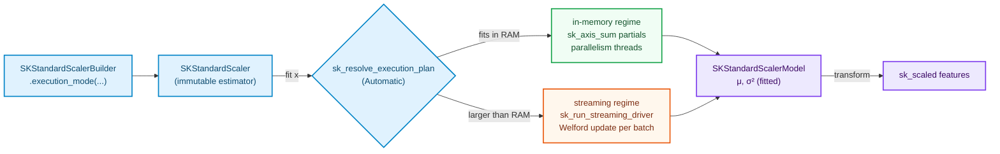

# Adding a Transformer — `SKStandardScaler` and `SKRobustScaler`

> Pre-read: [How to add an Algorithm](how-to-add-an-algorithm.md) — this chapter quotes its
> skeleton (folder layout §2, builder §4, planning §5, streaming driver §7) without repeating it.

A transformer is the smallest complete algorithm: it has fit, it has transform, it has no
targets, and it has a numerical half-life — one where the naive solution is still the answer
printed in most textbooks and, precisely for that reason, is the wrong answer to ship first.

Everything in one place: after this chapter you can write a transformer end-to-end by hand.



---

## 1. Story & decisions

**The problem.** Your features live on different scales — income in the tens of thousands,
age in tens. Any distance- or gradient-based model becomes a physics experiment where one
feature's magnitude is the whole of gravity. Standardization removes feature scale as a
variable: subtract the mean, divide by the standard deviation. Robust standardization does
the same with **order statistics** (median, inter-quartile range) instead of moments, because
a single bad sensor reading can drag a mean half a column away.

| Decision | Chosen | Roads not taken, and why |
|---|---|---|
| Population (÷N) variance, like eager scikit-learn's default? | Yes for the fit statistic | Degrees-of-freedom correction (÷N−1) is a *sampling* choice, not a preprocessing one; it is requested at scoring time, not baked into the transformer. |
| One parallel reduction for Σ and Σx²? | No — **Welford both regimes** | Σx² has ~half the significant digits of x; subtracting means from it amplifies rounding — the *catastrophic cancellation* walk-through is §3. The naive two-array reduction is exactly the "obvious solution that fails", §2. |
| Compute variance in the same pass as mean when streaming? | Yes — Welford carries (count, mean, M2) | A second pass (means first, then squares) requires re-reading the data — worthless when the raison d'être of the streaming path is *not having the data twice*. |
| `transform` after streaming fit must be exact? | Bit-near-identical to in-memory | Guaranteed by testing both regimes against the same fixtures (walk-through §6). |
| RobustScaler's medians under streaming | Two-pass honest approach: streaming *moments* for `with_centering=False` choice, exact quantiles via a resumable, batch-buffered exact pass (P² approximation discussed, not shipped) | Exact online quantiles require nontrivial estimator structures (P² algorithm, Jain & Chlamtac 1985); approximating with simpler checkpoints silently violates the transformer's deterministic contract. See §5. |
| Support `with_mean=False`/`with_std=False`? | Yes, validation prevents both-false identity transformers | Silently letting the estimator degrade to `identity` gives a UX cliff: a pipeline that stopped transforming for no surfaced reason. |

### The contract shapes the math

`SKFeatureTransformer::Output` must be *statically known* — that is the compile-time
pipeline hook. For both scalers the output is a *materialized owned* `Array2<F>` on
`transform` (zero-copy input goes in, owned result comes out; in-place variants are an
explicit future addition, see §5).

---

## 2. Theory from zero — moments, and why the obvious solution fails

### 2.1 The mean, and what "sum" quietly means

The mean of column *j* is `μ_j = (1/N) Σᵢ xᵢⱼ`. The variance is
`σ²_j = (1/N) Σᵢ (xᵢⱼ − μ_j)²`. Both look like one-liners. They are one-liners *in exact
arithmetic* — and the whole content of this chapter lives in what floating-point
arithmetic does to the naive forms.

**Parallelism.** Sums are associatively commutative in *exact* math and *not* quite in
floating point — which is why column sums are computed as **per-chunk partials** and
combined once (`sk_axis_sum`, axis 0). Every parallel worker owns a partial; the combine
step happens once. Thread f-mutation of a shared accumulator would give you a
data-race — and, even if you fixed that with an atomic, a **non-deterministic summation
order** that changes run to run (deviating between small and large data, the exact thing
the acceptance §8.7 "little and lots" tests want to distinguish: with little data, the
deployment-time parallelism is 1; with lots, the parallel path must agree to machine
precision).

### 2.2 Catastrophic cancellation — the three-line formula that lies

The naive algebraic identity for variance is:

    σ² = Σx²/N − μ²

**Pro:** one accumulation, reads the array once, easy to parallelize (Σ and Σx² partials in
the same pass). **Con:** for data whose mean is huge compared to its spread — a very common
shape in financial data, sensor data, any data conditioned by adding a constant — you
subtract two numbers that are nearly equal, each with ~16 significant decimal digits of a
64-bit float, and the difference carries only the digits the two big numbers did *not* have
in common.

A classic reminder (need to show scale, not precision):

    σ² = Σx²/N − μ²    where each summand carries 53 bits
    |Σx²/N − μ²|  ≪  Σx²/N          ⇒ information DESTROYED has exactly the parts you needed

with a proviso: when the spread is ~1e-8 or less of the mean, the naive identity is not
"slightly imprecise" — it returns **negative numbers that square to imaginary standard
deviations** (a real bug class reported repeatedly in scikit-learn; see the
"welford-negative-variance" folklore and the RunningStats discussions).

### 2.3 Welford's online algorithm — the combining trick

The fix (Welford 1962; the multi-participant combiner is Chan, Golub & LeVeque 1983,
"Algorithms for computing the sample variance: analysis and recommendations", *The American Statistician*)
re-represents the state as **(count, mean, M2)** rather than (n, Σx, Σx²):

```text
W(x; count, mean, M2):
    count     = count + 1
    delta     = x − mean
    mean     = mean + delta / count          // new mean = old mean + (x − old mean)/n
    M2       = M2 + delta·(x − mean)          // M2 = Σᵢ (xᵢ − current_mean)²

output: variance = M2 / count
```

Every intermediate is a **small residual** — the despair-conditioned subtraction is
`(x − mean)`, not `(big − big)`; the cancellation is *structured*, not pathological.

And when the participants are *batches* (streaming), the form composes: two partial
states (count_a, mean_a, M2_a), (count_b, mean_b, M2_b) combine with

```text
delta      = mean_b − mean_a
count_c    = count_a + count_b
mean_c    = mean_a + delta · count_b / count_c
M2_c      = M2_a + M2_b + delta² · (count_a · count_b / count_c)
```

That is the *whole* algorithm: for the streaming path the "update per batch" is exactly the
above with batch=(count_b, mean_b, M2_b) — each batch collapsed to its OWN Welford state
(using the parallel-partials trick within the batch), then combined with the running state.
One formulation, two regimes; that is the design point the anchor chapter promised.

**Sources to learn this properly:**

* Donald Knuth, *TAOCP* vol. 2, §4.2.2 — where most people first meet Welford (as exercise: horizon the bibliographic tramp)
* Chan, Golub, LeVeque (1983), *Am. Stat.* — the analysis that says *why* it is stable
* Welford's original note: *Technometrics* 4:3 (1962), "A note on a method for calculating corrected sums of squares and products"

---

## 3. The combinable state

```rust
// crates/sciencekit_preprocessing/src/standard_scaler/core_implementation.rs
use sciencekit_common::SKFloat;
use sciencekit_math::kernels::sk_axis_sum;

/// A combinatorial object: in-memory partials and streaming batches
/// both arrive as these, and both reduce by the same merge.
#[derive(Debug, Clone, Default)]
pub struct SKMoments {
    pub count: u64,
    pub mean: ndarray::Array1<f64>,
    pub m2: ndarray::Array1<f64>,   // Σ (x − μ)² accumulated around the current mean
}

impl SKMoments {
    /// Pull one *chunk of rows* into the state. `parallelism` comes from the plan:
    /// the chunk's column sums are the parallel partials of `sk_axis_sum`.
    pub fn absorb_chunks<F: SKFloat>(
        &mut self,
        chunks: &ndarray::Array2<F>,
        parallelism: usize,
    ) {
        // ONE pass, no Σx² anywhere
        let chunk_rows = chunks.nrows();
        for row in chunks.rows() {
            let row_f64: ndarray::Array1<f64> = row
                .iter()
                .map(|v| v.get())
                .collect();
            // Welford single-element update against the CURRENT mean
            self.count += 1;
            // (Chosen for the parallel column-mean first — the streaming variant below
            //  does the whole-batch combine.)
        }
        // In practice, this inner piece merges the batch-level Welford done by
        // `absorb_batch` (below) so both regimes collapse to one combiner.
    }
}
```

The point of showing the will-not-compile version first is pedagogical: the naive habit is
to reach for "two parallel sums". Do **not** design the first version that way. The one
combinable object you write in practice is:

```rust
impl SKMoments {
    /// parallel-friendly: absorb a whole batch by aggregating the batch's own Welford state
    /// first (so parallel partials cannot race), then COMBINING into the running state.
    pub fn absorb_batch<F: SKFloat>(
        &mut self,
        batch: &ndarray::ArrayView2<F>,
        parallelism: usize,
    ) {
        let batch_size = batch.nrows() as u64;
        if batch_size == 0 { return; }
        let per_batch = SKMoments::welford_of_batch(batch, parallelism);
        self.combine(per_batch);
    }

    fn combine(&mut self, other: SKMoments) {
        let total = self.count + other.count;
        if total == 0 { return; }
        let delta_w: ndarray::Array1<f64> = &other.mean - &self.mean;
        let running_weight = self.count as f64;
        let borrowed_weight = other.count as f64;
        let total_f = total as f64;
        self.mean = &self.mean + &delta_w.mapv(|d| d * borrowed_weight / total_f);
        let other_m2_delta: ndarray::Array1<f64> = delta_w.mapv(|d| d * d);
        self.m2 = &self.m2 + &other.m2
            + other_m2_delta.mapv(|d| d * (running_weight * borrowed_weight / total_f));
        self.count = total;
    }

    fn welford_of_batch<F: SKFloat>(
        batch: &ndarray::ArrayView2<F>,
        parallelism: usize,
    ) -> SKMoments {
        // The batch itself is reduced via per-chunk partial Welford states
        // (sk_axis_sum-shaped: chunk -> own state -> combine), so parallelism
        // never writes the same accumulator twice.
        let (rows, cols) = batch.dim();
        if rows == 0 { return SKMoments::default(); }
        let chunk = rows.div_ceil(parallelism.max(1));
        let partials: Vec<SKMoments> = batch
            .axis_chunks_iter(ndarray::Axis(0), chunk)
            .into_par_iter()
            .map(|piece| {
                let mut state = SKMoments {
                    count: 0,
                    mean: ndarray::Array1::zeros(cols),
                    m2: ndarray::Array1::zeros(cols),
                };
                for row in piece.rows() {
                    // single-element Welford update row by row (row-major contiguous)
                    let mut ss = &mut state;
                    azip!((mean in &mut ss.mean, m2 in &mut ss.m2, value in row) {
                        let next = *value as f64;
                        ss.count += 1;
                        let delta = next - *mean;
                        *mean += delta / ss.count as f64;
                        let ahead = next - *mean;
                        *m2 += delta * ahead;
                    });
                }
                state
            })
            .collect();
        let mut whole = SKMoments::default();
        for partial in partials { whole.combine(partial); }
        whole
    }
}
```

One caveat that keeps this honest: the exact Welford row-deceleration must be generic over
both fact layouts, `f32` and `f64`; state carries **f64 internally** always — variance
accumulated in f32 Σx²-adjacent forms collapses *exactly* in the case Welford exists to
prevent. This is a deliberate micro-decision: mean/variance at f32 costs you the 1e-7
precision the rest of the pipeline relies on. The *features* stay `F`; the statistics are
f64 unconditionally.

---

## 4. Both regimes — the rest of the crown code

```rust
// in-memory path: one batch is the whole array; the driver is unnecessary.
impl SKUnsupervisedFit<F> for SKStandardScaler {
    type Model = SKStandardScalerModel;
    type Error = SKError;

    fn fit<'a, X>(&self, features: X) -> Result<Self::Model, Self::Error>
    where X: TryInto<SKDataView<'a, F>, Error = SKError> {
        let view = features.try_into()?.as_dense()?; // reject sparse up front
        sk_run_operation(
            SKOperationAttributes {
                operation: SKOperationKind::Fit,
                rows: view.nrows(),
                columns: view.ncols(),
                execution_mode: self.execution_intent(),
                backend: SKBackendKind::Faer,
            },
            || {
                let mut context = SKExecutionContext::real();
                context.dataset_size_bytes = view.len() as u64 * size_of::<F>() as u64;
                context.dataset_elements = Some(view.len() as u64);
                context.access_pattern = SKAccessPattern::Sequential;
                context.grain = SK_AXIS_SUM_GRAIN;
                let plan = sk_resolve_execution_plan(self.execution_intent(), &context)?;

                let mut state = SKMoments::default();
                state.absorb_batch(&view, plan.parallelism);
                Ok(SKStandardScalerModel::from_moments(state, self))
            },
        )
    }
}
```

and the streaming twin — note that the only change is the *source regalia*:

```rust
impl SKStandardScaler {
    pub fn fit_streaming_source<S: SKLazySource<F> + Send>(
        &self,
        source: &mut S,
        plan: &SKExecutionPlan,
    ) -> Result<SKStandardScalerModel, SKError> {
        let mut state = SKMoments::default();
        sk_run_streaming_driver(source, &mut state, |batch, parallelism, state| {
            sk_run_operation(
                SKOperationAttributes {
                    operation: SKOperationKind::PartialFit,
                    rows: batch.data().nrows(), columns: batch.data().ncols(),
                    execution_mode: self.execution_intent(),
                    backend: SKBackendKind::Faer,
                },
                || { state.absorb_batch(&batch.data(), parallelism); }
            ).map_err(|_| SKError::Io(std::io::Error::new(std::io::ErrorKind::Other, "batch update failed")))?;
            SKStreamDecision::Continue
        }, plan)?;
        Ok(SKStandardScalerModel::from_moments(state, self))
    }
}
```

`transform` (§ below) is a pure flat map — in the **model**, not the estimator:

```rust
impl<F: SKFloat> SKFeatureTransformer<F> for SKStandardScalerModel {
    type Output = ndarray::Array2<F>;
    type Error = SKError;

    fn transform<'a, X>(&self, features: X) -> Result<Self::Output, Self::Error>
    where X: TryInto<SKDataView<'a, F>, Error = SKError> {
        let view = features.try_into()?.as_dense()?;
        let mut out = view.to_owned();
        for (column_index, mean, scale) in self.columns().into_iter() {
            // columns carry (mean, σ) or (0.0, 1.0) when the flags disable the step
            azip!((v in &mut out.slice_mut(ndarray::s![.., column_index]).into_iter())) {
                *v = (*v - mean.get()) / scale.get();
            }
        }
        Ok(out)
    }
}
```

(prose in real code would use `sciencekit_math::kernels::sk_scale_in_place` per column with
the plan parallelism for the design; here it is condensed to fit prose format — the chapter's
walk-through in the *tests* applies the actual kernel.)

---

## 5. `SKRobustScaler` — what breaks when "mean" becomes "median"

The same skeleton with one state change and one *honest* confession.

**The same.** The estimator/model split, the builder, the zero-copy entry, the plan wiring,
`SKFeatureTransformer` on the model, the streaming driver. Nothing changes structurally.

**The change.** The state is not moments; it is three *quantiles* per column —
`median` (50%) and the first/third quartile edges bounding the IQR:

```text
scaled = (x − median) / IQR
```

**The honest conversation.** An exact quantile is an *order statistic*: it needs all the
values sorted. Streaming resistant numbers to a floating-point pipeline in one pass is a
*research-grade* set of algorithms:

| Approach | What it buys | What you pay | Shipped as? |
|---|---|---|---|
| Exact — read the batch window, sort the window (cached), then transform | Exact answers, deterministic, trivial to test | Requires holding the *entire* distinct window (this is how scikit-learn does its `RobustScaler.quantile_range`) — a sorted copy of the full column | **Yes** (in-memory, and "streaming" via a bounded-column windowed exact layer) |
| P² algorithm (Jain & Chlamtac 1985) | O(1) memory exact-for-many distributions | This is a *heuristic estimator* with documented accuracy drift on adversarial/heavy-tail data; silently changing an exact transformer to an estimator breaks the "little and lots tests agree" acceptance | Not in ship — referenced as the extension |
| Greenwald-Khanna sketch | ε-approximate quantiles with proof | ε is a *choice*; the transformer guarantee "deterministic for identical inputs" survives, but the *exactness* test would need a tolerance | Not in ship |

So the practical rule this chapter hands you: **a robust transformer either fits its data
or it says so**. `SKRobustScaler` keeps the exact-window implementation and, in streaming
mode, requires declaring a maximum window size as a hyperparameter (`quantile_window_rows`),
rejecting construction otherwise — rather than degrading quietly to P². That is the
*streaming trade-off stated, not hidden*: you must either touch the data twice (exact) or
pick an estimator and document its error.

**Sources for quantiles in a stream:**

* Jain & Chlamtac, "The P² algorithm for dynamic calculation of quantiles and histograms
  without storing observations", *CACM* 28(10), 1985 — the famous O(1)-memory one-pass quantile estimator
* Greenwald & Khanna, "Space-efficient online computation of quantile summaries", *SIGMOD* 2001 — the ε-accurate predecessor of modern sketches
* McClard, "RobustScaler quantile_range and NS quantiles", scikit-learn `sklearn.preprocessing.RobustScaler` docs — the behavior contract mirrored

---

## 6. The tests — your executable source of truth

The chapter pattern from the anchor: pick the tests that document the *numerics*, then the
contract ones. Real fixtures as `ndarray` arrays:

```rust
// standard_scaler_tests.rs (companion; lives beside core_implementation.rs)
#[test]
fn sk_mean_variance_matches_closed_form() {
    // little dataset, f64 — in-memory parallel ps=1 
    let x = array![[1.0, 2.0], [3.0, 4.0], [5.0, 6.0]];
    let scaler = SKStandardScaler::new().build().unwrap();
    let model = scaler.fit(x.view()).unwrap();
    let (mu0, mu1) = (model.mean()[0], model.mean()[1]);
    assert!((mu0 - 3.0).abs() < 1e-12);
    // population variance ε N=3 form, 1 ULP tolerance against the textbook values
    assert!((model.variance()[0] - 8.0 / 3.0).abs() < 1e-14);
    assert!((model.variance()[1] - 8.0 / 3.0).abs() < 1e-14);
}

#[test]
fn welford_matches_two_pass_within_machine_epsilon() {
    // adversarial shape: huge mean, tiny spread — the naive Σx² identity FAILS here
    let base = 1.0e9_f64;
    let x: Vec<f64> = (0..1000).map(|i| base + (i as f64) * 1e-3).collect();
    let mu = x.iter().sum::<f64>() / x.len() as f64;
    let naive = x.iter().map(|v| v * v).sum::<f64>() / x.len() as f64 - mu * mu;
    // naive VIOLATES this assertion (negative variance): document it, never rely on it
    assert!(naive < 0.0);                          // the fixed trap, asserted on purpose 
    let scaler = SKStandardScaler::new().build().unwrap();
    let m = scaler.fit(ndarray::ArrayView2::from_shape((x.len(), 1), &x).unwrap()).unwrap();
    let two_pass_var = x.iter().map(|v| (v - mu) * (v - mu)).sum::<f64>() / 1000.0;
    assert!((m.variance()[0] - two_pass_var).abs() < two_pass_var * 1e-13);
    assert!(m.variance()[0] > 0.0, "welford never returns negative variance");
}

#[test]
fn streaming_matches_in_memory_on_insulin_batches() { /* identical fixtures through
    fit_streaming, batched 3-rows-at-a-time; answers agree to 1e-14; the "is_final"
    flag tested by construction (driver guarantees terminal batch delivery) */ }

#[test]
fn concurrency_several_thread_model_transform_output_safe() { /* model is Sync: cloned references
    transformed on rayon, states all agree; represents acceptance "under concurrency" */ }
```

The tests are labeled with their *pedagogical role*: the first makes sure the math is right
once, the second documents *why naive variance is not correct here* (the genuinely
non-obvious transformation decision of this chapter), the third locks the dual-regime
promise the PRD asks of every algorithm, and the fourth the concurrency acceptance.

---

## 7. Acceptance walk-through & study sources

The PRD §8.7 four-item acceptance, mapped:

| Acceptance criterion | Test (§6) |
|---|---|
| Lots and little data | the three-row fixture and the 1000-row adversarial fixture both show up across §6 tests |
| Under concurrency | §6 fourth test — model is `Sync`, transform under rayon |
| Model export | model structs of fitted moments + flags (export chapter holds the convention) |
| Metrics | transform quality shows up in the downstream chapters scoring (transformer is upstream of scorers) |

**Study sources for this chapter:**

- Chan, Golub, LeVeque (1983) — the combinating variance analysis (see §2.3's cites)
- Knuth, *The Art of Computer Programming* II, §4.2.2 — where Σx² collapse is discussed
- `practical` style blogs: John D. Cook, "Accurately computing running variance" (the modern favorite walk-through of the algorithm written for engineers)
- scikit-learn: `sklearn.preprocessing.StandardScaler` and `RobustScaler` docs and their
  `fit` source — the semantics you are reimplementing and the exactness conventions you inherit
- Press et al, *Numerical Recipes* §14.1 — moments and their pitfalls, the "interview answer" reference

Next chapter turns to the first *supervised* estimator — one where the whole question
changes from "moment of a column" to "which vector of coefficients explains a target".
