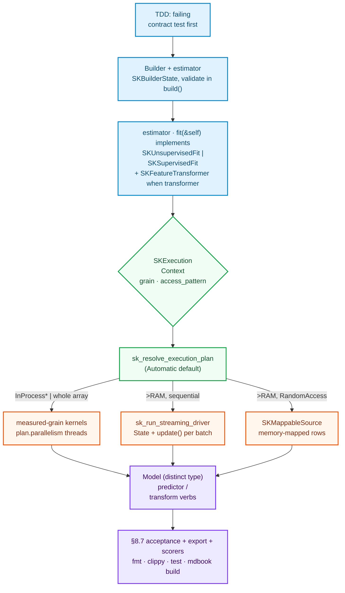

# How to add an Algorithm

This is the boiler plate. It contains **no algorithm** — only the skeleton every algorithm
in `sciencekit` must follow, and the discipline that keeps hundred algorithms coherent
instead of a drawer of clever one-offs. Every case-study chapter in this part assumes this
recipe and refers to it by section number.

> **Contract level.** Everything below is written against the merged master contracts of
> `sciencekit_common` and `sciencekit_math` as of the `parallel-kernel-execution` wave:
> `SKBuilder`/`SKBuilderState`, `SKSupervisedFit`/`SKUnsupervisedFit`/`SKFeatureTransformer`/`SKRegressorPredictor`/`SKClassifierPredictor`,
> `SKDataView`/`SKTargetView`, `SKExecutionContext`/`sk_resolve_execution_plan`,
> `sk_run_streaming_driver`, `SKLazySource`/`SKMappableSource`, the measured-grain kernels and
> the `SKMathBackend` abstraction. When a real algorithm crate lands and any signature has
> moved, this chapter is the one that gets the maintenance edit.

---

## 0. The journey at a glance

The whole routine, before the details:



---

## 1. What "adding an algorithm" means

You are not writing "a file with a math loop". You are adding a new public estimator to the
catalog, which means six obligations, each checked by a gate:

| # | Obligation | Checked by |
|---|---|---|
| 1 | Naming and file layout follow the conventions | review; project conventions |
| 2 | Construction is impossible to misuse (builder pattern) | traits: `SKBuilder<Model>` |
| 3 | Inputs enter zero-copy and are validated at the seam | traits: `TryInto<SKDataView/T>` |
| 4 | The estimator works in **all three execution regimes** or declares why not | `sk_resolve_execution_plan` + your tests |
| 5 | Every operation is observable (`sk_run_operation` spans) | telemetry review |
| 6 | It passes PRD §8.7 acceptance: little and lots of data, under concurrency, model export, metrics | your `*_tests.rs` modules |

Skipping any of the six produces the estimators this library exists to make unnecessary.

---

## 2. File layout and naming

### 2.1 Folder modules, always private-state, never index loops

Once any file reaches 200 lines, it becomes a **folder module** with a standardized shape.
Start in that shape directly: implement the algorithm *expecting* to exceed 200 lines.

```text
crates/sciencekit_preprocessing/src/standard_scaler/
├── mod.rs                     # pure dispatcher: mod declarations + re-exports ONLY
├── builder.rs                 # builder + hyperparameter validation + build()
├── core_implementation.rs     # the estimator struct + fit internals
├── model.rs                   # the fitted object + transform
└── standard_scaler_tests.rs   # companion tests, declared at the END of mod.rs
```

Three hard rules from the conventions chapter:

1. **`mod.rs` carries no logic.** It declares submodules and re-exports public items.
2. **Tests live beside the implementation** in a companion `*_tests.rs` — never a global
   `tests/` directory. The tests are later quoted, verbatim, in the Development Explained
   chapter for your algorithm; they are the executable truth.
3. **No manual index loops.** Iteration is `azip!()`, `map()`, `par_azip!()`.

### 2.2 Naming rules (PRD §3.4)

- **No abbreviations, ever**, with the single exception of the project prefix. The builder
  field is `maximum_number_of_iterations: usize`, not `max_iter`; the count of nearest
  neighbors is `nearest_neighbors_count`, not `k`.
- Structs and traits: `SK` + PascalCase → `SKStandardScaler`, `SKRegressorPredictor`.
- Free public functions, public variables, public modules: `sk_` + snake_case →
  `sk_resolve_execution_plan`, `sk_axis_sum`.
- **Methods get no prefix** — standing inside an `impl` is the privilege that earns it:
  `fn fit(...)`, `fn transform(...)`, `fn predict(...)`.
- Crates keep their full name: `sciencekit_preprocessing`, never `sk_prep`.

The discipline is not pedantry: a `dataframe.max_iter` reads like a contract to every future
reader; an abbreviation makes every editor and greppable name a guessing game.

---

## 3. The four contracts your algorithm plugs into

`sciencekit` does not have one `Estimator` god-trait. It has **small verbs**, and your
algorithm composes exactly the ones it supports (PRD §3.3).

### 3.1 Fitting traits — one of three

```rust
// Unsupervised (scalers, kmeans, pca): features only.
pub trait SKUnsupervisedFit<F: SKFloat> {
    type Model;                                  // the FITTED object — a distinct type
    type Error: From<SKError>;
    fn fit<'a, X>(&self, features: X) -> Result<Self::Model, Self::Error>
    where
        X: TryInto<SKDataView<'a, F>, Error = SKError>;
}

// Supervised (regressors, classifiers): features + targets.
pub trait SKSupervisedFit<F: SKFloat> {
    type Model;
    type Error: From<SKError>;
    fn fit<'a, X, T>(&self, features: X, targets: T) -> Result<Self::Model, Self::Error>
    where
        X: TryInto<SKDataView<'a, F>, Error = SKError>,
        T: TryInto<SKTargetView<'a>, Error = SKError>;
}

// Transformers additionally transform, with a statically known output type
// (this associated type is what makes pipeline chaining compile-time checked).
pub trait SKFeatureTransformer<F: SKFloat> {
    type Output;
    type Error: From<SKError>;
    fn transform<'a, X>(&self, features: X) -> Result<Self::Output, Self::Error>
    where
        X: TryInto<SKDataView<'a, F>, Error = SKError>;
}
```

Three details carry the design and are easy to miss in a skim:

- **`fit(&self, ...)` — not `&mut self`.** An estimator is immutable configuration; you may
  hand the *same* `SKStandardScaler` to two threads fitting two datasets concurrently. All
  mutation lifetime lives in the returned `Model`.
- **`Self::Model` is a distinct type.** Do not reuse the estimator struct as its own model.
  The model holds fitted values (`mean`, `variance`, coefficients...), implements the
  operation traits, and is what gets serialized for export.
- **Everything enters through `TryInto<SKDataView>` / `TryInto<SKTargetView>`.** The caller
  passes zero-copy inputs; the fallible conversion seam (`Error = SKError`, the central
  taxonomy: `ShapeMismatch`, `UnsupportedRepresentation`, ...) is where validation lives.
  Never accept raw `Array2` by value.

### 3.2 The model's predictive side

```rust
// Implemented on the MODEL, never on the estimator.
pub trait SKRegressorPredictor<F: SKFloat> {
    type Error: From<SKError>;
    fn predict<'a, X>(&self, features: X) -> Result<ndarray::Array1<F>, Self::Error>
    where
        X: TryInto<SKDataView<'a, F>, Error = SKError>;
}

pub trait SKClassifierPredictor<F: SKFloat> {
    type Error: From<SKError>;
    fn predict_labels<'a, X>(&self, features: X) -> Result<ndarray::Array1<i64>, Self::Error>
    where
        X: TryInto<SKDataView<'a, F>, Error = SKError>;
    fn predict_probabilities<'a, X>(&self, features: X) -> Result<ndarray::Array2<F>, Self::Error>
    where
        X: TryInto<SKDataView<'a, F>, Error = SKError>;
}
```

Note `predict` returns `Array1<F>` in the model scalar — an `f32` model predicts
`f32` with no `f64` detour — while classifier labels are scalar-independent `i64`
indices (`SKTargetView::Continuous` is likewise generic over `F`).

---

## 4. The builder

The builder is the only public constructor path. Direct constructors are private; a new
estimator validates every hyperparameter exactly once, in `build()`.

```rust
use sciencekit_common::builders::{SKBuilder, SKBuilderState};
use sciencekit_common::builders::sk_validate_hyperparameter;
use sciencekit_common::SKExecutionMode;

pub struct SKStandardScaler {
    plan: SKBuilderState,
    with_mean: bool,
    with_std: bool,
}

impl SKStandardScaler {
    pub fn new() -> SKStandardScalerBuilder {
        SKStandardScalerBuilder::new()
    }
    // ... the estimator also exposes:
    pub fn execution_intent(&self) -> SKExecutionMode { self.plan.execution_intent() }
    pub fn resolve_plan(
        &self, context: &SKExecutionContext,
    ) -> Result<SKExecutionPlan, SKError> { self.plan.resolve_plan(context) }
}

pub struct SKStandardScalerBuilder {
    state: SKBuilderState,     // holds execution_intent, defaults to Automatic
    with_mean: bool,
    with_std: bool,
}

impl SKStandardScalerBuilder {
    pub(crate) fn new() -> Self {
        Self { state: SKBuilderState::new(), with_mean: true, with_std: true }
    }

    pub fn with_mean(mut self, value: bool) -> Self { self.with_mean = value; self }
    pub fn with_std(mut self, value: bool) -> Self { self.with_std = value; self }

    pub fn execution_mode<E>(mut self, mode: E) -> Self
    where E: TryInto<SKExecutionMode> {
        self.state.execution_mode(mode);
        self
    }
}

impl SKBuilder<SKStandardScaler> for SKStandardScalerBuilder {
    fn execution_mode<E>(&mut self, mode: E) -> &mut Self
    where E: TryInto<SKExecutionMode> {
        self.state.execution_mode(mode);
        self
    }
    fn build(self) -> Result<SKStandardScaler, SKError> {
        // validation here — e.g. with_mean=false && with_std=false leaves identity.
        Ok(SKStandardScaler { plan: self.state, with_mean: self.with_mean, with_std: self.with_std })
    }
}
```

The obligations encoded:

- `execution_mode(SKExecutionMode::Automatic)` is the **default resolved intent**; the user
  may override, and the trait's `&mut self` form coexists with the by-value chaining form —
  both funnel into the same `SKBuilderState`.
- `build()` never panics; invalid states return `SKError::InvalidHyperparameter` via
  `sk_validate_hyperparameter(name, valid, reason)`.

### 4.1 Why the intent is resolved *at operation time*, not at build time

A constant that tempts every newcomer: resolve the plan eagerly in `build()` and store it.
**Do not.** The estimator is *reusable*: the same fitted model may be asked to `transform`
a 100-row slice in the morning and drive the usual 50 GB job in the afternoon — and
`available_memory_bytes`, the dominant variable of the resolution rule, is *free memory
right now*. Resolution happens per-operation, inside `fit`/`transform`/`predict`, from a
fresh `SKExecutionContext`.

---

## 5. Planning: from intent to executable plan

Inside every operation you do the same four lines, and then parametrize *everything* by
`plan.parallelism` and guard everything by `plan.mode`:

```rust
use sciencekit_common::execution::{SKExecutionContext, sk_resolve_execution_plan};
use sciencekit_common::observability::{SKOperationAttributes, SKOperationKind};
use sciencekit_math::kernels::SK_AXIS_SUM_GRAIN; // your dominant kernel's grain

fn standardize<F: SKFloat>(
    estimator: &SKStandardScaler,
    features: &ndarray::ArrayView2<F>,
) -> Result<ndarray::Array2<F>, SKError> {
    sk_run_operation(
        SKOperationAttributes {
            operation: SKOperationKind::Fit,
            rows: features.nrows(),
            columns: features.ncols(),
            execution_mode: estimator.execution_intent(),
            backend: SKBackendKind::Faer, // or the actual backend's kind()
        },
        || {
            let mut context = SKExecutionContext::real();
            context.dataset_size_bytes = features.len() as u64 * size_of::<F>() as u64;
            context.scalar_size_bytes = size_of::<F>() as u64;   // defaults are f64-sized; set it for f32 batches
            context.dataset_elements = Some(features.len() as u64);
            context.access_pattern = SKAccessPattern::Sequential;
            context.grain = SK_AXIS_SUM_GRAIN;          // the algorithm declares its grain
            let plan = sk_resolve_execution_plan(estimator.execution_intent(), &context)?;

            // dispatch on plan.mode / use plan.parallelism (see §6, §7)
            // ...
            unimplemented!()
        },
    )
}
```

What `sk_resolve_execution_plan` does with that (pure, deterministic — so your tests can
assert it exactly):

```
intent = Automatic:
    dataset_size_bytes ≤ available_memory_bytes  →  InProcessSynchronous
    else access_pattern RandomAccess             →  OutOfCoreMemoryMapped
    else Sequential | Iterative                  →  OutOfCoreStreaming

parallelism = min(cores, ceil(unit_elements / grain))
              unit = whole dataset (in-memory) | one batch (streaming, batch_size_hint) | ∞ (mapped)
```

Two compile-time facts your tests should lock in:

- `Automatic` is a *policy*, not a prophecy: it never returns
  `ExecutionModeIncompatible`, and small data always lands in-memory (parallelism
  collapses to `1` when the unit is below one grain — the resolver will not hand out
  threads for a 5-element array). One caveat: when `Automatic` resolves to a *streaming*
  plan, the buffer guard still applies — an oversized `batch_size_hint` raises
  `BatchBufferOversize`, which is a data-shape error, not an intent error.
- Declaring `OutOfCoreStreaming` with `access_pattern = RandomAccess` is a programming
  error caught *before* any data moves: `SKError::ExecutionModeIncompatible`.

### 5.1 Which access pattern should *your* algorithm declare?

| Pattern | Means | Choose when |
|---|---|---|
| `Sequential` | one pass (or the state is order-independent) — most fit operations | your state is a combiner updated once per element/batch |
| `RandomAccess` | any element in O(1), possibly many times | nearest-neighbor bases, memory-mapped training sets |
| `Iterative` | multiple passes over the same data | k-means, SGD over epochs, iterative solvers |

The pattern is a property of the *algorithm math*, not a preference. `SKStandardScaler` is
`Sequential`. `SKSGDClassifier` is `Sequential` per pass (it never needs a random row).
`SKKNeighborsClassifier` is the textbook `RandomAccess`: its "training" is storing and its
prediction needs any stored row at any time.

---

## 6. Regime 1 — in-memory, parallel kernels

`InProcessSynchronous` is the regime every algorithm supports: the whole array is resident,
and the job is to throw `plan.parallelism` threads at it. You do not create threads and you
do not write `rayon` code in the algorithm — the **kernels** do, taking a single
`parallelism: usize` and branching internally:

```rust
use sciencekit_math::kernels::sk_axis_sum;

// axis 0 => per-column sums; parallel path uses per-chunk PARTIAL accumulators
// combined at the end (no thread ever writes to another thread's accumulator).
let per_column_sums = sk_axis_sum(&features.view(), 0, plan.parallelism);
```

The rules to internalize before writing your first kernel call:

- **Parallelism is paid for by the grain.** Each kernel family carries a *measured* grain
  (`SK_AXIS_SUM_GRAIN = 100_000` elements for reductions, 1M for elementwise transforms...)
  — the crossover point where splitting work pays for its own dispatch overhead. You inject
  your dominant kernel's grain into the context; the resolver computes
  `parallelism = min(cores, ceil(unit / grain))`. The same number governs in-memory and
  streaming: the grain is a property of the kernel, not of the regime.
- **Partials, never shared accumulators.** When you compute anything in parallel, each
  worker accumulates into *its own* partial vector; partials are combined once at the end.
  This is why the parallel column sum is deterministic-order-tolerant and race-free — and in
  the [transformer chapter](adding-a-transformer.md) it is why Σ and Σx² partials compose
  into Welford cleanly.
- **Layout is a contract, not an accident.** Pass `&features.view()` into kernels; when a
  copy may be needed for a blocked/backend path, `sk_force_contiguous` gives back a
  `CowArray` — borrow if already contiguous, own only if strided.

---

## 7. Regime 2 — out-of-core streaming, the generic driver

> **The mental model first.** Streaming is not "a smaller fit called repeatedly by the
> user". It is the *same fit*, running over an `SKLazySource` that yields owned
> `SKDataBatch`es, with your algorithm's state updated per batch inside the driver's
> prefetch pipeline. You write **one closure**; the driver owns buffering, an I/O producer
> thread, ordering, errors and the final-batch flag.

```rust

struct StreamingMomentsState {
    count: u64,
    count_f: f64,          // Welford accumulators — see the transformer chapter
    mean: ndarray::Array1<f64>,
    m2: ndarray::Array1<f64>,
}

fn fit_streaming<F: SKFloat>(
    source: &mut impl SKLazySource<F>,
    plan: &SKExecutionPlan,
) -> Result<StreamingMomentsState, SKError> {
    let mut state = StreamingMomentsState { count: 0, count_f: 0.0,
        mean: ndarray::Array1::zeros(0), m2: ndarray::Array1::zeros(0) };

    sk_run_streaming_driver(source, &mut state, |batch, parallelism, state| {
        // ← THE "partial fit": one batch, one update of the combinable state.
        update_moments(batch.data(), parallelism, state);
        SKStreamDecision::Continue
    }, plan)?;

    Ok(state)
}
```

Mechanics you inherit for free by using the driver (and must never re-implement by hand —
that is a whole second book of subtle concurrency):

- a dedicated **I/O producer thread** reads ahead through a bounded buffer sized by
  `plan.buffer_depth` (double buffering = 1), so disk and CPU overlap;
- batches arrive **in source order**, owned (`SKDataBatch` owns its `Array2<F>` precisely so
  it can be handed across the producer/consumer boundary);
- `SKDataBatch::is_final()` marks the last batch; `position()` gives zero-based order;
- a read error mid-stream surfaces as `SKError` with all earlier batches' effects
  preserved in your state — error handling is *monotonic*: never a partial model without an
  error, and never an error that discards the caller's ability to see it;
- `SKStreamDecision::Stop` halts the pipeline early while keeping the current batch's effect.

The same state produced by the stream must be *the same kind of state* the in-memory path
produces. For a scaler that is trivial; for LinearRegression it is exactly why Chapter 4
accumulates a Gram matrix per batch; for SGD Chapter 3 of this part never had to re-formulate
anything — its `update` is *already* the only formulation it has.

**Batch sizing.** The plan carries `plan.batch_size` (streaming only) and checks a buffer
guard: `2 × batch_elements × scalar_size ≤ available_memory_bytes`, else
`SKError::BatchBufferOversize`. Pass `batch_size_hint` in the context if your format has a
natural batch (e.g. rows of a parquet row-group, cache-line multiples of a `.npy` memmap).

---

## 8. Regime 3 — memory-mapped random access (`SKMappableSource`)

The third regime exists because **not all algorithms read data in order**. k-NN needs "row
arbitrary"; so do k-means over the same dataset used twice, and decision-tree splits over a
base too big for RAM.

```rust
pub trait SKMappableSource<F> {
    type Error: From<SKError>;
    fn number_of_rows(&self) -> usize;
    fn row(&self, index: usize) -> Result<ndarray::ArrayView1<'_, F>, Self::Error>;
}
```

Design rule: implement `SKMappableSource` when the algorithm declares
`SKAccessPattern::RandomAccess` and the data backing it lives on disk in a layout that gives
O(1) rows (contiguous row-major, no header tricks). Then
`sk_resolve_execution_plan(Automatic)`'s resolution sends huge datasets to
`OutOfCoreMemoryMapped` where the union of memory and page cache serves the algorithm — no
`SKDataBatch` copying, no prefetch pipeline, just rows handed out from where they already
are.

The transform chapter will not need it; [the neighbors chapter](adding-a-neighbors-model.md)
is built on it.

---

## 9. Observability: every public operation under one span

```rust
use sciencekit_common::observability::{sk_run_operation, SKOperationAttributes, SKOperationKind};

pub fn fit<F>(...) -> Result<Model, MyError> {
    sk_run_operation(
        SKOperationAttributes {
            operation: SKOperationKind::Fit,          // Fit · FitTransform · FitPredict · PartialFit · Transform · Predict · Score
            rows, columns,
            execution_mode, backend,
        },
        || { /* the real work */ },
    )
}
```

`sk_run_operation` opens a span carrying operation/rows/columns/mode/backend, times the
closure and, if it errors, records the error — bounded enums only, never free-form strings.
The streaming tip: each per-batch `update` is instrumented with `SKOperationKind::PartialFit`
(k-means over 10² batches, an SGD classifier with 100 → a streaming job becomes a legible
sequence of partial steps rather than one opaque `fit`).

---

## 10. The routine, end to end

Assemble everything above into the routine you will now repeat. It is the same routine no
matter the algorithm — only the math body changes:

```text
TDD guarantee (mandatory, never skipped):
  1. Failing contract test FIRST         (cargo test → compile-error/fail; commit on the red)
  2. Smallest naive implementation        (passes; commit)
  3. Performance pass                     (grain, layout, partials; same tests still green;
                                           commit)
  4. Streaming/out-of-core pass           (same state, driver wiring; SAME tests, plus batch
                                           tests; commit)

Gates, before any push:
  cargo fmt --all --check && cargo clippy --workspace --all-targets && cargo test --workspace
  mdbook build docs   (documentation change accompanies every code change)

Acceptance, per PRD §8.7 — the four scenarios each estimator must survive:
  ✔ large and small datasets        (the same tests ask both shapes of data from the contract)
  ✔ under concurrency               (Send/Sync by design; parallel kernels; &self fit)
  ✔ model export & reload           (fit→serialize→deserialize→predict must equal)
  ✔ metrics computed                (scorer traits give you score() for free)
```

Numbers to keep in mind when you pick the second pass (the ones teams constantly trip on):

- **Do not skip the performance stage.** The naive version exists to make the *next* test
  meaningful: the parallel/Welford/laid-out version must produce the same answers to 1e-15
  (see the transformer chapter's cancellation walk-through), and the grain constants in
  `sciencekit_math::kernels::grain` are *measured*, not folklore — reuse them.
- **`Automatic` is the golden default because resolution is pure and total** — the plan is
  a function of (intent, context) with no world effects, which means every algorithm's
  *dispatch itself* is unit-testable without disks or clusters. Keep it that way: never
  read the clock, the file system, or the thread pool inside a decision path.
- **The model type is the export boundary.** PRD §8.7 acceptance includes export; design
  the model as a plain, default-`repr` struct of fitted values + the metadata needed to
  rebuild, and serialization is nearly a recording note rather than a new design.

---

## 11. Checklist — before you open the PR

- [ ] Folder module; `mod.rs` is semantics-free; tests are companions, not in `tests/`
- [ ] Naming: no abbreviations; `SK`/`sk_` prefixes applied per §3.4; crate name intact
- [ ] Builder-only construction; `execution_mode` default `Automatic`; validation in `build()`
- [ ] Zero-copy inputs via `TryInto<SKDataView>`; errors from the central taxonomy
- [ ] Estimator is immutable (`&self` methods), model is distinct type + implements its verbs
- [ ] Execution context declares `grain` and `access_pattern`; plan resolved per operation
- [ ] In-memory path goes through measured-grain kernels with `plan.parallelism`
- [ ] Streaming path (when the algorithm afford sequential batches): same state + driver;
      memory-mapped path (if `RandomAccess`): `SKMappableSource`
- [ ] Every entry point wrapped in `sk_run_operation` with bounded attributes
- [ ] Red→green→refactor committed **per task**; OpenSpec `tasks.md` `- [x]` kept in lockstep
- [ ] `fmt`/`clippy`/`test`/`mdbook build` all green locally
- [ ] Documentation branch: Development Explained chapter (new) + tutorials walk-through
- [ ] Independent review: spec met, then the PR references the ADR issue with closing keywords

You now know everything that is the same across algorithms. The next four chapters are what
is *different* — the math, the numerics, and the traps of each family.
