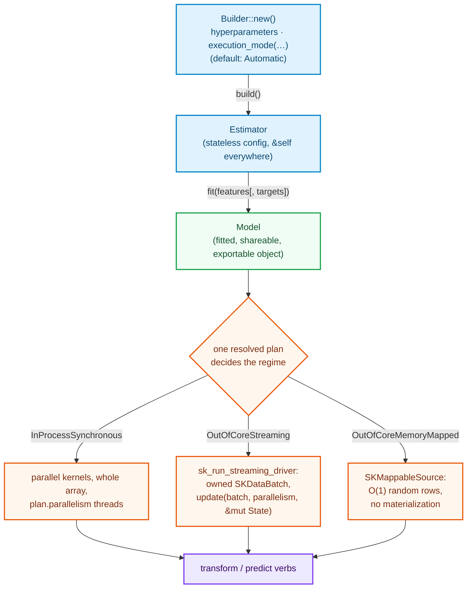

# Tutorials

This part is the **hands-on textbook** for the library. Where [Development Explained](../development-explained/how-to-read.md)
walks through what *was already built* and why, this part teaches you how to *build the next
thing* — by hand, with no agent, using only the book as your companion.

## Who this is for

You already know Rust (ownership, generics, traits, iterators — where a Rust *language*
concept appears, we reference the Development Explained book instead of re-teaching it).
You do **not** need to know:

- how `sciencekit` wires its internals (we show every wire),
- the numerical-computing theory behind the algorithms (we teach each one from zero),
- how parallel machines think about work (we teach grain, partials and prefetch pipelines
  in context, the first time an algorithm needs them).

## The one idea to hold

Every estimator in `sciencekit` follows the same skeleton:



The key that makes all of this cohere: the algorithm is first designed as a function of a
**combinable state** (Σ sums, Welford moments, a gradient accumulator, a set of stored
neighbor vectors). Once the state exists, the in-memory path is "the streaming path with one
batch that happens to hold everything" — the two regimes share the same math, and the user
never picks a code path, only a [`SKExecutionMode`](how-to-add-an-algorithm.md) — usually the default
`Automatic`, which resolves it from dataset size, free memory and access pattern.

## Chapter map

| Chapter | What you build | The lesson it carries |
|---|---|---|
| [How to add an Algorithm](how-to-add-an-algorithm.md) | (no algorithm — the boiler plate) | file layout, naming, builder, contracts, planning, three regimes, TDD, gates, acceptance |
| [Adding a Transformer](adding-a-transformer.md) | `SKStandardScaler`, `SKRobustScaler` | reductions and partials; Welford; quantiles are hard in a stream |
| [Adding a Linear Model](adding-a-linear-model.md) | `SKLinearRegression` | dense linear algebra through the backend; SVD vs normal equations; Gram accumulation when streaming |
| [Adding a Streaming Model](adding-a-streaming-model.md) | `SKSGDClassifier`, `SKSGDRegressor` | gradient descent from zero; the driver's update; PartialFit spans; in-memory = degenerate batch |
| [Adding a Neighbors Model](adding-a-neighbors-model.md) | `SKKNeighborsClassifier`, `SKKNeighborsRegressor` | the honest exception: random access, memory-mapped bases, why no sequential stream |

Each case-study chapter follows the same internal contract:

1. **Story & decisions** — what problem, which roads taken and not taken.
2. **Theory from zero** — numerics with sources; pros/cons; where the *obvious* solution quietly fails.
3. **A state that combines** — the mathematical core both regimes share.
4. **Full reference code** — real, final-form files (folder module, builder, estimator, model, tests).
5. **Both regimes side by side** — Mermaid data flow and when to prefer each.
6. **Acceptance walk-through** — PRD §8.7 mapped to the tests you just wrote.
7. **Study sources.**

## Prerequisites check

Before starting, make sure you can run the CI gates locally — they are part of every task:

```console
$ cargo fmt --all --check
$ cargo clippy --workspace --all-targets
$ cargo test --workspace
```

and build the book you are reading:

```console
$ mdbook build docs
```

Everything else — grain constants, error taxonomy, planning rules, backend selection — is
introduced where the algorithms first need it.
